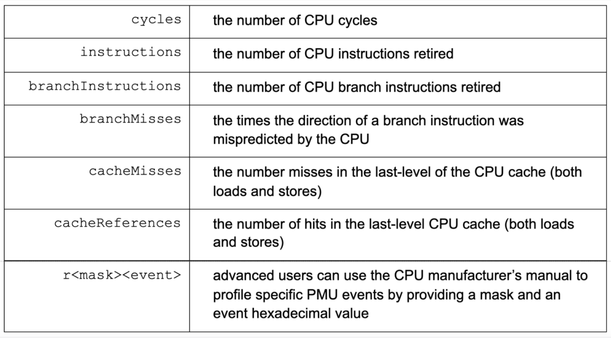

大家好，我是站长 polarisxu。

今天看到 Uber 使用 Go 的情况，挺吃惊的，给大家分享下情况。

## 01 Uber 使用 Go 的情况

Uber 有数千个后端服务是使用 Go 实现的，它们运行在数百万个 CPU 内核上。因此，对于 Uber 来说，详细准确掌握 CPU 瓶颈至关重要。这不仅为了减少服务延迟，同时也能提高计算机运行效率。Uber 这个量级的规模，要求对代码和微观结构的影响有深入的了解。

## 02 定制 Go 编译器

其实说定制 Go 编译器有点不准确。主要是基于以上规模和要求，虽然 Go 内置了 Profiler，但这个 CPU Profiler 在基于 Linux 的系统上有严重的限制（也许在其他操作系统也有此问题，但 Uber 使用的是 Linux，其他机器并没有测试验证），同时内置的 Profiler 缺少掌握 CPU 瓶颈所需要的许多细节。

基于这些问题，Uber fork 了一份 github.com/golang/go 代码，在其上建立一个定制的 Go Profiler，以便更符合 Uber 的需求和 Uber 的商业运营规模。

具体来说，Uber 通过将丰富的硬件性能监视特性集成到 Go 的缺省 pprof 分析器中来增强它。这提供了几个关键好处：

- 能够获得更准确和精确的 Go 程序分析文件（profiles）；
- 监控各种 CPU 事件的能力，比如缓存丢失、套接字间（NUMA）通信、 CPU 分支错误预测等等；
- 能够以非常高的采样频率（最高可达 10 微秒）监控 Go 程序；

所以，Uber 定制的「Go 编译器」其实只是增强了 Profiler。注意，对 Profiler 的使用并不需要改变，也就是说，对外的接口、使用的工具和分析都没有变（比如堆栈属性、调用图和火焰图等），只是增加了更多的数据。

增强版的 Profiler，Uber 称之为 pprof++，这是带有硬件性能计数器的解决方案。

具体增加了哪些 CPU 事件，Uber 给了一张图，公开了最常见的一些事件。

关于这些事件的使用，以及 pprof++ 的更详细信息可以参考：<https://eng.uber.com/pprof-go-profiler/>。

Uber fork 的 Go 仓库地址：<https://github.com/uber-research/go>。

## 03 感想

看到这个消息，惊叹 Uber 对 Go 的使用和研究之深，也证明了 Go 被大公司的规模使用，看好 Go 的前途。

不知道 Uber 开发的 pprof++，有没有和 Go Team 沟通，尝试合入 Go 官方仓库，毕竟既然开源出来了，如果能够在官方中使用，可以让更多人收益。当然，因为目前只支持 Linux 系统，可能不太适合合入。至少，不希望 Go 出现分裂！

