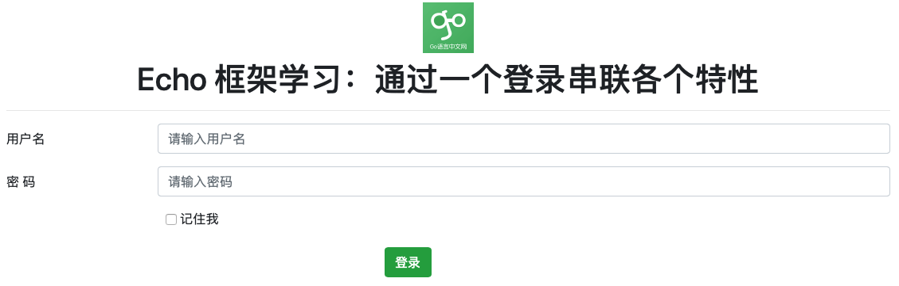
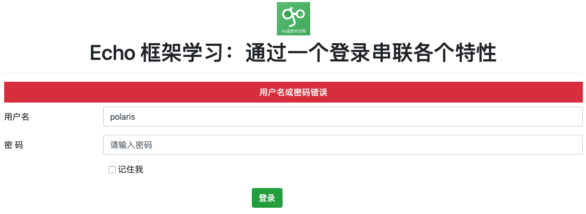

通过前面的介绍，相信对 echo 有了一个初步的认识。本文我们通过一个简单的登录页面来串联 echo 的相关特性。因为该文主要关注各个特性，所以在目录结构和代码组织方面很随意。

## 本节最终效果

1）登录页面



2）登录失败



3）登录成功


## main 函数骨架

使用 echo 框架，在程序入口处一般包含如下内容：

```go
func main() {
	// 创建 echo 实例
	e := echo.New()

	// 配置日志
	configLogger(e)

	// 注册静态文件路由
	e.Static("img", "img")
	e.File("/favicon.ico", "img/favicon.ico")

	// 设置中间件
	setMiddleware(e)

	// 注册路由
	RegisterRoutes(e)

	// 启动服务
	e.Logger.Fatal(e.Start(":2019"))
}
```

## 日志

echo 中定义了一个接口：[Logger](https://pkg.go.dev/github.com/labstack/echo?tab=doc#Logger)，而 [Echo 结构体](https://pkg.go.dev/github.com/labstack/echo?tab=doc#Echo)有一个该接口的字段，这也就是 main 函数最后一句：`e.Logger.Fatal` 可以这么用的原因。框架中该接口的具体实现使用的是 `github.com/labstack/gommon/log`，如果需要，我们可以采用自己的实现，替换框架默认的。

默认情况下，日志输出到终端，而且 Level 级别是 ERROR，我们可以方便的通过 Logger 接口提供的方法进行修改：

```go
func configLogger(e *echo.Echo) {
	// 定义日志级别
	e.Logger.SetLevel(log.INFO)
	// 记录业务日志
	echoLog, err := os.OpenFile("log/echo.log", os.O_CREATE|os.O_WRONLY|os.O_APPEND, 0644)
	if err != nil {
		panic(err)
	}
	// 同时输出到文件和终端
	e.Logger.SetOutput(io.MultiWriter(os.Stdout, echoLog))
}
```

为了方便，开发中我将日志同时输出到了终端和文件中。

## 中间件

几乎所有的 Web 框架都支持中间件。其实这里的中间件跟传统的中间件不是一回事，这里的中间件其实是一种装饰模式。闲言少叙，我们看看 Echo 的中间件。

以 Recover 中间件为例讲解。

### 中间件标准签名

通过 `Echo.Use` 方法知晓，中间件是 MiddlewareFunc 类型，它的定义如下：

```go
type MiddlewareFunc func(echo.HandlerFunc) echo.HandlerFunc
```

也就是说，一个中间件应该是 MiddlewareFunc 类型。所以，一个函数，只要返回 MiddlewareFunc 类型就是一个 Echo 中间件。

```go
func Recover() echo.MiddlewareFunc {
  ...
}
```

### 支持配置的中间件

Echo 的中间件通常都支持以下功能：

- 通过配置修改中间件的行为
- 可以选择是否跳过该中间件

一般做法就是：

- 定义一个类型，如：RecoverConfig，用于配置 Recover 中间件的行为；
- 给上述类型的一个默认实例：DefaultRecoverConfig；
- 定义一个支持传递配置的函数，返回中间件类型，如：RecoverWithConfig；
- 定义一个不带参数的函数，返回中间件类型，内部调用带参数的中间件函数，参数用默认实例，如：Recover，它的实现是直接调用 `RecoverWithConfig(DefaultRecoverConfig)`；

我们的例子代码中就通过配置修改了中间件行为：

```go
// access log 输出到文件中
	accessLog, err := os.OpenFile("log/access.log", os.O_CREATE|os.O_WRONLY|os.O_APPEND, 0644)
	if err != nil {
		panic(err)
	}
	// 同时输出到终端和文件
	middleware.DefaultLoggerConfig.Output = accessLog
	e.Use(middleware.Logger())
```

### 自己定义一个简单中间件

很多时候，我们业务的中间件，不需要那么灵活，没必要通过配置来控制行为，这时候可以像例子中的 AutoLogin 一样：

```go
// AutoLogin 如果上次记住了，则自动登录
func AutoLogin(next echo.HandlerFunc) echo.HandlerFunc {
	return func(ctx echo.Context) error {
		cookie, err := ctx.Cookie("username")
		if err == nil && cookie.Value != "" {
			// 实际项目这里可以通过 username 读库获取用户信息
			user := &User{Username: cookie.Value}

			// 放入 context 中
			ctx.Set("user", user)
		}

		return next(ctx)
	}
}
```

接收一个 echo.HandlerFunc 类型，同时返回一个 echo.HandlerFunc 类型，这就是 MiddlewareFunc 的定义，因此 AutoLogin 可以直接当中间件使用。**注意：在使用是这里和上面 Recover 的区别，Recover 是返回一个中间件，而 AutoLogin 本身是一个中间件，因此使用时分别是：Use(Recover()) 和 Use(AutoLogin)**。

在具体实现中间件时，可以在调用 `next()` 函数前后增加该中间件需要的功能。

## Cookie 和 Session

关于 Cookie、Session 和 Token 的介绍，可以通过 [《一文带您彻底理解Cookie、Session、Token》](https://cloud.tencent.com/developer/article/1542456) 了解下。

在 Go 中，Session 相关功能最常用的包是 `github.com/gorilla/sessions`。Echo 提供了 Session 中间件，使用的就是该包。这里我们主要讲解一下登录需要用到的功能。

### 登录成功种 Cookie

```go
// 用标准库种 cookie
cookie := &http.Cookie{
  Name:     "username",
  Value:    username,
  HttpOnly: true,
}
if rememberMe == "1" {
  cookie.MaxAge = 7*24*3600	// 7 天
}
ctx.SetCookie(cookie)
```

我们这里直接使用了标准库的方式实现，而不是使用 ``github.com/gorilla/sessions` 包。默认情况下，浏览器关闭，cookie 删除，当“记住我”，保存 7 天。这里留一个问题：**cookie.Expires 和 cookie.MaxAge 的区别？**

### 重定向保留用户名

在登录失败后，为了避免用户再次输入用户名，这里借用 `github.com/gorilla/sessions` 包的 Flash Message 功能。

`github.com/gorilla/sessions` 实现了 Cookie 和文件系统 Session，默认情况下，使用 Cookie。

```go
sess := getCookieSession(ctx)
sess.AddFlash(username, "username")
err := sess.Save(ctx.Request(), ctx.Response())
```

在读 Flash Message 的地方，一定要注意，需要再次执行 session.Save：

```go
sess := getCookieSession(ctx)
if flashes := sess.Flashes("username"); len(flashes) > 0 {
  data["username"] = flashes[0]
}
sess.Save(ctx.Request(), ctx.Response())
```

## 总结

一个简单的登录，涉及到的知识点还是不少的，但依然有不少 Echo 框架的功能没包括。后面我们会介绍更多 Echo 的特性和功能，这个简单的例子，希望能够让你对 Echo 更有感觉。

完整示例代码：<https://github.com/polaris1119/echo-login-example>
