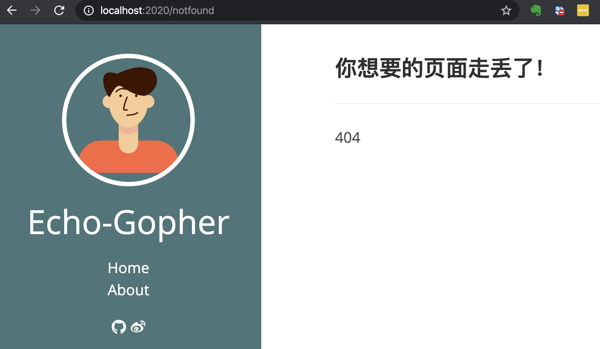

Echo 倡导通过从中间件和 Handler 返回错误来进行集中式 HTTP 错误处理。集中式错误处理程序使我们能够从统一位置将错误记录到外部服务，并向客户端发送自定义的 HTTP 响应。本节一起学习如何定制化，进行集中式错误处理。

## 默认的错误处理

在定制篇 4 中，我们讲到了 Render。如果在 Handler 中调用了 Render，但是并没有给 Echo.Renderer 赋值或其他原因，导致出错，页面看到的信息如下：

```json
{
	"message": "Internal Server Error"
}
```

这是 Echo 默认的 HTTP Error Handler，表示发生了 500 - Internal Server Error 错误。看看该默认 Error Handler 的代码：

```go
// DefaultHTTPErrorHandler is the default HTTP error handler. It sends a JSON response
// with status code.
func (e *Echo) DefaultHTTPErrorHandler(err error, c Context) {
	he, ok := err.(*HTTPError)
	if ok {
		if he.Internal != nil {
			if herr, ok := he.Internal.(*HTTPError); ok {
				he = herr
			}
		}
	} else {
		he = &HTTPError{
			Code:    http.StatusInternalServerError,
			Message: http.StatusText(http.StatusInternalServerError),
		}
	}

	// Issue #1426
	code := he.Code
	message := he.Message
	if e.Debug {
		message = err.Error()
	} else if m, ok := message.(string); ok {
		message = Map{"message": m}
	}

	// Send response
	if !c.Response().Committed {
		if c.Request().Method == http.MethodHead { // Issue #608
			err = c.NoContent(he.Code)
		} else {
			err = c.JSON(code, message)
		}
		if err != nil {
			e.Logger.Error(err)
		}
	}
}
```

- 如果是非 HTTPError，会包装成 HTTPError，并设置为 500 - Internal Server Error；
- 如果开启了 Debug 模式，则会输出具体的错误信息；

因此，开启 Debug 模式（e.Debug = true）后，输出是：

```json
"renderer not registered"
```

这对于调试很方便。

## 集中化自定义错误处理

在有些时候，默认错误 HTTP 处理程序可能足够了；但是，如果你想捕获其他类型的错误并采取相应的处理，比如，发送通知电子邮件或将错误记录到外部日志系统中，这时集中化自定义错误处理就很有用了。除此之外，你可能还希望错误页面更好看，或发送个性化的 JSON 响应。

通过给 Echo#HTTPErrorHandler 设置一个 HTTPErrorHandler 来设置自定义的错误处理程序，HTTPErrorHandler 的定义如下：

```go
// HTTPErrorHandler is a centralized HTTP error handler.
type	HTTPErrorHandler func(error, Context)
```

### 自定义错误页面

一般来说，通过 Go 语言渲染页面的话，在发生错误时，渲染对应的错误页面，比如：404.html、500.html 等。

以下自定义 HTTP 错误处理程序根据不同类型的错误显示对应的错误页面并记录错误。

```go
// 放在 http 包下的 error.go 中
// CustomHTTPErrorHandler 自定义 HTTP 错误处理
func CustomHTTPErrorHandler(err error, ctx echo.Context) {
	code := http.StatusInternalServerError
	if he, ok := err.(*echo.HTTPError); ok {
		code = he.Code
	}
	errorPage := fmt.Sprintf("%d.html", code)
	if err := ctx.File("template/" + errorPage); err != nil {
		ctx.Logger().Error(err)
	}
	ctx.Logger().Error(err)
}
```

在项目的 template 目录下加上相应的 html 文件，比如：404.html、500.html。之后设置上自定义的 CustomHTTPErrorHandler：

```go
e.HTTPErrorHandler = myhttp.CustomHTTPErrorHandler
```

页面简单的包含一些内容，如 404.html 页面内容如下：

```html
<!DOCTYPE html>
<html lang="en">
<head>
    <meta charset="UTF-8">
    <meta name="viewport" content="width=device-width, initial-scale=1.0">
    <title>404</title>
</head>
<body>
    <h2>这是404错误页面</h2>
</body>
</html>
```

编译启动程序后，随意访问一个不存在的路径：http://localhost:2020/notfound ，结果如下：


这里的错误，我们简单的记录下来。实际业务中，根据你的情况，可以发送到你需要记录的第三方系统中。

另外，这里给客户端的响应，不一定是 HTML 页面，还有可能是 JSON，根据实际的情况进行相应的处理。而且，实际中，HTML 页面也不会是这么简单的一个页面，可能涉及到一些通用数据，比如通用的头尾等。比如让这个错误页面更符合我们网站的风格，可以这么做：

```go
// CustomHTTPErrorHandler 自定义 HTTP 错误处理
func CustomHTTPErrorHandler(err error, ctx echo.Context) {
	code := http.StatusInternalServerError
	if he, ok := err.(*echo.HTTPError); ok {
		code = he.Code
	}
	errorPage := fmt.Sprintf("%d.html", code)
	if err := ctx.Render(code, errorPage, nil); err != nil {
		ctx.Logger().Error(err)
	}
	ctx.Logger().Error(err)
}
```

404.html 页面内容变为：

```html
{{define "content"}}
<div class="posts">
    <article class="post">
        <h2 class="post-title">你想要的页面走丢了！</h2>
        <hr>
        404
    </article>
</div>
{{end}}
```

这时 404 页面看起来像这样：



### 怎么做到的？

为什么这么一句：

```go
e.HTTPErrorHandler = myhttp.CustomHTTPErrorHandler
```

就可以接管错误处理？在 Echo 框架源码中搜索 `Echo#HTTPErrorHandler` 在哪里调用的：

```go
// ServeHTTP implements `http.Handler` interface, which serves HTTP requests.
func (e *Echo) ServeHTTP(w http.ResponseWriter, r *http.Request) {
	// Acquire context
	c := e.pool.Get().(*context)
	c.Reset(r, w)

	h := NotFoundHandler

	if e.premiddleware == nil {
		e.findRouter(r.Host).Find(r.Method, getPath(r), c)
		h = c.Handler()
		h = applyMiddleware(h, e.middleware...)
	} else {
		h = func(c Context) error {
			e.findRouter(r.Host).Find(r.Method, getPath(r), c)
			h := c.Handler()
			h = applyMiddleware(h, e.middleware...)
			return h(c)
		}
		h = applyMiddleware(h, e.premiddleware...)
	}

	// Execute chain
	if err := h(c); err != nil {
		e.HTTPErrorHandler(err, c)
	}

	// Release context
	e.pool.Put(c)
}
```

以上代码的逻辑大体是：

- 从池中获取一个 Context；
- 解析路由和中间件；
- 执行中间件链，发生错误时，调用 `e.HTTPErrorHandler`；
- 将 Context 放回池中；

如果中间件（包括 Handler）执行没有出错，HTTPErrorHandler 自然执行不到。因此，我们可以不用上文提到的方式进行集中错误处理。**你知道是什么方式吗？**当然我们应该使用 HTTPErrorHandler 的方式，这是使用该框架的正确姿势。

