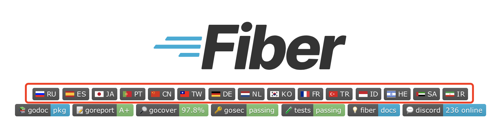

大家好，我是 polarisxu。

每次发框架相关的文章，总有人提到 Go Fiber 框架。于是乎，学习了下 Fiber，感觉确实挺不错的。因此写下这个 Fiber 系列。

Fiber 项目地址：<https://github.com/gofiber/fiber>，目前 Star 数 15.3k+。

## 01 Fiber 框架

这是一个 Go 语言 Web 框架，启发自 NodeJS 框架：[Express](https://github.com/expressjs/express)。该框架基于 [FastHTTP](https://github.com/valyala/fasthttp) 构建，旨在**简化**、**零内存分配**和**提高性能**，以便**快速**开发。

> 如果你是一位 NodeJS 开发者，想学习 Go，这个框架应该很适合你，同时这里还有一份专门为 NodeJS 开发者准备的 Go 学习资料：<https://github.com/miguelmota/golang-for-nodejs-developers>

这个框架是 2020 年 1 月份启动开发的，没想到短时间就受到很多人关注。从 README 的多国语言就可见一斑：



从第三方性能测试结果看，Fiber 的表现比 Gin、Echo 好很多。这里有详细的 Benchmark 测试说明：<https://docs.gofiber.io/extra/benchmarks>。

摘抄一段官方关于 Fiber 的哲学：

> Fiber 作为一个 Web 框架 ，是按照极简主义的思想并遵循 UNIX 方式创建的，因此新的 gopher 可以在热烈和可信赖的欢迎中迅速进入 Go 的世界。
>
> Fiber 受到了互联网上最流行的 Web 框架 Express 的启发 。我们结合了 Express 的易用性和 Go 的原始性能 。如果您曾经在 Node.js 上实现过 Web 应用程序(使用 Express 或类似工具)，那么许多方法和原理对您来说应该非常易懂。
>
> 我们关注 整个互联网 用户在 issues 和 Discord channel 的消息，为了创建一个迅速，灵活以及友好的 Go Web 框架，满足任何任务，最后期限和开发者技能。就像 Express 在 JavaScript 世界中一样。

所以，总结一下 Fiber 的特点（优势）：

- 强大的路由
- 静态文件服务
- 极致高性能
- 内存占用低
- API 接口
- 中间件和 Next 支持
- 快速服务器端编程
- 支持各种模版引擎
- WebSocket 支持
- 频率限制器
- 文档被翻译为 16 种语言

不过有两点需要注意，Fiber 使用了 unsafe 和 fasthttp，所以可能和 Go 最新版本有兼容性问题。目前 Fiber 2.18.0 兼容 Go 1.14 到 Go1.17；但 fasthttp 和 net/http 是不兼容的，因此 net/http 生态的项目无法使用在 fiber 上。

## 02 和 Express 的简短比较

既然是受 Express 启发，那就和它比较下。

### Hello World

基于 Express 的 Hello World 程序：

```js
const express = require("express"); // 引用 Express library
const app = express(); // 创建一个 Express 实例

// 路由：/ endpoint
app.get("/", (req, res) => {
  res.send("Hello World!");
});

// 在 3000 端口启动服务
app.listen(3000);
```

确实挺简单，几行代码就搞定了一个 Web 服务。

现在用 Fiber 实现类似上面的功能：

```go
package main

import "github.com/gofiber/fiber/v2" // 注意，最新版本是 v2.18.0，所以有 v2

func main() {
  app := fiber.New() // 创建一个 Fiber 实例

  // 路由：/ endpoint
  app.Get("/", func(c *fiber.Ctx) error {
    return c.SendString("Hello, World!")
  })

  // 在 3000 端口启动服务
  app.Listen(":3000")
}
```

目前，几乎所有 Go 框架都是类似的路子，没有太多好解释的。

Fiber 启动后终端的输出结果：

```bash
$ go run main.go

 ┌───────────────────────────────────────────────────┐
 │                   Fiber v2.18.0                   │
 │               http://127.0.0.1:3000               │
 │       (bound on host 0.0.0.0 and port 3000)       │
 │                                                   │
 │ Handlers ............. 2  Processes ........... 1 │
 │ Prefork ....... Disabled  PID ............. 83538 │
 └───────────────────────────────────────────────────┘
```

### 路由和端点

任何 Web 应用程序、微服务或 API 都包含一个基于描述 HTTP 方法的端点（endpoint）和处理程序函数的路由系统，只有在这个端点接收到客户端的请求后才会执行这个路由系统。

除了上面的 HTTP GET 方法，Express 和 Fiber 还支持其他 HTTP 基本方法（当然还支持其他 HTTP 方法）。

```js
// Endpoint for POST method
app.post("/", (req, res) => {
  // function that stores a new data
});

// Endpoint for PUT method
app.put("/", (req, res) => {
  // function that replaces the existing data
});

// Endpoint for PATCH method
app.patch("/", (req, res) => {
  // function that replaces part of the existing data
});

// Endpoint for DELETE method
app.delete("/", (req, res) => {
  // function that deletes the data
});
```

对应的 Fiber 代码：

```go
// Endpoint for Post method
app.Post("/", func(c *fiber.Ctx) error {
  // function that stores a new data
})

// Endpoint for PUT method
app.Put("/", func(c *fiber.Ctx) error {
  // function that replaces the existing data
})

// Endpoint for PATH method
app.Path("/", func(c *fiber.Ctx) error {
  // function that replaces part of the existing data
})

// Endpoint for DELETE method
app.Delete("/", func(c *fiber.Ctx) error {
  // function that deletes the data
})
```

### 中间件

中间件函数可以访问 HTTP 请求和响应对象，以及调用下一个中间件函数。一般地，中间件函数执行如下动作：

- 执行我们想让其执行的代码
- 对请求或响应对象做任何修改
- 完成请求-响应循环
- 调用堆栈中的下一个中间件函数

看一个中间件的例子，它们在 Express 和 Fiber 中如何写。

```js
app.use(function (req, res, next) {
  // 打印当前时间
  console.log("Date:", Date.now());

  next();
});
```

对应 Fiber 的代码如下：

```go
app.Use(func(c *fiber.Ctx) error {
  // 打印当前时间
  fmt.Println("Date:", time.Now())

  return c.Next()
})
```

### 服务静态文件

Web 应用经常会有静态文件，它们需要能够被请求，比如图片、css/js 文件等。

服务静态文件，一般基于如下几个点：

- 一个存储静态文件的文件夹
- 在 Web 程序中指定挂载点
- 对挂载点进行引用

看看 Express 如何做到的：

```js
app.use(
  "/static", // mount address
  express.static("public") // path to the file folder
);
```

对应 Fiber 的代码如下：

```go
app.Static(
  "/static",  // mount address
  "./public", // path to the file folder
)
```

因此，我们对 `/static/` 下的文件访问，都对应到 public 下的文件。比如：

> `http://localhost:3000/static/images/background.jpg` 对应是 `public/images/background.jpg` 文件

### 使用模板

目前，Go 很多框架对各种模板引擎支持是不够的。但 Fiber 做到了和 Express 类似，支持大量开箱即用的模板引擎，比如：[Pug](https://pugjs.org/)、[Jade](https://jade-lang.com/)、[Mustache](https://mustache.github.io/) 和 [Handlebars](https://handlebarsjs.com/) 等。

以 Pug 为例，看看 Express 和 Fiber 如何使用的。（注意，以下代码会查找 ./views 目录下的 index.pug 文件，没有该文件会报错）

```js
app.set("view engine", "pug");

// 初始化模板文件夹
app.set("views", "./views");

app.get("/", (req, res) => {
  res.render("index", {
    title: "Hey!",
    message: "This is the index template.",
  });
});
```

对应的 Fiber 代码如下（注意，Fiber 对模板的支持是 <https://github.com/gofiber/template> 包）：

```go
// 基于 ./views 文件夹初始化 Pug 模板引擎
engine := pug.New("./views", ".pug")

app := fiber.New(fiber.Config{
  Views: engine, // 设置模板引擎
})

app.Get("/", func(c *fiber.Ctx) error {
  return c.Render("index", fiber.Map{
    "Title":   "Hey!",
    "Message": "This is the index template.",
  })
})
```

## 03 小结

本文简单介绍了 Fiber 的一些特性。因为 Fiber 是受 Express 启发实现的，因此和 Express 进行了对比。不知道你对 Fiber 有什么感觉？

下篇文章会较详细的介绍 Fiber 的一些特性。

## 参考

- <https://dev.to/koddr/go-fiber-by-examples-how-can-the-fiber-web-framework-be-useful-487a>
- <https://docs.gofiber.io/api/fiber>