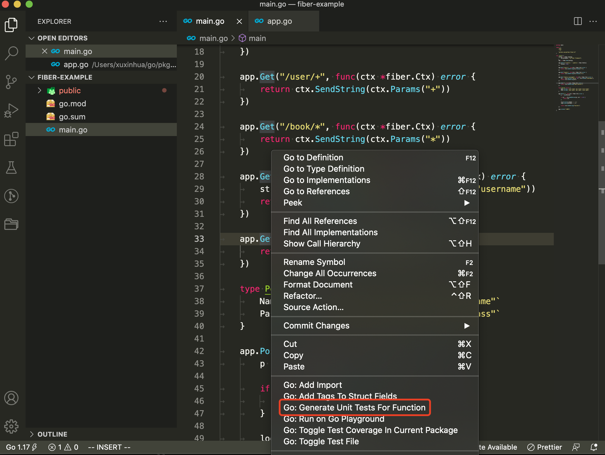

大家好，我是 polarisxu。

实际项目中，大家经常不会对 Web API 写单元测试。Go 标准库不仅有 testing 包支持普通单元测试，还有 net/http/httptest 包支持 HTTP 的测试。

本文虽然是测试 Fiber 应用程序，但对其他的框架也适用。

## 01 如何测试

Web API 的单元测试如何进行？

本节介绍的测试方法主要是验证请求返回的 HTTP 状态码是否符合预期。

如果返回的状态码是 200 OK，那么表示这个测试用例成功（Pass），如果返回的状态码是 404 Not Found，那么表示这个测试用例失败（Fail）。所以，要求请求返回正确的状态码。

## 02 VSCode 生成测试

VSCode 安装了 Go Team 的 Go 插件后，可以一键生成单元测试。

在某个函数上右键，出现的菜单中会有 `Generate Unit Tests For Function`：



点击它会自动创建 main_test.go 文件，并生成类似下面的代码：

```go
package main

import "testing"

func Test_main(t *testing.T) {
	tests := []struct {
		name string
	}{
		// TODO: Add test cases.
	}
	for _, tt := range tests {
		t.Run(tt.name, func(t *testing.T) {
			main()
		})
	}
}
```

## 03 动手写单元测试

动手之前，需要先介绍下 Fiber 中专门针对测试提供的方法：

```go
// Test is used for internal debugging by passing a *http.Request.
// Timeout is optional and defaults to 1s, -1 will disable it completely.
func (app *App) Test(req *http.Request, msTimeout ...int) (resp *http.Response, err error)
```

该方法接收一个 `*http.Request`，返回 `*http.Response`，通过这个 Response 可以获得 HTTP StatusCode。

待测试的程序如下：

```go
// main.go
package main

import (
	"github.com/gofiber/fiber/v2"
)

func setupRoutes(app *fiber.App) {
	app.Get("/hello", func(ctx *fiber.Ctx) error {
		return ctx.SendString("Hello World!")
	})
}

func main() {
	app := fiber.New()
	setupRoutes(app)
	app.Listen(":3000")
}
```

测试程序如下：

```go
package main

import (
	"net/http/httptest"
	"testing"

	"github.com/gofiber/fiber/v2"
	"github.com/stretchr/testify/assert"
)

func TestHelloRoute(t *testing.T) {
	tests := []struct {
		description  string
		route        string // route path to test
		expectedCode int    // expected HTTP status code
	}{
		{
			description:  "get HTTP status 200",
			route:        "/hello",
			expectedCode: 200,
		},
		{
			description:  "get HTTP status 404, when route is not exists",
			route:        "/notfound",
			expectedCode: 404,
		},
	}

	app := fiber.New()

	setupRoutes(app)

	for _, test := range tests {
		// 利用 httptest 包生成 request
		req := httptest.NewRequest("GET", test.route, nil)
		resp, _ := app.Test(req, 1)
		assert.Equalf(t, test.expectedCode, resp.StatusCode, test.description)
	}
}
```

我们还用了 `github.com/stretchr/testify` 库，这是一个辅助测试的库，assert 是它的子包，用于进行断言。

然后运行如下命令测试：

```bash
$ go test -v .
=== RUN   TestHelloRoute
--- PASS: TestHelloRoute (0.00s)
PASS
ok  	github.com/polaris1119/fiber-example
```

## 04 总结

本文从 HTTP 状态码的维度测试 Web API，保证 API 大的逻辑正确，但不包括业务逻辑相关的测试。
