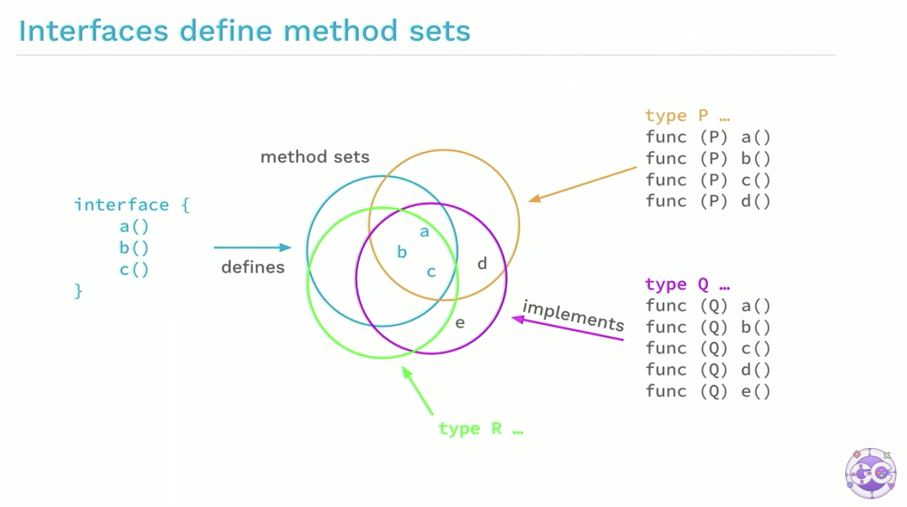
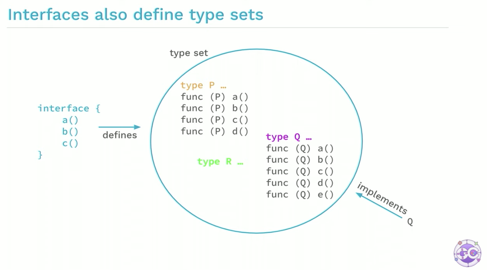
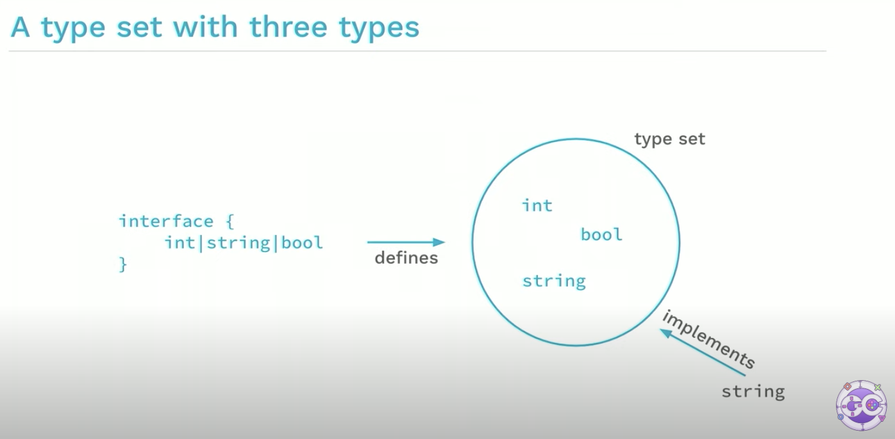

大家好，我是 polarisxu。

在 GopherCon 2021 年大会上，Go 两位作者 Robert Griesemer 和 Ian Lance Taylor 做了泛型相关的演讲，即将在 Go1.18 发布的 Go 泛型，正是两位设计的。一直想着把他们的演讲做一个梳理，然后分享给大家。拖的有点久，趁春节假期整理出来了。

> 注意，本文中的 constraints 包，已经确定在 Go1.18 正式版中去除，放入 golang.org/x/exp 中。详细可以参考该文：[Go1.18 这个包确定没了](https://mp.weixin.qq.com/s/odWcML2OIlT97EXbhYcZNQ)。

Go1.18 关于泛型部分，主要有三个特性：

- Type parameters for functions and types，即函数和类型的类型参数
- Type sets defined by interfaces，即由接口定义的类型集合
- Type inference，即类型推断

## 1、类型参数

先看函数的类型参数。

### 类型参数列表（Type parameter lists）

类型参数列表看起来是带方括号的普通参数列表。通常，类型参数以大写字母开头，以强调它们是类型：

```go
[P, Q constraint1, R constraint2]
```

看一个例子。

非泛型版本的求最小值：

```go
func min(x, y float64) float64 {
  if x < y {
    return x
  }
  return y
}
```

如果有 int 类型的 min 版本需求，得另外写一个类似的函数，这完全是重复代码。

那泛型版本呢？

```go
func min[T constraints.Ordered](x, y T) T {
  if x < y {
    return x
  }
  return y
}
```

注意和上面版本的区别。

- 多了一个 `[T constraints.Ordered]`，这就是类型参数列表，声明了一个类型 T，它的约束是 constraints.Ordered，即类型 T 满足它规定的条件
- 参数类型 float64 变成了 T，而不是具体的某个类型

那这个泛型函数如何调用呢？

```go
m := min[int](2, 3)
```

是不是很奇怪？其实仔细一琢磨，好像没问题。因为函数声明中有  `[T constraints.Ordered]`，跟普通的函数参数有点像。调用时，提供 int，表明普通函数参数是 int 类型。

### 实例化

在调用时，会进行实例化过程：

1）用类型实参（type arguments）替换类型形参（type parameters）

2）检查类型实参（type arguments）是否实现了类型约束

如果第 2 步失败，实例化（调用）失败。

所以，调用过程可以分解为以下两步：

```go
fmin := min[float64]
m := fmin(2.3, 3.4)

// 和下面等价
m := min[float64](2.3, 3.4)
// 相当于 m := (min[float64])(2.3, 3.4)
```

所以，实例化产生了一个非泛型函数。

### 类型的类型参数

类型也可以有类型参数。通过一个例子理解一下。

一个泛型版二叉树：

```go
type Tree[T interface{}] struct {
	left, right *Tree[T]
	data        T
}

func (t *Tree[T]) Lookup(x T) *Tree[T]

var stringTree Tree[string]
```

注意其中的 `[T interface{}]` ，跟函数的类型参数语法是一样的，T 相当于是一个类型，所以，之后用到 Tree 的地方，T 都跟随着，即 `Tree[T]`，包括方法的接收者（receiver）。

注意实例化的地方：`var stringTree Tree[string]`，和上面两个实例化步骤中的第一步一样。

## 2、类型集合（Type sets）

先看值参数的类型（the type of value parameters）。

函数普通参数列表中的每个值参数都有一个类型，这个类型定义值的集合。比如 float64 定义了浮点数值的集合。

相应的有类型参数的类型（the type of type parameters），也就是说，类型参数列表中的每个类型参数都有一个类型，这个类型定义了类型的集合，这叫做类型约束（type constraint）：

```go
func min[T constraints.Ordered](x, y T) T
```

这里的 constraints.Ordered 是类型参数列表中的 T 参数的类型，它定义了类型的集合，即类型约束。

constraints.Ordered 是 Go1.18 内置的一个类型约束，它有两个功能：

- 只有值支持排序的类型才能传递给类型参数 T；
- T 类型的值必须支持 `<` 操作符，因为函数体中使用了该操作符。

### 类型约束是接口

大家都知道接口定义了方法集（method sets），演讲中给了一张图：



根据 Go 的规则，类型 P、Q、R 方法中包含了 a、b、c，因此它们实现了接口。

所以，反过来可以说，接口也定义了类型集（type sets）：



上图中，类型 P、Q、R 都实现了左边的接口（因为都实现了接口的方法集），因此我们可以说该接口定义了类型集。

既然接口是定义类型集，只不过是间接定义的：类型实现接口的方法集。而类型约束是类型集，因此完全可以重用接口的语义，只不过这次是直接定义类型集：



这就是类型约束的语法，通过接口直接定义类型集：

```go
type Xxx interface {
  int | string | bool
}
```

而 constraints.Ordered 的定义如下：

```go
// Ordered is a constraint that permits any ordered type: any type
// that supports the operators < <= >= >.
// If future releases of Go add new ordered types,
// this constraint will be modified to include them.
type Ordered interface {
	Integer | Float | ~string
}
```

Ordered 定义了所有 interger、浮点数和字符串类型的集合。所以，< 操作符也是支持的。这其中的 Integer、Float 也在 constraints 包有定义。

细心的朋友应该发现了 `~string`，类型前面的 `~`。`~T` 意味着包含底层类型 T 的所有类型集合。

> 如果约束中的所有类型都支持一个操作，则该操作可以与相应的类型参数一起使用

除了将约束单独定义为类型外，还可以写成字面值的形式，比如：

```go
[S interface{~[]E}, E interface{}]
```

这看着有点晕，其实可以直接这么写：

```go
[S ~[]E, E interface{}]
```

Go1.18 中，any 是 interface{} 的别名，因此可以进一步写为：

```go
[S ~[]E, E any]
```

E 是切片的元素类型，`~[]E` 表示底层是 `[]E` 切片类型的都符合该约束。

## 3、类型推断

在调用泛型函数时，提供类型实参感觉有点多余。Go 虽然是静态类型语言，但擅长类型推断。因此泛型这里，Go 也实现了类型推断。

调用泛型版的 min，可以不提供类型实参，而是直接由 Go 进行类型推断：

```go
var a, b, m float64
m := min[float64](a, b)
```

类型推断的细节很复杂，但使用起来还是很简单，大部分时候，跟普通函数调用没有区别。

关于类型推断，演讲中给了一个例子：

```go
func Scale[E constraints.Integer](s []E, c E) []E {
	r := make([]E, len(s))
	for i, v := range s {
		r[i] = v * c
	}
	return r
}
```

这个函数的目的是希望对 s 中的每个元素都乘以参数 c，最后返回一个新的切片。

接着定义一个类型：

```go
type Point []int32

func (p Point) String() string {
	// 实现细节不重要，忽略
	return "point"
}
```

很显然，Point 类型的切片可以传递给 Scale：

```go
func ScaleAndPrint(p Point) {
	r := Scale(p, 2)
	fmt.Println(r.String())
}
```

我们希望对 p 进行 Scale，得到一个新的 p，但发现返回的 r 根本不是 Point：

```go
func main() {
	p := Point{3, 2, 4}
	ScaleAndPrint(p)
}
```

会报错：`r.String undefined (type []int32 has no field or method String)`。

所以，我们应该这样修改 Scale 函数：

```go
func Scale[S ~[]E, E constraints.Integer](s S, c E) S {
	r := make(S, len(s))
	for i, v := range s {
		r[i] = v * c
	}
	return r
}
```

注意其中的变化：加入了泛型 S，以及额外的类型约束 `~[]E`。

调用 Scale 时，不需要 `r := Scale[Point, int32](p, 2)`，因为 Go 会进行类型推断。

正确的完整代码如下：

```go
package main

import (
	"constraints"
	"fmt"
)

func Scale[S ~[]E, E constraints.Integer](s S, c E) S {
	r := make(S, len(s))
	for i, v := range s {
		r[i] = v * c
	}
	return r
}

type Point []int32

func (p Point) String() string {
	// 实现细节不重要，忽略
	return "point"
}

func ScaleAndPrint(p Point) {
	r := Scale(p, 2)
	fmt.Println(r.String())
}

func main() {
	p := Point{3, 2, 4}
	ScaleAndPrint(p)
}
```

## 4、什么时候用泛型

泛型的加入，无疑增加了复杂度。我个人认为，能不用泛型就不用泛型。在演讲中，两位大佬提到，在以下场景可以考虑使用泛型：

- 对于 slice、map、channel 等类型，如果它们的元素类型是不确定的，操作这类类型的函数可以考虑用泛型
- 一些通用目的的数据结构，比如前面提到的二叉树等
- 如果一些函数行为相同，只是类型不同，可以考虑用泛型重构

注意，目前 Go 方法不支持类型参数，所以，如果方法有需要泛型的场景，可以转为函数的形式。

此外，不要为了泛型而泛型。比如这样的泛型就很糟糕：

```go
func ReadFour[T io.Reader](r T) ([]byte, error)
```

而应该使用非泛型版本：

```go
func ReadFour(r io.Reader) ([]byte, error)
```

## 5、总结

泛型是一把双刃剑。泛型的加入，让 Go 不那么简单了。有些代码写出来，可读性可能非常差。我们应该按没有泛型时候写代码，当发现在 Repeat Yourself 时，再考虑能不能用泛型重构，千万别玩什么花样！

最后，放上演讲的视频地址，有兴趣的可以观看：<https://www.youtube.com/watch?v=Pa_e9EeCdy8>。