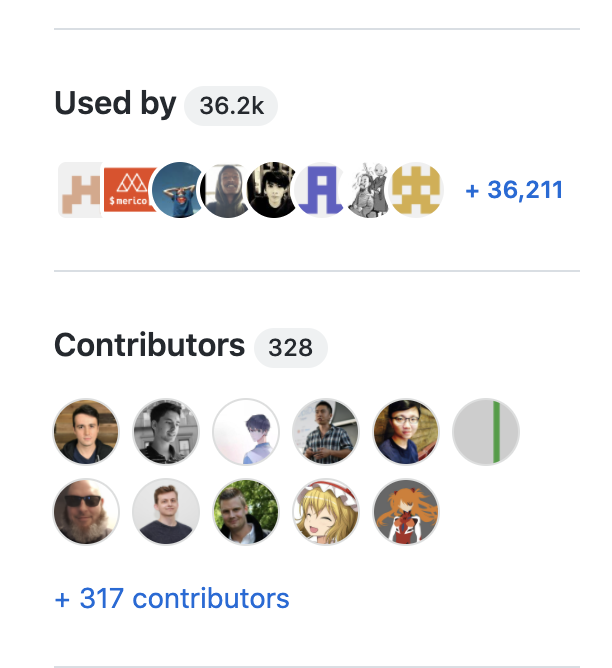
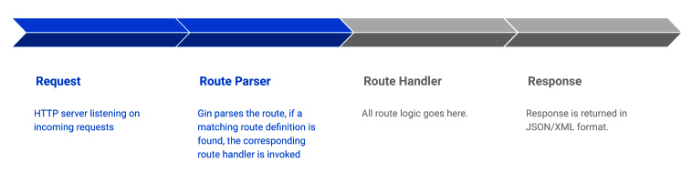

大家好，我是 polarisxu。

从今天起，计划开启 Gin 系列教程。

别问我为什么开一个这样的系列，问就是「希望大家喜欢」。

> 本系列基于的环境：
>
> Mac、Go1.17、Gin1.7.4，开发工具 VSCode + vscode-go 插件。关于这个插件，我之前写过相关文章，可以查阅：[VSCode 开发 Go 程序也可以和 GoLand 一样强大](https://mp.weixin.qq.com/s/J01LY7s6xMB8Lk10sxTFhg)
>
> 本系列参考资料：
>
> - 官方文档
> - 图书：《使用 Gin 构建分布式应用》英文版

## 01 简介

看这个系列的小伙伴，想必已经有了 Go 语言基础，如果没有，请先阅读其他 Go 基础教程。

Go 中 Web 框架很多，Gin 不一定是最好的，但却是受到最多关注和使用的，截止 2021-09-15，Star 数达到了 51.4k+。Gin 是 2014 年启动的（Echo 框架是 2016 年，晚了两年），有一定的先发优势。

在 GitHub 的 Go topic 下，Gin 框架排在了第 6 位（Star 数排名）。在 Gin 框架仓库主页可以看到，目前有 328 位贡献者，被 36.2k+ 项目使用（这是 GitHub 新增的功能）：



Gin 号称高性能，这得益于先辈们的努力（踩在巨人的肩膀上）。它的路由是基于开源库：<https://github.com/julienschmidt/httprouter> 实现的。而 Gin 的 API 风格，仿照 martini 设计的，这是一个 2013 年创建的 Web 框架，该框架很早就不维护了：<https://github.com/go-martini/martini>。

Gin 仓库主页：<https://github.com/gin-gonic/gin>，官网：<https://gin-gonic.com>，有中文版（汉化不完全）。

Gin 框架由如下特性：

- 文档友好。
- 简单。Gin 是轻量级的框架，核心只包括必要的功能。其他更多特性可以通过插件的方式引入。它更适合用来开发 API，而不是后台管理系统。
- 灵活。这主要体现在很容易的通过中间件扩展。
- 高性能。官方有给性能测试。

## 02 安装并使用

都 Go1.17 了，必须使用 Go Module。

执行如下命令：

```bash
$ mkdir ~/gin-tutorial
$ cd ~/gin-tutorial
$ go mod init github.com/polaris1119/gin-tutorial
$ touch main.go
$ code .
```

最后一行命令会打开 VSCode。

在 main.go 中输入如下内容：

```go
package main

import (
  "net/http"
  
  "github.com/gin-gonic/gin"
)

func main() {
	router := gin.Default()
	router.GET("/", func(c *gin.Context) {
		c.JSON(http.StatusOK, gin.H{
			"message": "Hello World",
		})
	})
	router.Run()
}
```

然后在终端执行如下命令：

```bash
$ go mod tidy
go: finding module for package github.com/gin-gonic/gin
go: downloading github.com/gin-gonic/gin v1.7.4
go: found github.com/gin-gonic/gin in github.com/gin-gonic/gin v1.7.4
go: downloading github.com/gin-contrib/sse v0.1.0
go: downloading github.com/golang/protobuf v1.3.3
go: downloading github.com/stretchr/testify v1.4.0
go: downloading github.com/json-iterator/go v1.1.9
go: downloading github.com/ugorji/go/codec v1.1.7
go: downloading gopkg.in/yaml.v2 v2.2.8
go: downloading golang.org/x/sys v0.0.0-20200116001909-b77594299b42
go: downloading github.com/go-playground/assert/v2 v2.0.1
go: downloading github.com/davecgh/go-spew v1.1.1
go: downloading github.com/pmezard/go-difflib v1.0.0
go: downloading gopkg.in/check.v1 v0.0.0-20161208181325-20d25e280405
go: downloading github.com/modern-go/concurrent v0.0.0-20180228061459-e0a39a4cb421
go: downloading github.com/modern-go/reflect2 v0.0.0-20180701023420-4b7aa43c6742
go: downloading github.com/ugorji/go v1.1.7
```

安装了最新的 Gin 版本：1.7.4。（依赖可以通过 `go list -m all` 命令查看）

接着运行该项目：

```bash
$ go run main.go
[GIN-debug] [WARNING] Creating an Engine instance with the Logger and Recovery middleware already attached.

[GIN-debug] [WARNING] Running in "debug" mode. Switch to "release" mode in production.
 - using env:	export GIN_MODE=release
 - using code:	gin.SetMode(gin.ReleaseMode)

[GIN-debug] GET    /                         --> main.main.func1 (3 handlers)
[GIN-debug] Environment variable PORT is undefined. Using port :8080 by default
[GIN-debug] Listening and serving HTTP on :8080
```

通过输出可以看到几个信息：

- 建议使用 Logger 和 Recovery 中间件；
- 当前运行在 debug 模式，有两种方式可以切换到 release 模式。一般建议通过配置文件+代码的方式来控制。生成环境请确保运行在 release 模式；
- 可以通过环境变量 PORT 指定监听的端口，如果没有指定，默认使用 8080。当然也可以往 Run 中传递端口。

打开浏览器访问 `http://localhost:8080/` 可以看到输出：

```json
{"message": "Hello World"}
```

同时，在终端看到有如下日志：

```bash
[GIN] 2021/09/15 - 11:52:52 | 200 |     197.714µs |             ::1 | GET      "/"
```

下图显示了 Gin 处理一个 HTTP Request 的过程。



## 03 自定义 HTTP Handler

通过前面的示例，我们看看 router.GET 的签名：

```go
func (group *RouterGroup) GET(relativePath string, handlers ...HandlerFunc) IRoutes

// HandlerFunc defines the handler used by gin middleware as return value.
type HandlerFunc func(*Context)
```

可见，自定义 HTTP Handler 就是定义一个函数，它的参数是：`*gin.Context`。将上面的示例代码改下：

```go
package main

import (
	"net/http"

	"github.com/gin-gonic/gin"
)

func IndexHandler(c *gin.Context) {
	c.JSON(http.StatusOK, gin.H{
		"message": "Hello World",
	})
}

func main() {
	router := gin.Default()
	router.GET("/", IndexHandler)
	router.Run()
}
```

通过将 Handler 和路由分离，有利于管理和单元测试。

此外，Gin 框架可以从请求 URL 中提取片段。比如希望请求 `http://localhost:8080/polarisxu` 时，返回：`Hello polarisxu`，可以这么实现：

```go
package main

import (
	"net/http"

	"github.com/gin-gonic/gin"
)

func IndexHandler(c *gin.Context) {
	name := c.Param("name")
	c.JSON(http.StatusOK, gin.H{
		"message": "Hello " + name,
	})
}

func main() {
	router := gin.Default()
	router.GET("/:name", IndexHandler)
	router.Run()
}
```

注意其中的 `/:name` 路由和 `name := c.Param("name")`。

除了返回 JSON 格式，Gin 还默认支持返回 HTML、XML、YAML、ProtoBuf 等，这里就不一一举例。

## 04 总结

本文通过一个简单的示例程序，相信大家对 Gin 有了一个初步印象。对其中的原理，后续文章慢慢了解。

从下篇起，一步步介绍通过 Gin 构建分布式微服务需要掌握的知识。

