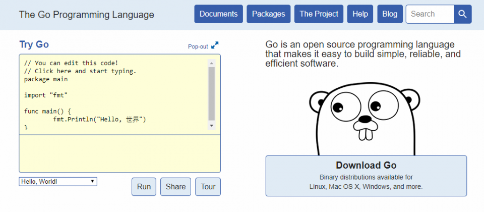
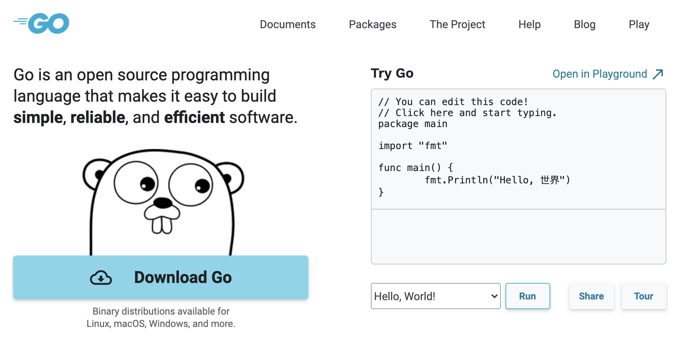

大家好，我是 polarisxu。

最近 618，阿里云等云厂商都在促销，我之前有一台服务器在华为云，正好要过期了，发现续费要 2500 左右。而阿里云新客买一台服务器，3 年才 179.9（1 核 2 G），用来镜像一个 Go 官网还是绰绰有余的。因为很早就镜像过 Go 官网，这次发现官网搭建又有了很大变化，因此决定回顾下 Go 官网的演变。

> 新人常年有优惠，比如 99 元/年。有兴趣的可以购买：<https://www.aliyun.com/1111/new?userCode=tdj9sqcr>，如果不是新客，可以使用家里人的身份注册。

大家应该知道，Go 官网 <https://golang.org> 我们默认访问不了。这对很多新手来说挺困惑的。所以我很早就搞了一个 Go 官网镜像：<https://docs.studygolang.com>。下面就聊聊我搭建官网的一些事，也是官网的演变史。

## 01 自带官网

Go 1.0 发布时，安装包中自带 godoc 程序，通过该程序可以在本地搭建一个官网镜像：

```bash
godoc -http=:6060
```

打开浏览器访问 http://localohst:6060 ，看到如下页面：



这解决了我们访问不了 Go 官网的问题，我也借此搭建了一个 Go 官网镜像：<https://docs.studygolang.com>。

## 02 从主仓库剥离

从 Go1.2 开始，godoc 从 Go 主仓库剥离，放入了 <https://github.com/golang/tools> 中。这时，如果想要本地搭建 Go 官网镜像，可以通过 go get 命名安装：

```bash
go get golang.org/x/tools/cmd/godoc
```

但那时候这样多半安装不成功，因为 golang.org 访问不了。

## 03 官网改版

2019 年，官网做了改版，也就是现在的样子。代码也不再使用 golang.org/x/tools/cmd/godoc，而是使用新仓库 <https://github.com/golang/website>，相当于完全重写。

要在本地搭建官网镜像，clone 该仓库代码，然后执行如下命令即可：

```bash
go run ./cmd/golangorg
```

新官网长这样：



但有两个问题：

- 官方博客在单独的域名：<https://blog.golang.org>；
- play 在另一个单独的域名：<https://play.golang.org>；

这两个域名一样访问不了。而且，虽然 Go 官方特意为我们搭建了 <https://golang.google.cn>，但这是阉割版，没有 blog 和 play。

play 主程序在 <https://github.com/golang/tools> 仓库中，而 blog 在 <https://github.com/golang/blog> 中， 为了搭建自己的 blog，得费一番心思。

Go1.16 发布后，使用了 Go  内嵌功能。最近在 website 仓库中，把 blog 也包含进来了（原 blog 仓库也删除了），同时 go.dev 网站主程序也放在了 website 中。

现在 Go 语言中文网搭建的 Go 官网镜像：<https://docs.studygolang.com> 可以正常访问 blog 和 play，欢迎使用。

## 04 总结

Go 官网在 website 仓库中，一个网站涉及几个程序，之前分开好几个项目。现在，通过 website 集中管理，同样的代码放在了该项目的 internal 子包中。

现在自己搭建一个 Go 官网镜像，只要 clone website 仓库代码，运行 `go run ./cmd/golangorg` 即可。
