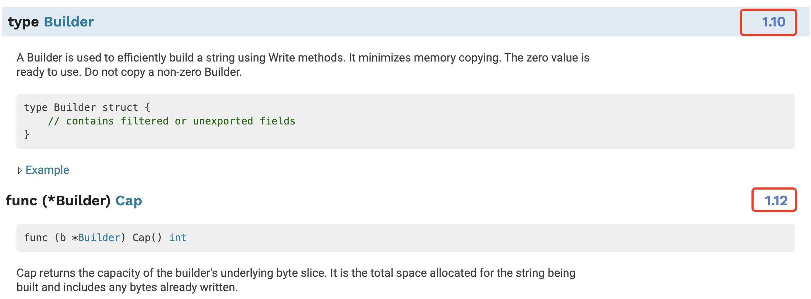
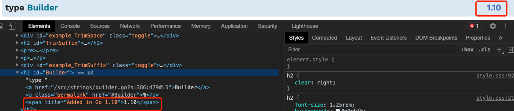
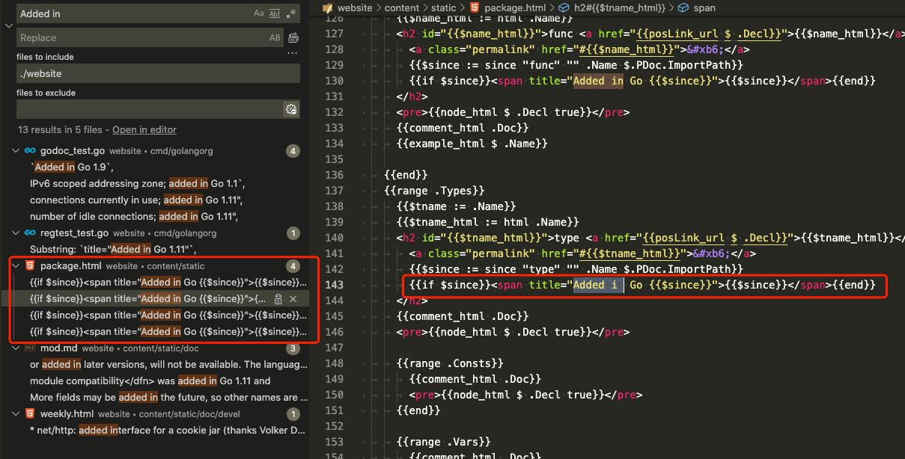
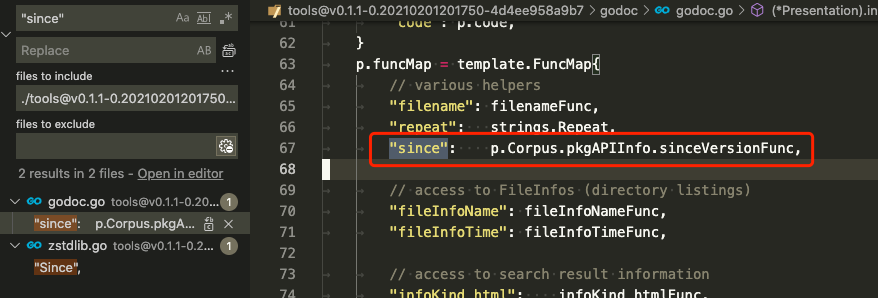
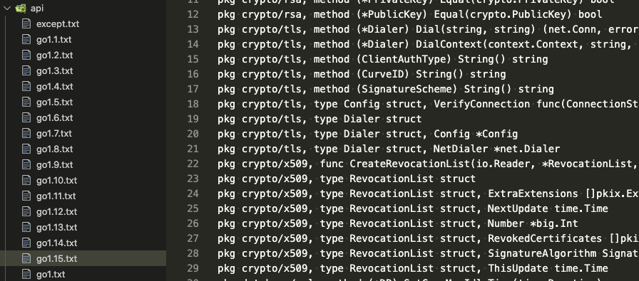

大家好，我是站长 polarisxu。

因为 Go 的兼容性做的很好，很多人不太关心 Go 的具体版本。然而有时候可能会涉及到版本的问题，比如你想使用 strings.Builder，Go 版本就必须 >= 1.10，但以下代码在 Go1.10 却编译不通过。

```go
package main

import (
	"fmt"
  "strings"
)

func main() {
  var b strings.Builder
  b.WriteString("polarisxu")
  fmt.Println(b.Cap())
}
```

编译会报错：

```bash
$ go version
go version go1.10.8 darwin/amd64
$ go run main.go
# command-line-arguments
./main.go:11:15: b.Cap undefined (type strings.Builder has no field or method Cap)
```

提示 strings.Builder 类型没有 Cap 字段或方法。

所以，你知道标准库中哪个 API 是什么版本引入的吗？或者更实际的是，我当前的版本是否能使用某个 API。

## 01 常见的两种方式

在 Go 官网有最新稳定版本的标准库文档。从 Go1.11 版本开始，在标准库中，每个类型、函数或方法有加入的版本信息，如果没有，表示 Go1.0 就有了，具体 issue 见：<https://github.com/golang/go/issues/5778>。但目前常量和变量没有版本信息，具体 issue 见：<https://github.com/golang/go/issues/29204>。



第二种方法，不是看具体某个 API 对应的版本，而是至少知晓，你当前使用的 Go 版本有没有某个 API，这就是 pkg.go.dev，具体通过这个网站 <https://pkg.go.dev/std?tab=versions> 选择你对应的版本，然后查找是否有对应的 API。

当然了，你使用 GoLand 之类的编辑器，某个 API 是否有，它会自动提示。

## 02 标准库显示版本是如何实现的

保持好奇心很重要，这是求知的动力之一。看到官网标准库显示了版本信息，我就想看看它是怎么实现的。

怎么查找实现的代码？

我的第一反应是看标准库注释里有没有写。

```go
// A Builder is used to efficiently build a string using Write methods.
// It minimizes memory copying. The zero value is ready to use.
// Do not copy a non-zero Builder.
type Builder struct {
	addr *Builder // of receiver, to detect copies by value
	buf  []byte
}
```

没有看到任何版本相关信息。这时你会如何查找？

我的方式是这样的。

1）在页面审查元素，看到 `<span title="Added in Go 1.10">1.10</span>` 节点。



2）Go 官网源码在这里：<https://github.com/golang/website>，在该源码中搜索 `Added in`，找到了 package.html 模板文件。



3）上图中， $since 变量代表了 Go 版本，而它是通过 since 函数得到的： `{{$since := since "func" "" .Name $.PDoc.ImportPath}}`，很显然这是一个自定义模板函数，因此查找它。website 项目没有找到，因此到 [tools](https://github.com/golang/tools) 项目去找：因为 godoc 在这个项目中。



通过这个可以找到 sinceVersionFunc 所在文件：versions.go，然后就能找到如下的代码：

```go
// InitVersionInfo parses the $GOROOT/api/go*.txt API definition files to discover
// which API features were added in which Go releases.
func (c *Corpus) InitVersionInfo() {
	var err error
	c.pkgAPIInfo, err = parsePackageAPIInfo()
	if err != nil {
		// TODO: consider making this fatal, after the Go 1.11 cycle.
		log.Printf("godoc: error parsing API version files: %v", err)
	}
}

func parsePackageAPIInfo() (apiVersions, error) {
	var apiGlob string
	if os.Getenv("GOROOT") == "" {
		apiGlob = filepath.Join(build.Default.GOROOT, "api", "go*.txt")
	} else {
		apiGlob = filepath.Join(os.Getenv("GOROOT"), "api", "go*.txt")
	}

	files, err := filepath.Glob(apiGlob)
	if err != nil {
		return nil, err
	}

	vp := new(versionParser)
	for _, f := range files {
		if err := vp.parseFile(f); err != nil {
			return nil, err
		}
	}
	return vp.res, nil
}
```

通过以上代码可以看出来版本信息是通过读取 GOROOT 下 api/go*.txt 文件获取的。



api 目录下的这些文件维护了每个版本新增的内容。

最终从这些文件中读取的内容会用以下的类型表示：

```go
// pkgAPIVersions contains information about which version of Go added
// certain package symbols.
//
// Only things added after Go1 are tracked. Version strings are of the
// form "1.1", "1.2", etc.
type pkgAPIVersions struct {
	typeSince   map[string]string            // "Server" -> "1.7"
	methodSince map[string]map[string]string // "*Server" ->"Shutdown"->1.8
	funcSince   map[string]string            // "NewServer" -> "1.7"
	fieldSince  map[string]map[string]string // "ClientTrace" -> "Got1xxResponse" -> "1.11"
}
```

这里有类型、方法、函数和（类型）字段，但没有变量和常量，这也就是说变量和常量的版本号显示还未实现。

最后，在 website 项目的 main 函数中有这么一句：

```go
// Initialize the version info before readTemplates, which saves
// the map value in a method value.
corpus.InitVersionInfo()
```

用于初始化版本信息。

## 03 总结

希望你平时生活、学习和工作过程中，能多一些好奇。本文是一个引子，内容不太重要，过程希望能够对你有所启发。当然，如果你计划学习学习 Go 语言官网的实现，也许本文的帮助会更大。