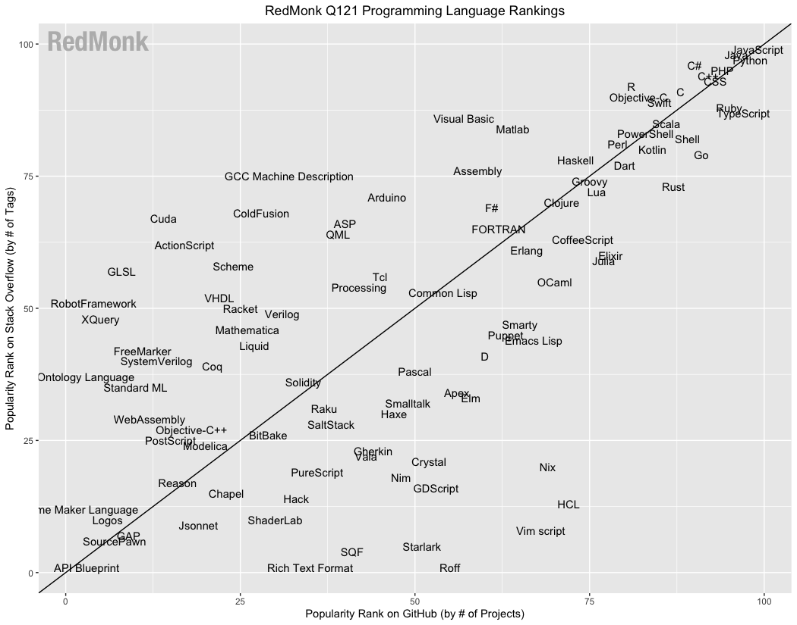

大家好，我是站长 polarisxu。

2021 年 3 月 1 日，RedMonk 发布了 2021 年 1 月 编程语言排行榜（实际是 1 月 和 2 月的数据）。

先介绍下这个排名的依据。RedMonk 从 GitHub 和 Stack Overflow 中提取语言排名，并将它们合并为一个排名，试图反映代码（GitHub）和问答（Stack Overflow）的吸引力。这个想法并不是为了提供一个统计上有效的当前使用情况的表示，而是为了将语言的问答和使用联系起来，努力提取对潜在的未来使用趋势的洞察。

## 01

那这个排名具体是怎么得来的呢？

对于 GitHub，使用的数据源是 GitHub Archive（即某个具体归档点，参考：<https://archiveprogram.github.com/>）。

- 基于仓库的主语言；
- 排除了 fork；
- 使用聚合历史来确定排名；

对于 Stack Overflow，使用其有用的数据浏览器工具收集所需的指标。

一些注意事项：

- 要包含在这个分析中，必须是 GitHub 和 Stack Overflow 中都有的语言；
- 这里没有说这些排名代表了它的广泛使用程度。它们只不过是对两个人群之间相互关系的检验，相信这两个人群可以预测未来的使用情况，因此它们具有一定价值；
- 有许多潜在的社区可以被用来进行这种分析。选择使用 GitHub 和 Stack Overflow 是因为它们的规模，其次是因为它们公开了分析所需的数据。然而，RedMonk 鼓励有关各方使用其他数据来源进行自己的分析；
- 所有的数字排名都应该加了一些盐值。在这里严格按照数字排名是为了引起兴趣。一般来说，数字排名和语言的层次或分组无关。在许多情况下，列表中的一个点与下一个点是无法区分的。
- 排名越下降，可用于语言排名的数据就越少。
- 那些在 Stack Overflow 之外拥有社区的语言，如 Mathematica，在这个轴上的代表性不足。衡量 100 个不同社区站点的过程是不可能的，一方面是因为许多站点没有可用的公共指标，另一方面是因为不同社区站点之间的相互衡量在统计学上是不正确的；

## 02

RedMonk 提供了一个图表：



但这张图，看起来挺费劲的。于是 RedMonk 提供了一份数字排名：

```bash
1 JavaScript
2 Python
3 Java
4 PHP
5 C#
5 C++
5 CSS
8 TypeScript
9 Ruby
10 C
11 Swift
12 R
13 Objective-C
14 Shell
14 Scala
16 Go
17 PowerShell
18 Kotlin
19 Rust
19 Perl
```

接着 RedMonk 对这个排名和上次的变化做了分析。这里着重看看对 Go 语言的分析：

> 首先，Go 语言相比上次下降了一位。RedMonk 提到，Go 的排名不如它的发展轨迹重要，也就是说，Go 的排名没那么重要，关键在于它的发展轨迹。RedMonk 认为，在经历了最初的快速增长期，并在 2018 年以第 14 位的排名达到顶峰之后，Go 语言充其量只是一种静止的语言，可以说**正在走向衰落**。

这结论也太草率了吧？排名降了一点，就说它走向衰退了？RedMonk 进一步解释：

> 这其中的一些原因可以 Go 的应用市场相对于其他语言来说更窄。Red Monk 认为，Java 是后端应用程序的主要竞争对手，在经历了这么多年的服务之后，它仍然是一种非常重要且被广泛使用的语言，而不是逐渐消失。

用 Java 做对比，似乎无法反驳？然而，毕竟 Java 这么多年了，体量和生态在那摆着。想想世界上最好的语言 PHP，在这个名单中依然排在第 4，但国内普遍还是认为 PHP 在走下坡路。很多 PHPer 都在学习 Go。

RedMonk 进一步提到说，如果 Go 希望成为真正的行业力量，必须做一些改变。文中提到要在 path 和 structure 上改变。实话说，不知道这指的是什么。

不可否认，世界上没有银弹，Go 自然也有它的不足，哪门语言不是呢？！但 Go 这几年越来越受欢迎，肯定由它的原因。我从 Go 语言中文网的流量数据以及这几年国内大厂的招聘情况，很明显的感觉到，Go 在国内热度持续上升，甚至上升的速度比之前更快！

## 03

此外 RedMonk 还有对其他一些语言的分析、评价，整体上，我很不认可通过这个排名做出的一些判断（哈哈哈，不知道有没有个人情感因素在里面）。你怎么认为？欢迎交流！

> 详细排名和分析见 <https://redmonk.com/sogrady/2021/03/01/language-rankings-1-21/>