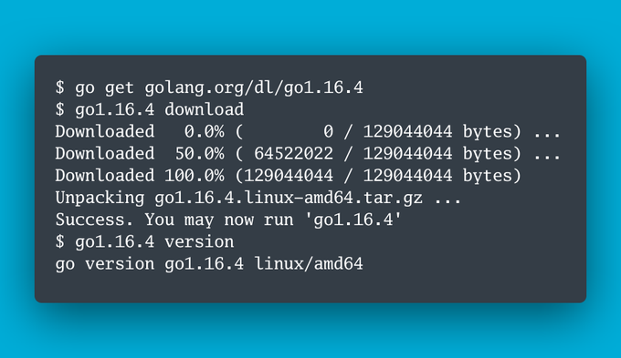
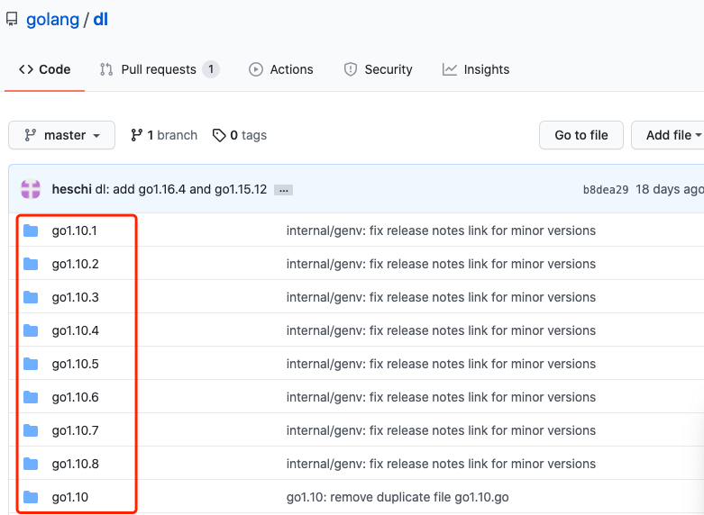

大家好，我是 polarisxu。

有些人可能注意到，每次 Go 发布新版本，官方都会提供类似这样的升级截图：



这可以说是官方的 Go 多版本管理，也是升级 Go 的方式。今天就一起聊一聊这种多版本管理方式及其实现原理。（我之前介绍过一个第三方多版本管理工具 [goup](https://mp.weixin.qq.com/s/yTblk9Js1Zcq5aWVcYGjOA)，是我比较推荐的）。

> 注意，Windows 用户应该使用 WSL2。

## 01 为什么需要多个 Go 版本

有些人可能觉得没有这样的需求。实际工作中，这样的需求还是很常见的。以下一些场景，可能会希望有多版本：

- 一般为了稳定，线上版本通常不会激进升级到最新版本，但你本地很可能想试用新版本的功能。这时候就希望能方便的支持多版本；
- 为了测试或重现特定的问题，希望能够在特定的版本进行，这是为了避免不同版本干扰。
- 。。。

多版本并存，让我们可以更自如的使用 Go。

## 02 官方多版本的使用方式

根据上面的图，安装某个版本的 Go，跟一般 Go 包安装一样，执行 go get 命令：

```bash
$ go get golang.org/dl/go<version>		// 其中 <version> 替换为你希望安装的 Go 版本
```

这一步，只是安装了一个特定 Go 版本的包装器，真正安装特定的 Go 版本，还需要执行如下命令：

```bash
$ go<version> download			// 和上面一样，<version> 是具体的版本
```

因此，如果需要安装 Go1.16.4，执行如下两个命令即可。

```bash
$ go get golang.org/dl/go1.16.4
$ go1.16.4 download
```

几个注意的点：

- 有一个特殊的版本标记：gotip，用来安装最新的开发版本；
- 因为 golang.org 访问不了，你应该配置 GOPROXY（所以，启用 Module 是必须的）；
- 跟安装其他包一样，go get 之后，go1.16.4 这个命令会被安装到 `$GOBIN` 目录下，默认是 `~/go/bin` 目录，所以该目录应该放入 PATH 环境变量；
- 没有执行 download 之前，运行 go1.16.4，会提示 `go1.16.4: not downloaded. Run 'go1.16.4 download' to install to ~/sdk/go1.16.4`；

可见，最后下载下来的 Go 放在了 ~/sdk/go1.16.4 目录下。

现在你是否有这样的疑问：没执行 download 之前，直接运行 go1.16.4 会报错，执行之后，它就成了具体的 Go 命令了，怎么做到的？

## 03 扒一扒原理

`golang.org/dl/go<version>` 对应的源码在 <https://github.com/golang/dl>（这是一个镜像）。

查看该仓库代码，发现一堆以各个版本命名的目录：



可见，每次发布新版本，都需要往这个仓库增加一个对应的版本文件夹。

随便打开一个（比如 go1.16.4），看看里面包含什么文件：

就一个 main.go 文件（从 go get 安装操作，你应该猜到一定有一个 main.go 文件）。

main.go 文件的内容如下：（gotip 的内容不一样，它调用的是 version.RunTip()）

```go
package main

import "golang.org/dl/internal/version"

func main() {
	version.Run("go1.16.4")
}
```

所以，关键在于 internal/version 包的 Run 函数（不同版本，version 参数不同）。注意以下代码我给的注释：

```go
// Run runs the "go" tool of the provided Go version.
func Run(version string) {
	log.SetFlags(0)

  // goroot 获取 go 安装的目录，即 ~/sdk/go<version>
	root, err := goroot(version)
	if err != nil {
		log.Fatalf("%s: %v", version, err)
	}

  // 执行下载操作
	if len(os.Args) == 2 && os.Args[1] == "download" {
		if err := install(root, version); err != nil {
			log.Fatalf("%s: download failed: %v", version, err)
		}
		os.Exit(0)
	}

  // 怎么验证是否已经下载好了 Go？在下载的 Go 中会创建一个 .unpacked-success 文件，用来指示下载好了。
	if _, err := os.Stat(filepath.Join(root, unpackedOkay)); err != nil {
		log.Fatalf("%s: not downloaded. Run '%s download' to install to %v", version, version, root)
	}

  // 运行下载好的 Go
	runGo(root)
}
```

这里主要是下载和运行 Go。

### 下载

我们先看下载、安装 Go。

当执行 go1.16.4 download 时，会运行 install 函数，查看该函数发现，它调用了 versionArchiveURL 函数获取要下载的 Go 的 URL：

```go
// versionArchiveURL returns the zip or tar.gz URL of the given Go version.
func versionArchiveURL(version string) string {
    goos := getOS()

    ext := ".tar.gz"
    if goos == "windows" {
        ext = ".zip"
    }
    arch := runtime.GOARCH
    if goos == "linux" && runtime.GOARCH == "arm" {
        arch = "armv6l"
    }
    return "https://dl.google.com/go/" + version + "." + goos + "-" + arch + ext
}
```

也就是从 https://dl.google.com 下载 Go 包，最终的包（是一个归档文件，Wiindows 下是 .zip，其他系统是 .tar.gz）会放到 ~/sdk/go1.16.4 目录下。

之后通过 sha256 验证文件的完整性（因为服务端放了 sha256 校验文件），最后解压缩，并创建上面说的 `.unpacked-success` 空标记文件。这样这个版本的 Go 就安装成功了。

> 注意，gotip 的下载是通过 git 获取源码的方式进行的，它会通过源码构建安装最新的 gotip 版本。具体逻辑在 internal/version/gotip.go 中。

### 运行

因为下载的 Go 是预编译好的，因此可以直接使用。

但是它将 Go 下载到了 `~/sdk/go<version>` 目录下了，我们并没有将这个目录的 bin 目录加入 PATH，因此直接 go 命令运行的还是之前的版本，而不是刚安装的 go1.16.4。这个问题我们一会再说，先看看为什么这个时候 go1.16.4 命令可以当作 go 命令来使用。

上文说了，go1.16.4 只是一个包装器。当对应的 Go1.16.4 安装成功后，再次运行 go1.16.4，会执行 internal/version/version.go 中的 runGo(root) 函数。

```go
func runGo(root string) {
    gobin := filepath.Join(root, "bin", "go"+exe())
    cmd := exec.Command(gobin, os.Args[1:]...)
    cmd.Stdin = os.Stdin
    cmd.Stdout = os.Stdout
    cmd.Stderr = os.Stderr
    newPath := filepath.Join(root, "bin")
    if p := os.Getenv("PATH"); p != "" {
        newPath += string(filepath.ListSeparator) + p
    }
    cmd.Env = dedupEnv(caseInsensitiveEnv, append(os.Environ(), "GOROOT="+root, "PATH="+newPath))

    handleSignals()

    if err := cmd.Run(); err != nil {
        // TODO: return the same exit status maybe.
        os.Exit(1)
    }
    os.Exit(0)
}
```

该函数通过 os/exec 包运行 `~/sdk/go1.16.4/bin/go` 命令，并设置好响应的标准输入输出流等，同时为新运行的进程设置好相关环境变量，可以认为，执行 go1.16.4，相当于执行 `~/sdk/go1.16.4/bin/go`。

所以，go1.16.4 这个命令，一直都只是一个包装器。如果你希望新安装的 go1.16.4 成为系统默认的 Go 版本，即希望运行 go 运行的是 go1.16.4，方法有很多：

- 将 `~/sdk/go1.16.4/bin/go` 加入 PATH 环境变量（替换原来的）；
- 做一个软连，默认 go 执行 go1.16.4（推荐这种方式），不需要频繁修改 PATH；
- 移动 go1.16.4 替换之前的 go（不推荐）；

## 03 每次升级版本创建一个包装器

手动复制粘贴代码做这件事情肯定是很笨的办法。在 golang.org/dl 中提供了一个工具，可以快速生成对应版本的包装器：<https://github.com/golang/dl/blob/master/internal/genv/main.go>。

```bash
$ genv go1.16.4
```

就可以生成 go1.16.4 包装器。这里的实现，有一个点提一下，它使用了 go list -m -json 命令：

```bash
$ go list -m -json
{
        "Path": "golang.org/dl",
        "Main": true,
        "Dir": "<workspace>/dl",
        "GoMod": "<workspace>/dl/go.mod",
        "GoVersion": "1.11"
}
```

可以方便解析相关信息。

## 04 总结

官方的 Go 多版本管理就介绍完了。总结一下：

- 官方通过 genv 命令生成对应版本的包装器；
- 通过 go get 命令下载安装对应的包装器；
- 运行包装器，提供 download 这个 flag，下载对应版本的 Go 安装包并解压、校验；
- 之后，运行包装器，会执行对应版本的 go 命令；

这样达到了多版本管理的目的。这个设计思路还是可以的。

但这种多版本管理，我认为存在一些问题：

- 上面说的，让某个版本成为默认 Go 版本，没有命令一键搞定；
- 没法知道有哪些版本，比如无法方便的知晓 1.15.13 是否存在，更无法方便的知晓 1.15.x 系列，x 的最大版本；
- 删除某个版本，得手动进行（删除包装器和下载的 Go 安装包）；

你喜欢这种方式管理还是类似 goup 这样的第三方工具呢？你现在是怎么管理多版本的，欢迎交流！

