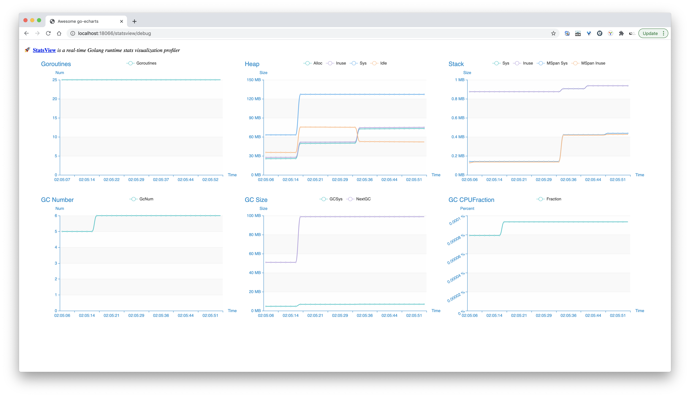

大家好，我是站长 polarisxu。

掌握系统运行状态，知道系统哪些地方可能存在问题，方便进行优化，这是一个实际系统必备的。裸奔，对系统一无所知，迟早是要出大事的。

在 Go 语言中，官方标准库提供了方法，让我们能够获得内存分配、GC 和 Goroutine 等情况。比如内存、GC 等情况，可以通过 runtime.MemStats 获取：<https://docs.studygolang.com/pkg/runtime/#MemStats>，Goroutine 数量可以通过 runtime.NumGoroutine() 函数获得。

一般我们我们需要自己解析 MemStats 信息、做展示，也可以做图表。

之前推荐过一个在浏览器中实时查看 Go 应用程序运行时统计信息（GC，MemStats 等）的库：[statsviz](https://polarisxu.studygolang.com/posts/go/pkg/statsviz/)。今天给大家推荐另外一个库：<https://github.com/go-echarts/statsview>，这是这两天刚出来的。

看长什么样：



我们可以运行下面这段代码得到类似上面的图：

```go
package main

import (
    "github.com/go-echarts/statsview"
    "time"
    "math/rand"
    "strconv"
)

func main() {
    go work()
    mgr := statsview.New()

    // Start() runs a HTTP server at `localhost:18066` by default.
    mgr.Start()

    // Stop() will shutdown the http server gracefully
    // mgr.Stop()
}

func work() {
    // Generate some allocations
    m := map[string][]byte{}

    for {
        b := make([]byte, 512+rand.Intn(16*1024))
        m[strconv.Itoa(len(m)%(10*100))] = b

        if len(m)%(10*100) == 0 {
            m = make(map[string][]byte)
        }

        time.Sleep(10 * time.Millisecond)
    }
}
```

## 01 如何使用

> 都 Go1.15.x 了，请使用 go module。

statsview 的使用较简单。

- import "github.com/go-echarts/statsview”
-  mgr := statsview.New()
- mgr.Start()
- 打开浏览器访问：http://localhost:18066/statsview/debug
- 尽情享受吧~

此外，可以通过 `viewer.SetConfiguration(opts …Option)`改变一些行为，包括：

```go
// WithInterval sets the interval(in millisecond) of collecting and pulling metrics
// default -> 1500
WithInterval(interval int) Option

// WithMaxPoints sets the maximum points of each chart series
// default -> 40
WithMaxPoints(n int) Option

// WithTemplate sets the rendered template which fetching stats from the server and
// handling the metrics data
WithTemplate(t string) Option

// WithAddr sets the listen address
// default -> "localhost:18066"
WithAddr(addr string) Option

// WithTimeFormat sets the time format for the line-chart Y-axis label
// default -> "15:04:05"
WithTimeFormat(s string) Option

// WithTheme sets the theme of the charts
// default -> Macarons
//
// Optional:
// * ThemeWesteros
// * ThemeMacarons
WithTheme(theme Theme) Option
```

例如修改默认端口：

```go
viewer.SetConfiguration(view.WithAddr("localhost:8087")
```

不像之前介绍的 statsviz，statsview 固定使用 net/http，所以集成到项目中只需要让它在单独的一个 goroutine 中运行，单独的端口即可。

```go
go func() {
	mgr := statsview.New()
	mgr.Start()
}()
```

其实这也是在介绍 statsviz 时的最佳实践。毕竟 runtime 信息属于系统内部信息，不适合暴露给公网用户。

## 02 学习相关实现

和 [statsviz](https://polarisxu.studygolang.com/posts/go/pkg/statsviz/) 不同，该库没有使用 WebSocket 协议，直接通过轮询的方式不断获取数据。另外，因为 statsview 是 go-echarts 出的，因此画图也使用的是 [go-echarts](https://github.com/go-echarts/go-echarts) 库。

### 多参数控制

关于 statsview，有一个知识点想跟大家讲一下，那就是多参数控制。

上文提到库可以通过 `viewer.SetConfiguration(opts …Option)` 函数定制一些行为，其中 Option 是一个函数类型：

```go
type Option func(c *config)
```

其中 config 的定义如下：

```go
type config struct {
	Interval   int
	MaxPoints  int
	Template   string
	Addr       string
	TimeFormat string
	Theme      Theme
}
```

该类型的字段用于控制该库的一些行为。它有一个默认的实例：

```go
var defaultCfg = &config{
	Interval:   DefaultInterval,
	MaxPoints:  DefaultMaxPoints,
	Template:   DefaultTemplate,
	Addr:       DefaultAddr,
	TimeFormat: DefaultTimeFormat,
	Theme:      DefaultTheme,
}
```

面对这样的需求，通常的解决方案是：

- 将 config 默认实例导出，使用方直接修改对应字段的值；
- 通过提供一系列函数实现修改，比如 SetInterval(int)

方案一封装性不好，暴露太多细节；而方案二的问题在于，config 的字段类型不一致，通常方案不够优雅。该库的实现方式是定义一个 Option 类型，然后提供一系列具有相似签名的函数来控制这些配置，即上文列出来的 WithXXX 类函数，看其中的一个实现：

```go
// WithAddr sets the listening address
func WithAddr(addr string) Option {
	return func(c *config) {
		c.Addr = addr
	}
}
```

这样通过 WithXXX 函数得到一系列 Option 实例，而 viewer.SetConfiguration 接收一系列 Option 实例，所以使用是就这样了：

```go
viewer.SetConfiguration(viewer.WithTheme(viewer.ThemeWalden), view.WithAddr("localhost:8087"))
```

还有其他案例吗？

### colly 中的案例

[Colly](https://github.com/gocolly/colly) 是一个 Go 语言实现的，快速的、优雅的 Scraper 和 Crawler 框架。它的实例化函数比较“独特”：

```go
func NewCollector(options ...func(*Collector)) *Collector
```

实例化一个类型，一般有以下几种方式：

1. new(T)
2. T{} 或 &T{}
3. 自定义的工厂函数

对于类型中的成员，我们可以在实例化时传递，如第 2、3 种方式；也可以在生成实例后，通过 `t.Field` 的形式赋值（前提是导出的成员）。

一般地，我们在定义工厂函数时，要为类型成员初始化，会给工厂函数定义相应的参数。而 Collector 类型的工厂函数参数，却是一个或多个函数。这样设计有以下方面的原因：

1. Collector 类型的成员较多；
2. 成员的类型多样；
3. 不要求所有的成员必须指定值；

针对这些问题，Collector 工厂类 NewCollector() 巧妙的使用不定参数，而且类型是 `func(*Collector)`，这样可以有选择的配置一个或多个选项，很好地解决了上面的三个问题。它的源码如下：

```go
func NewCollector(options ...func(*Collector)) *Collector {
    c := &Collector{}
    c.Init()

    for _, f := range options {
        f(c)
    }

    c.parseSettingsFromEnv()

    return c
}
```

同时，通过函数的方式来配置选项，就好比很多面向对象语言中的 Set 方法，可以在里面有其他的一些逻辑判断，而不仅仅是设置一个值。比如以下配置函数：

```go
func Debugger(d debug.Debugger) func(*Collector)
```

### BigCache 中的案例

[BigCache](https://github.com/allegro/bigcache) 是一个高性能缓存库。获得它的一个实例是这样的形式：

```go
bigcache.NewBigCache(bigcache.DefaultConfig(10 * time.Minute))
```

即它的构造函数（New 函数）接收一个 Config 对象，这也是要控制多个配置。

因为 Go 不是完全的面向对象语言。当类型中有较多成员，且可以通过外部控制时，根据封装的原则，一般不建议将这些字段导出（公开），但这样一来构造函数就需要能接收很多参数。在 Go 中有两种较常见的设计方法。

1）通过另外一个结构体来控制

比如 bigcache 包中的 Config 结构体。这么做有什么好处？

一方面控制了 BigCache 类型的行为，避免实例化后可以随意更改，起到了封装的作用。另一方面，让构造函数更简洁，只需要接收一个 Config 即可（注意最好使用 Config 值类型，而不是指针）。而且可以通过提供一些 Config 的默认值来做到更易用，比如 bigcache.DefaultConfig() 函数就是这样的例子。

2）通过一个函数类型来控制

比如我们通过这种方式替换 bigcache 包的 Config 结构体。

```go
type BigCacheOption func(*BigCache)

func ShardsNum(shards int) BigCacheOption {
	return func(c *BigCache) {
		c.shards = shards
	}
}

func LifeWindow(eviction time.Duration) BigCacheOption {
	return func(c *BigCache) {
		c.lifeWindow = uint64(eviction.Seconds())
	}
}

// 提供更多的配置选项函数
...
```

通过定义一个函数类型 BigCacheOption 来控制。对 BigCache 类型中非导出的字段，提供相应的函数，该函数返回 BigCacheOption 类型。

针对这种方式，BigCache 的构造函数需要改为如下的形式：

```go
func NewBigCache(options ...BigCacheOption) (*BigCache, error) {
	c := &BigCache{}
	// 省略其他，主要处理 options 部分
	for _, f := range options {
		f(c)
	}

	return c, nil
}
```

## 03 总结

如果你需要实时图表的方式查看系统运行时的一些数据，可能之前介绍的 statsviz 更合适。

该文介绍的通过参数灵活控制系统的方法，希望你能够掌握。