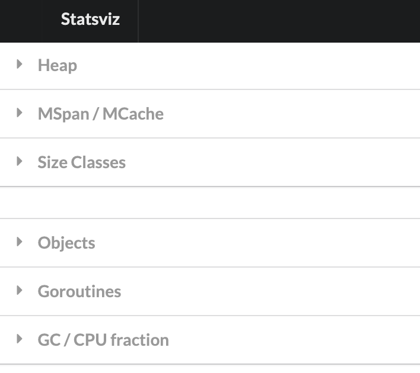
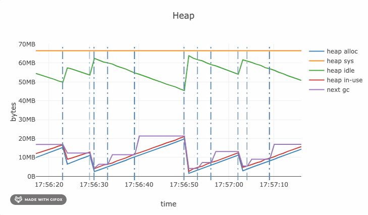

大家好，我是站长 polarisxu。

掌握系统运行状态，知道系统哪些地方可能存在问题，方便进行优化，这是一个实际系统必备的。裸奔，对系统一无所知，迟早是要出大事的。

在 Go 语言中，官方标准库提供了方法，让我们能够获得内存分配、GC 和 Goroutine 等情况。比如内存、GC 等情况，可以通过 runtime.MemStats 获取：<https://docs.studygolang.com/pkg/runtime/#MemStats>，Goroutine 数量可以通过 runtime.NumGoroutine() 函数获得。

一般我们我们需要自己解析 MemStats 信息、做展示，也可以做图表。

今天我给大家推荐一个库：<https://github.com/arl/statsviz>，它是一个在浏览器中实时查看 Go 应用程序运行时统计信息（GC，MemStats 等）的库。

它能展示的信息如下图：



再看其中 Heap 的实时动图：



上面这些通过运行下面这段代码就可以了：

```go
package main

import (
	"math/rand"
	"net/http"
	"strconv"
	"time"

	"github.com/arl/statsviz"
)

func main() {
	// Force the GC to work to make the plots "move".
	go work()

	// Register statsviz handlers on the default serve mux.
	statsviz.RegisterDefault()
	http.ListenAndServe(":8080", nil)
}

func work() {
	// Generate some allocations
	m := map[string][]byte{}

	for {
		b := make([]byte, 512+rand.Intn(16*1024))
		m[strconv.Itoa(len(m)%(10*100))] = b

		if len(m)%(10*100) == 0 {
			m = make(map[string][]byte)
		}

		time.Sleep(10 * time.Millisecond)
	}
}
```

## 1、如何使用

> 都 Go1.15.x 了，请使用 go module。

statsviz 的使用很简单。假设基于 net/http 使用。

- import "github.com/arl/statsviz”
- 注册 statsviz HTTP handlers
- 启动程序
- 打开浏览器访问：http://host:port/debug/statsviz
- 尽情享受吧~

具体看看实际中怎么集成到项目中，根据可能的情况分别介绍。

### 基于 net/http

如果你的项目没有使用框架，直接基于 net/http；或者你的项目并没有提供 HTTP 服务。集成 statsviz 可以按照下面的方式。

**1）一个使用 net/http 的 Web 项目**

只需要 import statsviz 包后，在注册路由的地方加上如下代码：

```go
statsviz.RegisterDefault()
```

这是使用默认的 http.DefaultServeMux，如果你使用的是自定义 Mux，则加上如下类似如下代码：

```go
mux := http.NewServeMux()
statsviz.Register(mux)
```

其中，mux 使用你定义好的。

实际上，statsviz.RegisterDefault() 内部是这么实现的：

```go
func RegisterDefault() {
	Register(http.DefaultServeMux)
}
```

**2）没有提供 HTTP 服务的项目**

这时最简单的方式就是使用 statsviz.RegisterDefault() ，同时需要启动一个 HTTP 服务：

```go
go func() {
  statsviz.RegisterDefault()
  log.Println(http.ListenAndServe("localhost:8080", nil))
}()
```

### 基于兼容 net/http 的框架

因为兼容 net/http 框架，因此可以直接将 statsviz 的 Handler 集成进去。比如对于 gorilla/mux 库，可以这么做：

```go
r := mux.NewRouter()
r.Methods("GET").Path("/debug/statsviz/ws").Name("GET /debug/statsviz/ws").HandlerFunc(statsviz.Ws)
r.Methods("GET").PathPrefix("/debug/statsviz/").Name("GET /debug/statsviz/").Handler(statsviz.Index)

mux := http.NewServeMux()
mux.Handle("/", r)
http.ListenAndServe(":8080", mux)
```

这里主要是 statsviz.Ws 和 statsviz.Index，因为 gorilla/mux 库兼容 net/http，所以可以这么做。

### 不兼容 net/http 的框架

比如集成进 Gin 框架。做法就是和“没有提供 HTTP 服务的项目”一样，另开一个 HTTP 端口。

```go
go func() {
  statsviz.RegisterDefault()
  log.Println(http.ListenAndServe("localhost:8080", nil))
}()
```

因此这里实际上和具体框架没关系。

### 最佳实践

因为 runtime 信息属于系统内部信息，不适合暴露给公网用户。因此，实际上中，最佳实践是，不管什么情况下，都单独开一个 HTTP 端口，类似下面这样，对公网不可访问。

```go
go func() {
  statsviz.RegisterDefault()
  log.Println(http.ListenAndServe("localhost:8080", nil))
}()
```

## 原理简单说明

该库使用 WebSocket 协议，定时将系统的 runtime 数据发送给浏览器，浏览器接收到之后，利用 JS 绘制图表，展示出来。Go 核心代码如下：

```go
// sendStats indefinitely send runtime statistics on the websocket connection.
func sendStats(conn *websocket.Conn) error {
	tick := time.NewTicker(defaultSendPeriod)
	defer tick.Stop()

	var stats stats
	for {
		select {
		case <-tick.C:
			runtime.ReadMemStats(&stats.Mem)
			stats.NumGoroutine = runtime.NumGoroutine()
			if err := conn.WriteJSON(stats); err != nil {
				return err
			}
		}
	}
}
```

对客户端代码感兴趣的请自行阅读源码。

## 总结

如果你需要实时图表的方式查看系统运行时的一些数据，可以尝试下它。用类似这样几行代码一步将它集成进你的系统：

```go
go func() {
  statsviz.RegisterDefault()
  log.Println(http.ListenAndServe("localhost:8080", nil))
}()
```

