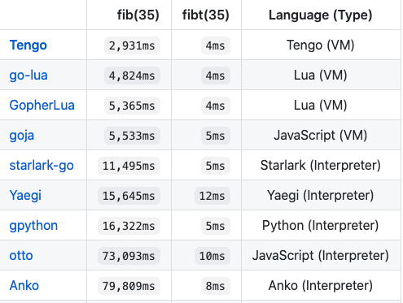

大家好，我是站长 polarisxu。

Go 是一门通用编程语言，Go1.5 实现了自举，也就是说，Go 语言是用它自身实现的。经过十来年的发展，开源界使用 Go 语言实现的编程语言不少，那它们发展的怎么样？本文进行一下梳理。

## 01 Go+

这是国内七牛老大许式伟主导的，对 Go 语言的扩展，专为数据科学领域打造。目标是取代 Python 在数据科学领域的位置。

项目地址：<https://github.com/goplus/gop>，Star 数：4.2k+。

该语言的前身是 qlang，2020 年 6 月份左右将其重命名为 Go+，并定位为数据科学领域。截止目前最新版本是 2021 年 1 月 8 日发布的 0.7.17，还不是稳定版本。

这是一门静态编程语言，完全兼容 Go 语言，类似脚本语言的风格，比 Go 更具可读性的数据科学代码。

例如下面的 Go 代码：

```go
package main

func main() {
    a := []float64{1, 2, 3.4}
    println(a)
}
```

对应的 Go+ 代码如下：

```go
a := [1, 2, 3.4]
println(a)
```

今天刚看到许大在寻找 Go+ 语言开发团队的负责人，有兴趣的可以联系许大（找我转达也没问题）。

目前看，距离目标还有很长的路要走，最少先推出稳定版本，然后有一个线上实际的应用。

## 02 Tengo

Tengo 是一种小型、动态、快速、安全的脚本语言，它使用 Go 语言实现，并且可以嵌入 Go 程序中。它的语法和 Go 语言类似。

项目地址：<https://github.com/d5/tengo>，Star 数：2.2k+，目前最新版本是 2.6.2（2020 年 9 月 18 日发布）。

代码示例：

```go
/* The Tengo Language */
fmt := import("fmt")

each := func(seq, fn) {
    for x in seq { fn(x) }
}

sum := func(init, seq) {
    each(seq, func(x) { init += x })
    return init
}

fmt.println(sum(0, [1, 2, 3]))   // "6"
fmt.println(sum("", [1, 2, 3]))  // "123"
```

## 03 CX

CX 是一种用于区块链的新编程语言，使用 Go 语言实现，语法类似 Go 语言。

项目地址：<https://github.com/skycoin/cx>，Star 数 27，很凄惨。目前最新 tag 是 0.7.5，我查了下，该项目几年前就存在了。目前看属于半死不活的状态，是 skycoin 主导开发的。对区块链不太熟悉，不知道这个语言能为区块链开发带来什么革命性的功能。

我安装试用了下，写了一个 Hello World 程序：

```go
package main

func main() {
		str.print("Hello, World!")
}
```

哈哈哈，我又掌握了一门语言的 Hello World！

## 04 Goby

受 Ruby 启发的面向对象的解释型语言，核心代码 100％ 使用 Go 实现。它具有标准库，可提供多种功能，例如插件系统。

项目地址：<https://github.com/goby-lang/goby>，Star 数 3.2k+，目前最新版本 0.1.13（2020 年 4 月 26 日发布）。

Goby 的预期是用于后端开发。它具备（但不限于）以下功能：

- 基于 Go goroutine 的 thread/channel 机制；
- 内置 database 库；
- json 支持；
- 插件系统，支持动态加载 Go 库（目前不支持 Windows 系统）；
- 可以直接访问 Go 对象；

一个 Server 端 Hello World 的例子：

```ruby
require "net/simple_server"

server = Net::SimpleServer.new("3000")

i = 0

server.get("/") do |req, res|
  puts(i)
  i = i+1
  res.body = req.method + " Hello World"
  res.status = 200
end

server.get("/not_found") do |req, res|
  res.body = "Not Found"
  res.status = 404
end

server.start
```

不知道 Ruby 爱好者喜欢不？！

## 05 总结

除了上面介绍的，还有其他一些 Go 语言实现的语言，比如 chai2010 的 [wa 语言](https://github.com/wa-lang/wa)，以及其他一些脚本语言，如 Lua 虚拟机 Go 实现、JS 虚拟机实现、Python 解释器等。



有兴趣的可以通过 <https://github.com/d5/tengo> 项目的性能测试部分了解。

以上介绍的语言，你有看好的吗？会尝试哪个语言吗？如果你对编程语言实现感兴趣，可以参与其中。