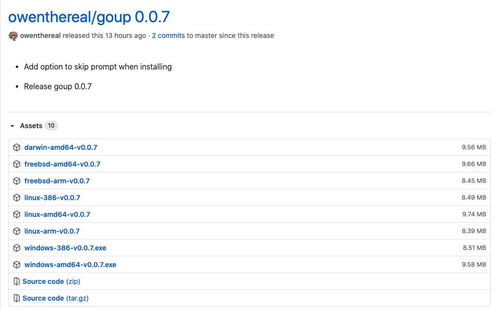

一直以来，我都习惯通过源码安装 Go。我是这么做的：

1）Git clone Go 源码

```bash
$ git clone https://github.com/golang/go
```

2）需要安装什么版本就切换到对应的分支，比如安装 1.15.x

```bash
$ git checkout -b release-branch.go1.15 origin/release-branch.go1.15
```

如果本地之前已经存在该分支，直接 git checkout release-branch.go1.15 即可。

3）将 go 整个目录复制到 /usr/local/go1.15，编译安装

4）创建软链：

```bash
ln -s go1.15 go
```

之后加上环境变量等。

如果想要切换版本，只需要做类似上面的步骤，最后将 go 这个软链指向要切换的版本。

我这种方式存在两个问题：

- 因为 Go1.5 实现了自举，对于没有安装 Go 的系统，需要先安装 Go1.4；
- 每次都编译，还是没那么方便，而且如果是 Windows 系统，可能会有一些问题（现在的 Windows 也可能没问题了？好久没使用 Windows 了，使用 Windows 的朋友可以留言告知下）；

之后看到 [gvm](https://github.com/moovweb/gvm) 这个工具，我试用了，可能是国内网络的原因，根本没法安装 Go，基本卡着不动。此外还有一些其他的解决方案，比如 [goenv](https://github.com/syndbg/goenv)，这是仿照 pyenv 和 rbenv 实现的，安装配置感觉略微有点复杂，直接没尝试。

今天发现另外一个工具，和我手动管理多版本的思路类似，所以爱上了！

## 1、开发 goup 的初衷

发音：Go Up。作者介绍，他开发了这个工具的原因：

1）操作系统发行版的包管理工具一般不会那么及时的升级 Go 到最新版本，特别是 Linux 发行版；

2）虽然安装和管理 Go 版本的工具不少，但作者认为要么存在一些问题，要么体验不好或缺失一些功能；（哈哈哈，很有道理是不是？造一个轮子，总是觉得别人的不够圆，自己的又大又圆，有木有？）

作者想要一个这样的工具：

- 不需要先安装了 Go 的某个版本；（我上面的管理方案就是需要先安装某个版本）
- 这个工具本身安装足够简单，最好一行命令搞定；
- 跨平台，在所有操作系统运行良好，至少在类 Unix 系统运行良好；
- 能方便的安装最新的 Go 版本；
- 能方便的安装 Go 的任意版本，包括 tip；
- 不会污染你的 Shell；
- 使用 Go 语言实现；

## 2、安装 goup

因为 goup 本身是 Go 语言实现的，因此他通过一个脚本下载对应系统的预编译 goup 程序。当前最新版本 0.0.7 （这个工具是 9 月底开发的），当然你也可以自己手动下载这些编译好 goup 程序。（如果你本地安装了 Go 版本，直接 go get -u -v github.com/owenthereal/goup 安装也是可以的）



一行代码安装 goup（推荐的方式）：

```bash
$ curl -sSf https://raw.githubusercontent.com/owenthereal/goup/master/install.sh | sh
```

## 3、使用介绍

看看 goup 的帮助文档：

```bash
$ goup help
The Go installer

Usage:
  goup [command]

Available Commands:
  help        Help about any command
  init        Initialize the goup environment file.
  install     Install Go by providing a version (e.g. "1.15.2", or "tip"). If empty, use the latest version.
  show        Show the current version of installed Go
  version     Show goup version

Flags:
  -h, --help   help for goup

Use "goup [command] --help" for more information about a command.
```

- install：安装对应的 Go 版本，也可以是 tip。如果不提供版本，则安装当前最新版本；
- show：显示当前生效的 Go 版本；
- init：会在 `$HOME/.go` 目录下生成一个 env 文件，内容是设置 PATH 环境变量，即将 `$HOME/.go/bin` 和 `$HOME/.go/current/bin` 加入 PATH 中；同时会往一些系统配置文件中加上 `source "$HOME/.go/env"`；

比如我想试试还不支持 Module 的版本：1.10.8

```bash
$ goup install 1.10.8
Downloaded   0.0% (    3320 / 87999054 bytes) ...
Downloaded   3.7% ( 3260416 / 87999054 bytes) ...
Downloaded  11.7% (10338304 / 87999054 bytes) ...
Downloaded  21.1% (18563072 / 87999054 bytes) ...
Downloaded  27.9% (24592384 / 87999054 bytes) ...
Downloaded  34.8% (30588928 / 87999054 bytes) ...
Downloaded  41.6% (36618240 / 87999054 bytes) ...
Downloaded  48.4% (42549248 / 87999054 bytes) ...
Downloaded  55.2% (48611328 / 87999054 bytes) ...
Downloaded  62.1% (54640640 / 87999054 bytes) ...
Downloaded  68.9% (60669952 / 87999054 bytes) ...
Downloaded  75.8% (66666496 / 87999054 bytes) ...
Downloaded  82.6% (72695808 / 87999054 bytes) ...
Downloaded  88.8% (78135296 / 87999054 bytes) ...
Downloaded  93.3% (82100224 / 87999054 bytes) ...
Downloaded  94.4% (83083264 / 87999054 bytes) ...
Downloaded  98.7% (86851584 / 87999054 bytes) ...
Downloaded 100.0% (87999054 / 87999054 bytes)
INFO[0016] Unpacking /Users/xuxinhua/.go/go1.10.8/go1.10.8.darwin-amd64.tar.gz ...
INFO[0020] Success: go1.10.8 downloaded in /Users/xuxinhua/.go/go1.10.8
INFO[0020] Default Go is set to 'go1.10.8'
```

你当前系统的 Go 版本就是 1.10.8 了。如果之前安装过，上面的下载过程就没有了：

```bash
$ goup install 1.10.8
INFO[0000] go1.10.8: already downloaded in /Users/xuxinhua/.go/go1.10.8
INFO[0000] Default Go is set to 'go1.10.8'

$ goup show
go1.10.8
```

尽情地享受吧！

## 4、工作原理

这个工具的灵感来自 Rust 的工具：[rustup](https://rustup.rs/)。

它的工作原理很简单，在 `$HOME/.go` 目录下创建对应的版本目录，然后在这个目录创建一个软链 current 来控制当前使用哪个 Go 版本。这个思路和我一直源码安装的思路类似。唯一区别是，它是从 dl.google.com 上下载对应编译好的版本。但 tip 版本，则需要 clone Go 源码，进行编译安装，因此要求有 Go 环境。

我本地 `$HOME/.go` 下的文件信息：

```bash
lrwxr-xr-x   1 xuxinhua  staff   28 10  9 17:16 current -> /Users/xuxinhua/.go/go1.10.8
-rw-r--r--   1 xuxinhua  staff   57 10  9 16:46 env
drwxr-xr-x  21 xuxinhua  staff  672 10  9 17:14 go1.10.8
drwxr-xr-x  22 xuxinhua  staff  704 10  9 10:03 go1.14.9
drwxr-xr-x  22 xuxinhua  staff  704 10  9 10:02 go1.15.2
drwxr-xr-x   2 xuxinhua  staff   64 10  9 17:10 gotip
```

## 5、存在的一些问题

这个工具才出来十几天，试用下来，还存在一些问题：

- 安装最新版本，需要知道当前最新版本是哪个？这是从 <https://golang.org/VERSION?m=text> 获取的，但这个网址咱们无法访问；同样的道理，安装 tip 版本，源码是从 <https://go.googlesource.com/go> 获取的。因此目前大陆还无法使用；不过我已经给作者提了 issue，应该很快就会支持；
- 缺失一些功能。比如我想安装某个版本，比如 1.12.x，但我希望安装的是 1.12 系列的最新版本，这时候你只能去找 1.12 的最新版本是哪个。
- 。。。

我参照 gvm 提供的功能，给 goup 作者提了 issue，希望增加如下功能：

- goup list 和 goup listall
- goup uninstall

## 6、小结

整体上，目前 goup 的使用还是比较顺畅的。欢迎大家试用，可以顺便给个 star。对了，项目地址：<https://github.com/owenthereal/goup>。

对了，至于为什么会需要管理多版本，我想很多人还会有这样的需求吧？！你为什么需要呢？欢迎留言。
