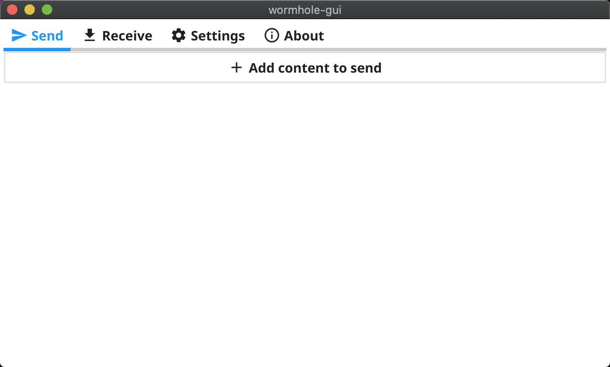
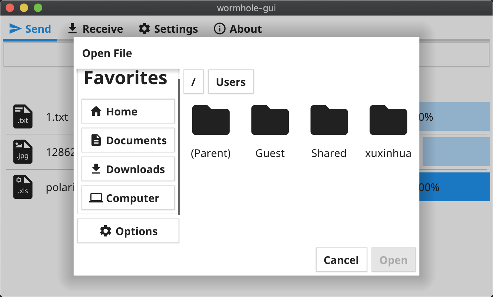

大家好，我是 polarisxu。

一直以来，挺多人想尝试 Go GUI 项目的，经过这些年的发展，响应的方案也挺多的，有原生的、有基于 Web 的。其中，fyne 这个 Go GUI 框架，发展比较好。之前写过一篇文章：[Go 真的也可以进行 GUI 开发：还有这样的图书呢](https://mp.weixin.qq.com/s/2kms7zoK39CL6aVSWrpAbQ)。

今天推荐一个开源 Go GUI 项目：wormhole-gui，项目地址：<https://github.com/Jacalz/wormhole-gui>。这是一个跨平台应用程序，可在设备之间轻松加密共享文件、文件夹和文本。

如果你使用的是 Go1.17 版本，可以直接终端运行如下命令查看效果：（注意，最新版是 v2）

```bash
$ go run github.com/Jacalz/wormhole-gui/v2@latest
```

成功后，会打开一个应用，如下图：



还支持暗黑模式。它有 4 个菜单：

- Send
- Receive
- Settings
- About

支持发送文件、文件夹、文本信息。

该项目涉及到的知识点：

- fyne 的使用
- 网络传输

看看 main.go 中的代码：

```go
package main

import (
	"fyne.io/fyne/v2"
	"fyne.io/fyne/v2/app"

	"github.com/Jacalz/wormhole-gui/v2/internal/assets"
	"github.com/Jacalz/wormhole-gui/v2/internal/ui"
)

func main() {
	a := app.NewWithID("com.github.jacalz.wormhole-gui")
	a.SetIcon(assets.AppIcon)
	w := a.NewWindow("wormhole-gui")

	w.SetContent(ui.Create(a, w))
	w.Resize(fyne.NewSize(700, 400))
	w.SetMaster()
	w.ShowAndRun()
}
```

不过项目存在以下问题：

1）选择文件对话框太丑



丑陋程度和 Java swing GUI 有得一拼。

2）不支持中文。

发送文本内容的对话框输入中文乱码。选择文件对话框中，文件名是中文也显示乱码。看你有没有办法解决这个问题。

