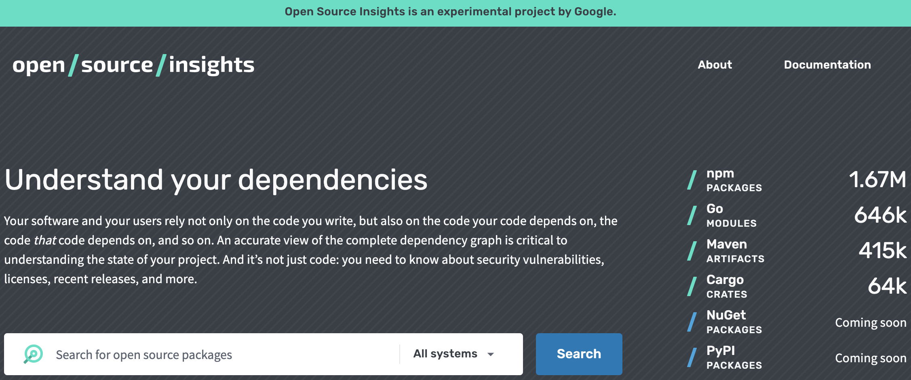
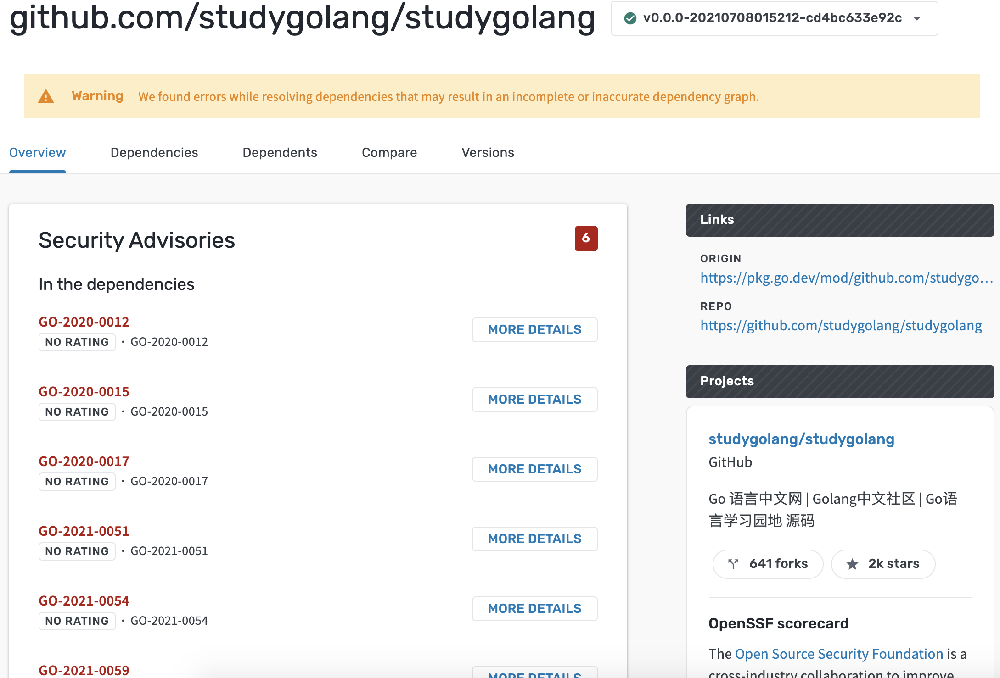
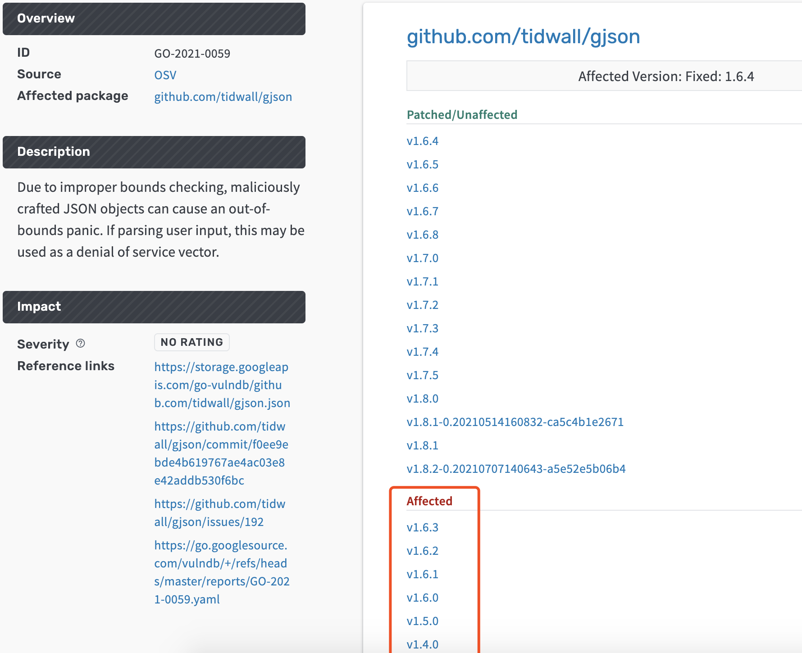
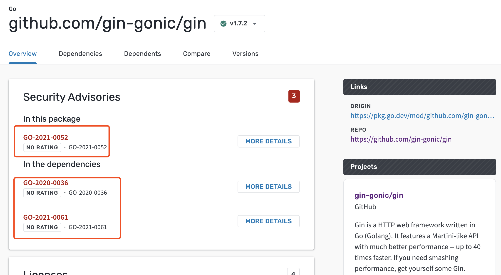

大家好，我是 polarisxu。

发现了一个好工具，推荐给大家！

<https://deps.dev/>，这是 Google 新出的一个实验性工具，命名为：Open Source Insights，它能让你更了解你的项目依赖。

通过这个网站，你可以查询任意开源项目的依赖情况，还包括依赖的依赖，可以看到完整的依赖关系图，而且可以看到它们的许可证。

目前该工具支持 Go Modules、NPM packages、Java 的Mavan 和 Rust 的 Cargo，将来可能还会支持 .Net 的 NuGet 和 Python 的 PyPI。

以 Go 语言中文网的源码为例，看看使用情况。

输入包名：github.com/studygolang/studygolang，<https://deps.dev/go/github.com%2Fstudygolang%2Fstudygolang> 结果如下：

发现有几处安全问题，查看详细信息，发现有几个库有漏洞：

- golang.org/x/crypto
- golang.org/x/text
- github.com/dgrijalva/jwt-go
- github.com/labstack/echo/v4
- github.com/tidwall/gjson

拿 github.com/tidwall/gjson 看看：

gjson 1.6.3 及以下版本存在这个漏洞，具体信息来源：<https://github.com/tidwall/gjson/issues/192>，由于不正确的边界检查，恶意构造的 JSON 对象可能会引起越界 panic。如果解析用户输入，这可能被用作分布式拒绝服务攻击。

根据这个提示应该升级我们的依赖，修复漏洞。

在 Dependencies 标签可以看到项目依赖，支持表格方式和图表方式查看依赖。在 Dependents 标签可以看到哪些项目依赖了当前项目。

赶紧看看你在使用的开源项目有无安全漏洞，会不会有安全隐患。比如 Gin 项目就有安全漏洞：

