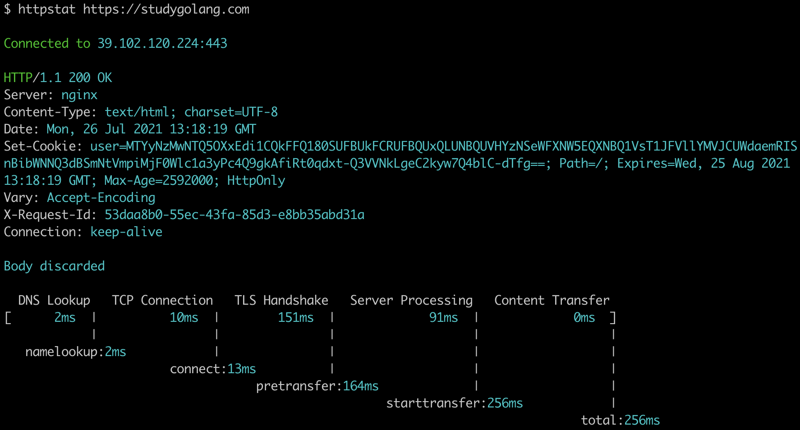
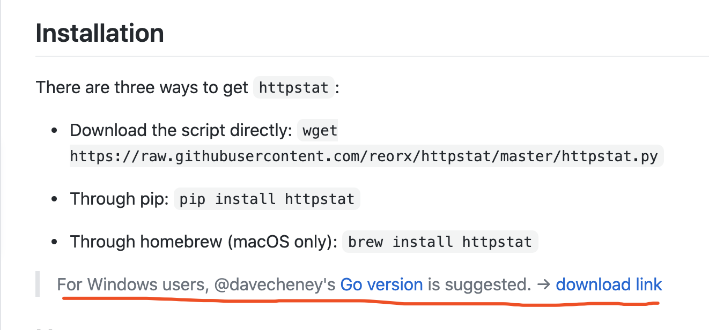

大家好，我是 polarisxu。

工作中遇到请求慢，难免想要查看时间都花在哪里了。办法肯定有不少，比如浏览器带的工具等。不过今天我要推荐一个命令行工具，目的有两个：

- 安装、使用方便，可以清晰的看出时间花在哪里了，建议放入自己的常用工具箱；
- Go 语言实现的，500 行左右代码，可以作为新手项目学习、练习、实战；

项目名称：httpstat，作者是 davecheney 大神。项目地址：<https://github.com/davecheney/httpstat>，截止本文发布，Star 数 5.3k+。

先看使用的效果图：



最下面可以看到时间花在哪些阶段了，是不是一目了然？！

这个项目是受一个类似的 Python 项目启发的：<https://github.com/reorx/httpstat>。实话说，这个时候 Go 的优势很明显：跨平台方便，安装方便。那个 Python 项目现在甚至建议 Windows 用户使用这个 Go 版本的。



httpstat 安装的话，go install 安装即可。看看使用说明：

```bash
$ httpstat
Usage: httpstat [OPTIONS] URL

OPTIONS:
  -4    resolve IPv4 addresses only
  -6    resolve IPv6 addresses only
  -E string
        client cert file for tls config
  -H value
        set HTTP header; repeatable: -H 'Accept: ...' -H 'Range: ...'
  -I    don't read body of request
  -L    follow 30x redirects
  -O    save body as remote filename
  -X string
        HTTP method to use (default "GET")
  -d string
        the body of a POST or PUT request; from file use @filename
  -k    allow insecure SSL connections
  -o string
        output file for body
  -v    print version number

ENVIRONMENT:
  HTTP_PROXY    proxy for HTTP requests; complete URL or HOST[:PORT]
                used for HTTPS requests if HTTPS_PROXY undefined
  HTTPS_PROXY   proxy for HTTPS requests; complete URL or HOST[:PORT]
  NO_PROXY      comma-separated list of hosts to exclude from proxy
```

从以上的选项可以看出支持的特性。

开头说了，这个项目的代码很少，可以作为一个实战项目学习。
