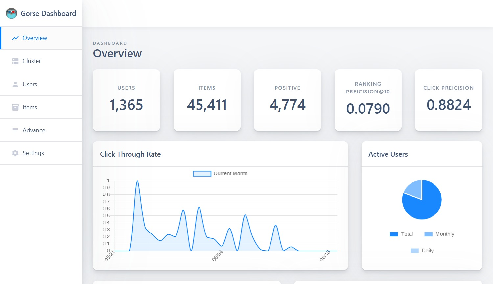

大家好，我是 polarisxu。

看到一个项目：<https://gorse.io/>，这是一个用 Go 编写的开源推荐系统。Gorse 的目标是成为一个通用的开源推荐系统，可以迅速地引入到各种各样的在线服务中。通过将项目、用户和交互数据导入 Gorse，系统将自动训练模型，为每个用户生成推荐。

这个项目代码托管在 GitHub 上：<https://github.com/zhenghaoz/gorse>，目前 Star 数 1.7k+，查了下记录，2018 年中旬，国人发起开发的这个项目（国人对 Go 确实情有独钟？！），因为他们参考的项目，一个是 Java 实现的，一个是 Python 实现的。

经过近 3 年的发展，目前该项目版本是 0.2.2，有两个实际的使用案例：

可见该项目有了一定的成熟度，小型创业团队，想要有自己的推荐系统，可以考虑基于这个项目。这个项目有如下特点：

- 自动化：通过后台模型搜索，自动选择最佳推荐模型和策略；
- 分布式推荐：单节点训练、分布式预测以及在推荐阶段实现水平扩展的能力；
- Restful API：为数据 CRUD 和推荐请求提供 RESTful API；
- 数据仪表盘：提供数据导入和导出、监控和集群状态检查的仪表板；

这是官方给的仪表盘示例：

这个项目提供了比较完整的文档：<https://docs.gorse.io/>，包括安装、使用的介绍，同时还提供了设计的思路、架构图，方便使用者学习、理解。从提交记录看，贡献者很活跃。

如果你只是对推荐系统感兴趣，刚好也想通过一个项目更熟悉 Go 语言，我觉得这个项目一定很适合你，可以好好学习学习。

