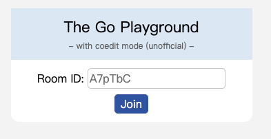
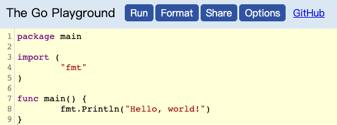
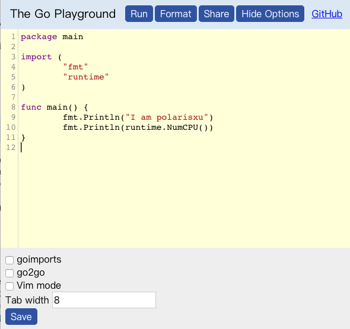

大家好，我是 polarisxu。

之前我为大家推荐过 Playground，[对比了三款 Go Playground](https://mp.weixin.qq.com/s/SYngjiM8M2T6KS0OQNonCQ)。今天发现了另外一款 Playground，它最核心的特点是，可以多人协同编辑。

协同编辑，目前是很流行的一种多人协作模式。GitHub 的编辑器 Atom 就有这方面的支持。

## 简介

先简单看看这款 Playground：gpgsync。这是 [syumai](https://github.com/syumai) 开发的一款多人协同编辑的 Go Playground，他是一个 TypeScript 和 Go 爱好者。

项目地址：<https://github.com/syumai/gpgsync>，这是一个 Node 项目，你可以本地搭建，也可以直接试用作者提供的 Demo：<https://gpgsync.herokuapp.com/>。

## 如何使用

打开 <https://gpgsync.herokuapp.com/>，会让你提供一个 Room ID，可以使用随机生成的，也可以自定义。

点击 Join 后，进入编辑界面。

这个界面和官方的 Playground 基本类似，但多了一个 Options。这个功能来自作者的另一个项目：<https://github.com/syumai/go-playground-custom>，好吧，又一个 Playground。这个项目的目标是为 Playground 提供一些额外的特性，包括：

- 基于 CodeMirror 的丰富编辑器；
  - 语法高亮（官方 Playground 是不支持语法高亮的）；
  - Vim 模式（我太喜欢这点了）；
- go2go 支持。这是对 Go 泛型的支持；

点击 Options 后，在底部有相关配置：

回到主题。

当你进入后，你可以将你的 Room ID 告诉你的协作者，或者直接复制链接发给 TA，你们就可以协同了。你或 TA 的改动，另一方能实时看到。

我的 Room：<https://gpgsync.herokuapp.com/rooms/polarisxu>，大家可以试试，看看一堆人是啥效果，会不会崩溃~

你自己想单独试验，可以开两个浏览器看看效果。

**特别说明**：最终的运行是交给 play.golang.org 的，因此要实际运行，请自备梯子。

## 有啥用

我想到的有两点：

- 请教大牛问题，实时看 TA 怎么写代码的；
- 面试，特别远程面试时，可以让对方通过这个写代码，你实时看到对方的整个 coding 过程；
