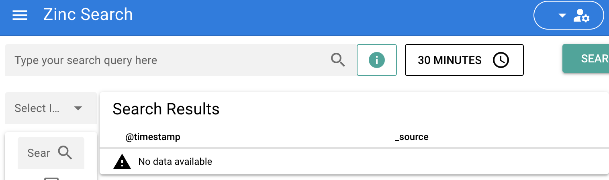

大家好，我是 polarisxu。

企业内部搭建搜索引擎常用 Solr、Elasticsearch，它们都是使用 Java 实现的，底层依赖 Lucene，Java 相对来说占用较多内存。而今天要介绍的这个项目，目标就是作为 ES 的替代者，一个轻量级搜索引擎：Zinc。

项目地址：<https://github.com/prabhatsharma/zinc>，该项目开源十来天，目前 Star 数 3.4k+。

---

Zinc 是一个全文索引的搜索引擎。它是 Elasticsearch 的轻量级替代品，可以在不到 100 MB 的 RAM 中运行。它使用 [bluge](https://github.com/blugelabs/bluge) 作为底层索引库。

而且，Zinc 使用 Vue 打造了一个比 Elasticsearch 更简单、更易于操作的界面。



如果你只是使用 API 获取数据并使用 kibana 进行搜索（Kibana 不支持 Zinc。Zinc 提供了自己的 UI），那么它是 Elasticsearch 的直接替代品。

 Zinc 主要有如下特性：

1. 提供全文索引功能
2. 单个二进制文件即可安装、运行，支持多平台。这得益于 Go 语言
3. 用 Vue 编写的用于查询数据的 Web UI
4. 与 Elasticsearch 兼容的数据获取 API（单记录和批量 API）
5. 开箱即用的身份验证
6. Schema less - 无需预先定义 schema，同一索引中的不同文档可以有不同的字段

不过，目前 Zinc 还处于 alpha 阶段，而且缺少集群，可用性也没得到很好的验证。

关于如何安装使用，项目首页有说明，支持普通安装（可以直接下载编译好的二进制文件），也支持 Docker 和 K8S 安装使用。

我根据说明，在本地搭建后，根据提供的示例数据构建索引：

```bash
$ FIRST_ADMIN_USER=admin FIRST_ADMIN_PASSWORD=Complexpass#123 ./zinc
{"level":"debug","time":"2021-12-12T22:53:51+08:00","message":"Loading indexes..."}
{"level":"debug","time":"2021-12-12T22:53:51+08:00","message":"Loading system indexes..."}
{"level":"debug","time":"2021-12-12T22:53:51+08:00","message":"Index loaded: _users"}
{"level":"debug","time":"2021-12-12T22:53:51+08:00","message":"Index loaded: _index_mapping"}
{"level":"debug","time":"2021-12-12T22:53:51+08:00","message":"Error loading .env file"}
[GIN-debug] [WARNING] Running in "debug" mode. Switch to "release" mode in production.
 - using env:	export GIN_MODE=release
 - using code:	gin.SetMode(gin.ReleaseMode)

[GIN-debug] GET    /healthz                  --> github.com/prabhatsharma/zinc/pkg/meta/v1.GetHealthz (3 handlers)
[GIN-debug] GET    /                         --> github.com/prabhatsharma/zinc/pkg/meta/v1.GUI (3 handlers)
[GIN-debug] GET    /ui/*filepath             --> github.com/gin-gonic/gin.(*RouterGroup).createStaticHandler.func1 (3 handlers)
[GIN-debug] HEAD   /ui/*filepath             --> github.com/gin-gonic/gin.(*RouterGroup).createStaticHandler.func1 (3 handlers)
[GIN-debug] POST   /api/login                --> github.com/prabhatsharma/zinc/pkg/handlers.ValidateCredentials (3 handlers)
[GIN-debug] PUT    /api/user                 --> github.com/prabhatsharma/zinc/pkg/handlers.CreateUpdateUser (4 handlers)
[GIN-debug] DELETE /api/user/:userID         --> github.com/prabhatsharma/zinc/pkg/handlers.DeleteUser (4 handlers)
[GIN-debug] GET    /api/users                --> github.com/prabhatsharma/zinc/pkg/handlers.GetUsers (4 handlers)
[GIN-debug] PUT    /api/index                --> github.com/prabhatsharma/zinc/pkg/handlers.CreateIndex (4 handlers)
[GIN-debug] GET    /api/index                --> github.com/prabhatsharma/zinc/pkg/handlers.ListIndexes (4 handlers)
[GIN-debug] PUT    /api/:target/document     --> github.com/prabhatsharma/zinc/pkg/handlers.UpdateDocument (4 handlers)
[GIN-debug] POST   /api/:target/_search      --> github.com/prabhatsharma/zinc/pkg/handlers.SearchIndex (4 handlers)
[GIN-debug] PUT    /es/:target/_doc/:id      --> github.com/prabhatsharma/zinc/pkg/handlers.UpdateDocument (4 handlers)
[GIN-debug] DELETE /es/:target/_doc/:id      --> github.com/prabhatsharma/zinc/pkg/handlers.DeleteDocument (4 handlers)
[GIN-debug] POST   /es/:target/_doc          --> github.com/prabhatsharma/zinc/pkg/handlers.UpdateDocument (4 handlers)
[GIN-debug] PUT    /es/:target/_create/:id   --> github.com/prabhatsharma/zinc/pkg/handlers.UpdateDocument (4 handlers)
[GIN-debug] POST   /es/:target/_create/:id   --> github.com/prabhatsharma/zinc/pkg/handlers.UpdateDocument (4 handlers)
[GIN-debug] POST   /es/:target/_update/:id   --> github.com/prabhatsharma/zinc/pkg/handlers.UpdateDocument (4 handlers)
[GIN-debug] POST   /es/_bulk                 --> github.com/prabhatsharma/zinc/pkg/handlers.BulkHandler (4 handlers)
[GIN-debug] POST   /es/:target/_bulk         --> github.com/prabhatsharma/zinc/pkg/handlers.BulkHandler (4 handlers)
[GIN-debug] Listening and serving HTTP on :4080
```

访问 <https://localhost:4080> 即可看到上面的界面。

目前 Go 语言中文网的搜索使用的是 Solr，抽空尝试验证 Zinc，如果稳定、成熟，考虑迁移到 Zinc。
