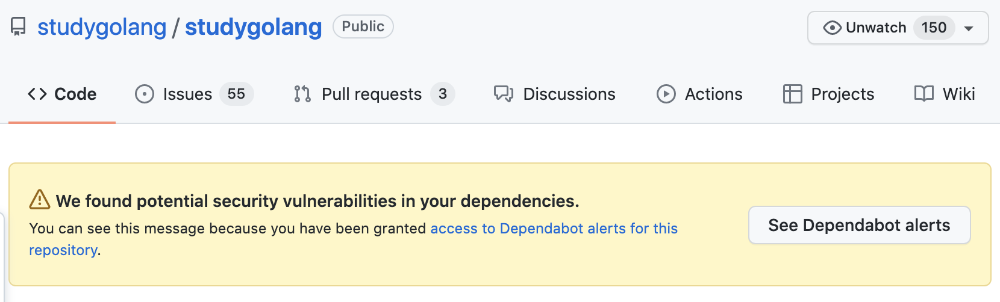
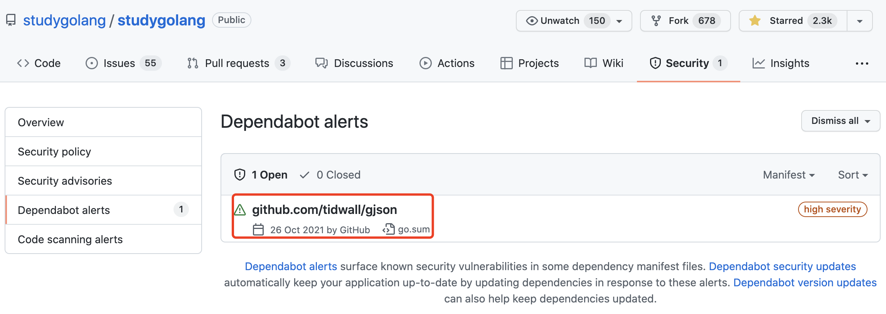
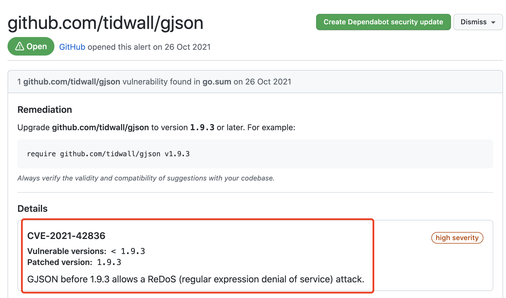

大家好，我是 polarisxu。

今天打开 studygolang 项目的 GitHub 仓库主页，发现了一个醒目的提示：



即发现了潜在的安全漏洞。

之所以 GitHub 能够发现这个安全漏洞，前提是我之前进行了授权。之前我写过一篇文章：[《重磅！GitHub 为 Go 社区带来安全支持》](https://mp.weixin.qq.com/s/m3VkJU-m_TXnY59ELW12fQ)，没看过的可以看看。

查看 「Dependabot alerts」，发现是 tidwall/gjson 有漏洞：



点击可以查看该漏洞的详细信息：



所以，修复该问题很简单，在 studygolang 项目执行以下命令：

```bash
$ go get -u github.com/tidwall/gjson
go: downloading github.com/tidwall/gjson v1.12.1
go: downloading github.com/tidwall/match v1.1.1
go get: upgraded github.com/tidwall/gjson v1.8.1 => v1.12.1
```

然后提交代码。注意，要确保这个有漏洞的依赖是你的项目直接依赖的。可以通过相关工具找到依赖关系。

如果你在维护开源项目，建议开启这个检测功能。