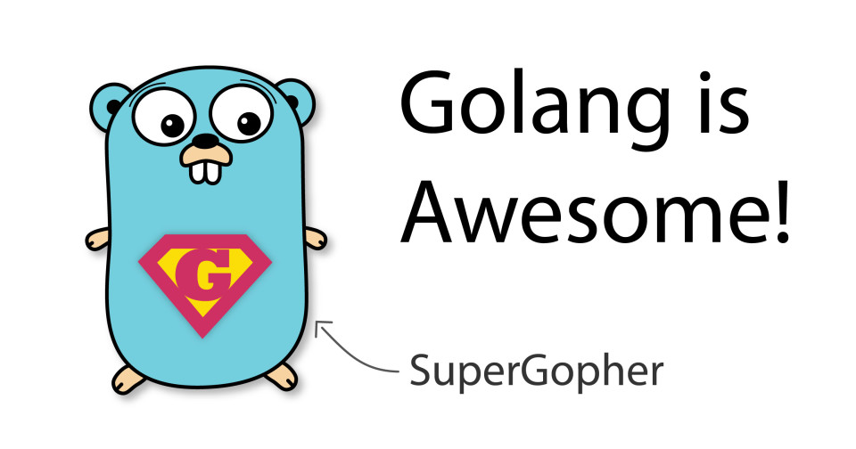

Go 当前引起了很多关注。让我们看一下 Go 好的部分。



我最近用 Go 写了一个 [SSH 服务器](https://github.com/janoszen/containerssh)，在其中启动容器。该项目已经发展到很大规模，并且我还向 Go [发起了 PR](https://go-review.googlesource.com/c/crypto/+/236517)，以修复我发现的错误。在积累了比 “Hello world！” 更多的经验之后，现在我有信心写出我真正喜欢的 Go 语言部分。

## 跨平台

Go 引起我注意的原因之一是其构建系统。Java 的最初承诺是它是跨平台的，但是它需要安装运行时的事实显然是一个失败。而 Go 编译为本地二进制文件。在 Windows 上，您将获得一个 .exe 文件，在 Linux 上，您将获得一个 ELF 二进制文件，依此类推。而且，除非您使用 cgo，否则 Go 程序可以在几乎没有外部依赖的情况下运行。无需安装任何 .dll 或 .so 文件，Go 程序即可[直接使用](https://www.youtube.com/watch?v=YPN0qhSyWy8)。

大部分时候，除了某些函数需要 libc 外，Go 程序可以在完全没有外部依赖的情况下运行。

Go 可以用来构建真正的跨平台二进制文件而无需安装笨拙的运行时（例如使用 Java 或 Python），这一事实是 Go 的主要吸引点。

## Goroutines 和 Channels

当我开始使用 Go 语言时，我意识到它对并发的处理是多么的酷。传统上，您将使用线程或单独的进程来同时运行多个任务（例如 Java，C，C ++）。另外，您也可以依靠协作式多任务处理（例如 Javascript）来达到相同的效果。

对于线程和进程，操作系统必须执行的每个切换都会造成资源损耗。这称为上下文切换。换句话说，一个使用大量线程的粗心程序员将带来性能问题。

另一方面，协作多任务将在单个线程上运行。每当一项任务必须等待某件事时，另一项任务就会运行。如果一个任务占用了 CPU，其他任务将被饿死。

Go 以巧妙的方式将两者结合在一起。让我们以以下示例为例：

```go
func main() {
    go someOtherFunction()
}
```

注意 go 关键字。通过使用此关键字，someOtherFunction() 可在 goroutine 中运行。想象一下 Go 作为线程池处理并发的方式。每当您运行 goroutine 时，它将在这些线程之一中运行。这样 Go 可以优化线程的使用以提高性能。

为了促进 goroutine 之间的数据传输，Go 引入了通道（channel），通道是应用程序中的消息队列，用于发送数据。

```go
func main() {
    chan done <- bool

    go func() {
        time.Sleep(2 * time.Second)
        done <- true
    }()

    //This will wait until the goroutine finishes
    <- done
}
```

从上面的代码中可以看到，`<- channelname` 将堵塞当前 goroutine 的执行，直到有可用数据为止，这使得并发编程非常容易。

如果您对更多细节感兴趣，请查看 [channel](https://gobyexample.com/channels)，[上下文](https://gobyexample.com/context)和[互斥锁](https://gobyexample.com/mutexes)。

## 指针，Defer 和垃圾收集

当提到指针时，首先想到的是 C 或 C++。通常，这种记忆并不愉快。

在 Go 中，指针更像是引用。指针并非总是将数据复制到变量中，而是指向原始的内存。不管传递包含指针的变量多少次，任何修改都将始终更改原始值。

让我们看一个例子：

```go
someVar := &someStruct{}
```

现在，变量包含指向该结构的指针。传递时，无论您复制指针多少次，它始终指代相同的内存空间。

但是，与 C 指针不同，Go 指针在不再需要时会自动进行垃圾回收。您无需担心使用后释放或缓冲区溢出漏洞，这些在 Go 中都不是问题。太棒了！

此外，您还可以使用 defer 语句来帮助您进行函数清除。考虑以下函数：

```go
func foo() error {
    close := func() {
        // Do somehing to clean up stuff
    }
    err := doSomething()
    if err != nil {
        close()
        return err
    }
    // Do something else
    close()
}
```

如您所见，我们在此函数中调用了 close() 两次。如果 foo 函数有多个出口（返回），则需要为每个出口重复 close() 调用。

defer 语句完全可以解决此问题：

```go
func foo() error {
    close := func() {
        // Do somehing to clean up stuff
    }
    defer close()

    err := doSomething()
    if err != nil {
        return err
    }
    // Do something else
}
```

defer 语句保证 close 总是会被调用。

## 多返回值

这看似没什么，但是在编程语言中却很少见。

```go
sshConn, chans, reqs, err := ssh.NewServerConn(tcpConn, config)
```

有什么理由不喜欢？

## OOP（好的部分）

尽管 Go 没有类的概念，但仍然可以编写面向对象的代码。

假设有以下 Java 代码：

```java
class TreeNode {
    private List<TreeNode> nodes = new ArrayList();
    public void addChild(child TreeNode) {
        nodes.add(child)
    }
}
```

在 Go 中，类似的代码如下所示：

```go
type TreeNode struct {
    children []treeNode
}

func New() *TreeNode {
		return &TreeNode{}
}

func (treeNode *TreeNode) AddChild(child * TreeNode) {
    treeNode.children = append(treeNode.children, child)
}
```

Go 将（`treeNode *TreeNode`）部分称为接收器。Go 中的 Receiver 可以使用与其他语言中的 this 关键字非常相似的任何数据类型和功能。

## Slices

和许多其他低级语言一样，Go 将数组实现为固定大小的元素列表。创建后无法更改其大小。

另一方面，切片（Slice）是使它们动态化的技巧。当切片已满时，Go 会创建一个更大的切片新副本。Go 以尽可能少的复制的方式优化过程。

此外，Go slice 还具有创建不占用额外内存的子切片的简洁功能。这些切片引用原始的数组。如果更改切片中的数据，则原始数据也将更改。

```go
import "fmt"

func main() {
	data := []string{"a", "b", "c", "d"}
	d := data[2:3]
	// Will print [c]
	fmt.Printf("%v", d)
	d[0] = "f"
	//Will print [a b f d]
	fmt.Printf("%v", data)
}
```

如果您想深入了解，请继续阅读 [Go by Example](https://gobyexample.com/slices)。

## 库

选择 Go 的原因之一是库数量众多。SSH 客户端和服务器库？[有](https://godoc.org/golang.org/x/crypto/ssh)。适用于 AWS 的 SDK？[同样有](https://aws.amazon.com/sdk-for-go/)。GitHub 操作库？[当然有](https://github.com/google/go-github)。让我们尝试一些非常少用的东西……FastCGI 协议实现如何？[当然也有](https://golang.org/pkg/net/http/fcgi/)。

我可以继续，但是没多大必要了。Go 的普及无疑对生态系统有所帮助。

## 工具

构建 Go 拥有大量可用的工具。您拥有从[自动代码格式化](https://blog.golang.org/gofmt)，测试到[完整发布工具](https://goreleaser.com/)的全套工具。几乎所有的都有很多工具。

## 结论

在代码组织方面，Go 当然有其缺点。但是，它特别适合用于各种任务的高性能软件开发。

那 Go 具体有哪些缺点呢？下次我们“喷一喷” Go 的缺点。

> 原文链接：https://pasztor.at/blog/go-is-awesome
> 编译：polaris

