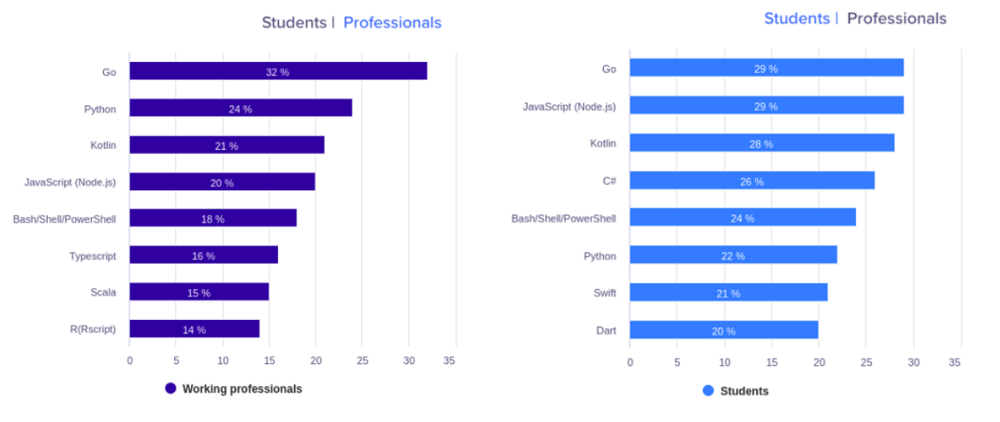

30 年前，Python 首次出现。但是花了 20 年时间才能获得开发人员的赏识。快进到 2019 年，它成为开发人员中第二受欢迎的语言。（来自 [Stackoverflow 开发人员 2019 调查结果](https://insights.stackoverflow.com/survey/2019#most-loved-dreaded-and-wanted)）

过去，尤其是在过去的 5 年中，它的增长是巨大的。Python 成为机器学习和数据科学开发人员的首选语言。

在接下来的几年中，Python 在这些领域的主导地位无疑会持续。但是与更新的语言相比，它具有一些严重的缺点。对于 21 实际 20 年代的开发者来说，这可能是一个障碍。

现在是检查 Python 问题并将其替换为更好的替代方法的正确时机。就 AI 开发和数据科学而言，我们的下一个入门语言可能是 Golang。

## Python 受欢迎的原因

Python 受欢迎的主要原因是：它易于学习。与其他语言相比，它的语法很简单，任何人都可以在几小时或几天内学习 Python 的基础知识。

即使在学习了其他语言（例如 C++ 或 Java）之后，开发人员通常还是更喜欢使用 Python。那是因为有一个 Python 库，几乎可以满足所有人的要求。

库和简单的语法使使用 Python 开发软件既简单又高效。这些优势使 Python 成为了初学者的语言。

## Python 问题

### 速度

Python 是一种解释型语言，这会引起 Python 的最大问题：执行缓慢。与其他编译语言（例如 C++ 和 Go）相比，Python 的执行速度很慢，非常慢。

Python 是一种动态类型的语言。在运行期间会自动分配变量的数据类型。这使执行速度大大降低。

### 使用 C/C++

为了克服 Python 运行慢的缺点，Tensorflow，Numpy 和 Pandas 之类的库部分用 C 或 C++ 编写。它们有助于显著提高执行速度。

基本上，Python 需要其他语言的帮助才能克服其问题。

### 全局解释器锁（Global Interpreter Lock）

Python 的[全局解释器锁](https://wiki.python.org/moin/GlobalInterpreterLock)（GIL）一次只能执行一个线程，同时提高了单线程性能。Python 的多线程并没有真正让多个线程同时运行。

实际上，Python 无法执行真正的多线程。

（注意：Python 的非 CPython 实现（例如 Jython 和 IronPython 没有 GIL））

## 为什么要使用 Go 语言？

> Go 是一种开放源代码编程语言，可轻松构建，简单，可靠和高效。

“ Go” 在 10 年前首次亮相。它是 Google 开发的通用性编程语言。

与 Python 和其他编程语言相比，它具有多个优势，这就是我们感兴趣的原因。

### 快速

Go 是静态类型化和编译的语言。这意味着执行速度将比 Python 快几倍。与 Python 不同，Go 不需要其他语言的帮助就可以更快。

这是 Go 和 Python 之间的一个[小型基准测试游戏比较](https://benchmarksgame-team.pages.debian.net/benchmarksgame/fastest/go-python3.html)。Go 几乎与 C++ 和 Java 一样快。而且，Go 的代码编译速度比 C+C 和 Java 快得多。

### 简单易学

Go 的语法很简单，类似于 C。它是一种易于学习的编程语言，特别是已经了解 C 或 Java 语言的基础知识。

要了解 Go 的基础知识，请访问 [Go 指南](http://tour.studygolang.com/welcome/1) 进行交互式之旅或访问[官方文档](https://docs.studygolang.com/doc/)。

### 越来越受欢迎

根据此次 Hackearth 对来自 76 个国家/地区的 16,000 多名开发人员的[调查](https://www.hackerearth.com/recruit/developer-survey/)，Go 是 2020 年最受欢迎的编程语言。

32％ 的经验丰富的开发人员和 29％ 的学生说他们想学习 Go 不足为奇。

### 并发

并发是 Go 的主要优势之一。Go 具有 [Goroutines](http://tour.studygolang.com/concurrency/1) 以实现并发。Goroutines 是可以同时独立运行的函数。

Goroutine 重量轻，仅占用 2KB（依赖于不同实现，目前 Go1.15 是 2KB） 的内存。由于 Goroutine 轻巧，因此可以同时运行成千上万个。

Goroutine 还有很多其他优点，比如：

- Goroutine 具有可增长的分段堆栈。这意味着它们仅在需要时才使用更多的内存。
- Goroutine 具有比线程更快的启动时间。
- Goroutine 带有内置原语，以在它们自己（通道）之间安全地通信。
- 使用 Goroutines 可以避免共享数据结构时不得不使用互斥锁。
- 此外，goroutine 和 OS 线程没有 1:1 映射。一个 goroutine 可以在多个线程上运行。 Goroutines 被多路复用到少量的 OS 线程中。

参考文章：[为什么要学习 Go？](https://medium.com/@kevalpatel2106/why-should-you-learn-go-f607681fad65)。

## 是什么使 Go 适用于 AI 研究

将 Go 专门用于 AI 研究或数据科学并没有什么特别的。为什么应将 Go 用于 AI 和数据科学？我会告诉你的...但是等一下。

30 年前，尚未开发 Python 来构建机器学习或深度学习算法或进行数据可视化。

之所以是今天，是因为开发人员和学生们喜欢用 Python 进行代码编写，并且支持*开发该开发人员意图*的语言。

Go 旨在提高程序员的生产力。与 Python 相比，它具有多个优点。它很可能会在未来几年中成功取代 Python，成为最受欢迎的语言。

因此，它可以归结为 1 行：

**Go 可以支持 “21 世纪 20 年代的开发人员”发展他们的思想，这比任何其他语言都要好得多。**

> 原文链接：<https://towardsdatascience.com/golang-ai-programming-language-for-the-20s-71890baa8c47>
>
> 本文作者：Dasaradh Saran
>
> 编译：polarisxu

