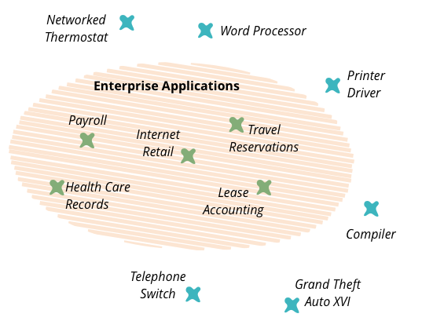

> 译注：发表这篇文章，不代表我认同作者的观点。大家都知道，在国内，Go 已经被很多大厂使用，早就可以用于企业系统。
>
> 对一门语言的爱，可以接受任何不同的观点，真理总是越辩越明，相信有不同的声音，Go 也会越来越好。欢迎大家留言发表你的看法。

## 介绍

企业应用程序是一个寿命长、可靠的系统，具有多年的持久数据。如今，Golang 的世界并没有提供以企业系统构建方式构建系统的可能性。



## Golang 的发展文化

让我们考虑几个问题，如错误处理不当、 手动组合的 SQL 查询和面向轮子开发。

### 错误处理不当

Golang 在错误处理方面提供了更多的自由。由于开发人员方面缺乏责任，这通常会导致应用程序中的错误处理不当。

最常见的情况与 sql 查询的执行有关：

```go
defer rows.Close() // omitted errors from sql driver
```

没有明确的方法来处理此返回的错误。实际上，该语言提供了捕获错误的特定方法：

```go
result, err := foo()
```

该错误是一个典型的返回值，可以通过各种方式忽略：

```
defer rows.Close() // omitted errors from sql driver
defer body.Close() // omitted IO errors
result, _ := foo() // omitted errors from foo function
```


此外，它会导致应用程序在 panic 函数调用后立即崩溃的风险增加，并且通常会降低可靠性。

> 根据 M.Nygard 的 “Release it!”，可靠的系统必须处理每个不重要的错误而不会崩溃。没有权衡。

作为解决方案，我们可以使用其他语言的 try/catch/finally 结构添加可靠的机制。此外，还需要消除 panic 函数。当然，这将是一种较慢的方法，但更可靠。

------

### 手动编写 SQL 查询语句

Golang 中处理数据库查询的典型方法是手动编写查询。如果 **SQL 查询被手工编写的**，那么数据库集成将是一个**瓶颈**。并非所有开发人员都擅长 SQL 和使用数据库。诸如 Hibernate（Java）和 Entity Framework（.NET）之类的功能齐全的 ORM 生成的典型查询已开放，用于数据库和缓存数据优化。**这是根据 ‘Release it’ 来编写可靠的应用程序的最有效方法之一。**

有些库将来可能是功能齐全的ORM（例如 GORM 和 XORM）。我相信，与手工编写的 SQL  查询相比，它们将来会更受欢迎。

### 重新发明轮子

通常，Golang 开发人员都在选择重新发明轮子。轮子无处不在：task scheduler，迁移工具，logger，worker pool，十进制数字的库，授权库和其他工具。

> 它们没有经过良好的测试，没有良好的文档，在生产中使用不足。风险太高，不能在企业应用程序中使用它们。

为了减少使用风险代码的可能性，检查是否有可用的解决方案。例如可以查看 [awesome-go](https://github.com/avelino/awesome-go)。

------

## 生态系统

Go 世界的生态系统包括 Consul, Kubernetes, Zipkin 和 Træfik 等。它是一个非常年轻且发展迅速的技术栈，没有公认的使用标准。

> Golang 生态系统中没有任何工具可以帮助建立可靠的企业系统。

考虑到以上所有情况，我们需要非常谨慎地将第三方中间件集成到基础架构中，公司必须有足够的专业知识支持该过程。否则，它将成为具有不同技术的生产环境中的雷区。好消息是，市场有很多管理解决方案，以最大限度地降低风险。不幸的是，它很贵。

------

Golang 生态系统太年轻，缺乏工具、编程文化，但我相信它将来会成为一个伟大的生态系统，并拥有伟大的程序员。语言社区正朝着正确的方向努力：性能和简化。但是，我们不能忘记可靠性也很重要。我们越早了解可靠性的价值，我们就会越快地用 Golang 编码更多、更好的企业系统。

## P.S.

我很惊讶，这篇文章有这么多的解释。可惜很多人错过了文章的重点。

这篇文章：

*1）不是关于我*

*2）不是关于我的技能*

*3）不是关于我的狗*

*4）*不是关于“为什么我的狗在其企业狗系统中不需要使用 Golang”

*5）不是关于 Golang 的最佳编码实践*

*6）不是关于与处理 go 错误有关的最佳实践*

*7）不是关于如何以正确的方式选择正确的工具*

*8）不是关于 Golang 的一般设计*

*9）不是关于“没有人可以将 Go 用于企业系统”*

*10）不是关于“没有人需要将 Go 用于企业系统”*

正如我所观察到的，这涉及将 Golang 用于企业的风险（在“ Golang”下，我的意思更多在于文化和生态系统，而不是语言设计）。这是我的看法。

当然，很多大公司，如谷歌和 Netflix 在企业中使用 Golang，在我看来，他们一样有风险（记住，谷歌使用 Golang 时，这种语言还没有包带版本的管理器 ）。其他开发人员可以有其他观点和其他经验并观察。

本文的主要目的是进行讨论，看看有多少人有相同的看法。

##  参考

图书：《Release It! Design and Deploy Production-Ready Software》

图书：《Patterns of Enterprise Application Architecture》by Martin Fowler

> 原文链接：https://medium.com/@afondmitro/golang-is-not-ready-for-enterprise-systems-yet-and-heres-why-c0ee72069963
>
> 作者：Dmitry Afonkin
>
> 编译：polarisxu
