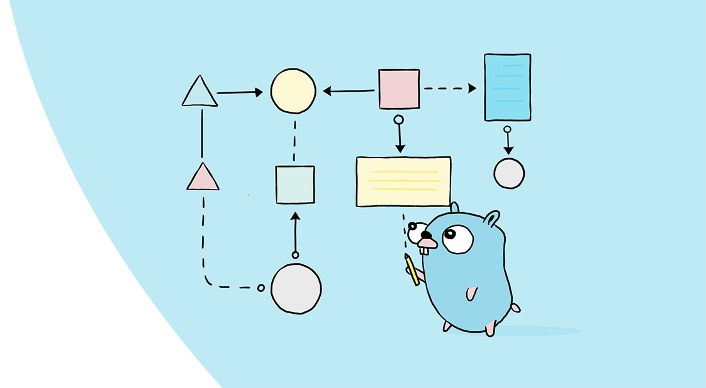

关于 Google 的核心数据：

> Google 是一家技术公司，其使命是组织全世界的信息，并使其普遍可访问和有用。
>
> 在这个案例研究中，Google 的核心数据解决方案团队分享了他们的 Go 旅程，包括他们决定在 Go 中重写 web 索引服务，利用 Go 的内置并发性，并观察 Go 如何帮助改进开发过程。

Google 的使命是“组织世界各地的信息，并使其普遍可访问和有用。” Google 的核心数据解决方案团队是负责组织该信息的团队之一。除此之外，该团队维护服务以索引全球的网页。这些网络索引服务通过保持搜索结果的更新和全面来帮助支持诸如 Google 搜索之类的产品，这些产品都是用 Go 语言编写的。

2015 年，为了跟上 Google 的规模，我们的团队需要我们将索引堆栈从用 C++ 编写的单个整体二进制代码重写为微服务架构中的多个组件。我们决定使用 Go 重写许多索引服务，现在我们将其用于支持大多数架构。

“ 因为鼓励团队中的工程师使用并发和并行算法，所以 Go 的内置并发是很自然的选择。” —Minjae Hwang， 软件工程师

选择语言时，我们的团队发现 Go 的多种特性特别适合。例如，因为鼓励团队中的工程师使用并发和并行算法，所以 Go 的内置并发是很自然的选择。工程师还发现，“ Go 代码更为自然”，使他们可以将时间花在业务逻辑和分析上，而不是在管理内存和优化性能上。

使用 Go 时，编写的代码要简单的多，因为它有助于减轻开发过程中的认知负担。例如，当使用 C++ 时，复杂的 IDE 可能“显示出源代码没有编译错误实际上确实有错误”，而“在 Go 中，当 IDE 指出代码没有错误时，代码总是会编译。” Core Data Solutions 团队的软件工程师 MinJae Hwang 说。减少开发过程中的小摩擦点，例如缩短修复编译错误的周期，有助于我们的团队在原始重写期间更快地发布，并有助于保持较低的维护成本。

“当我使用 C++ 并想使用更多软件包时，必须写一些 header 文件。当我用 Go 语言时，**内置工具使我可以更轻松地使用软件包。我的开发速度要快得多**。

通过简单的语言语法和 Go 工具的支持，我们团队中的一些成员发现用 Go 编写代码要容易的多。我们还发现 Go 在静态类型检查方面做得非常好，并且某些 Go 基础知识（例如 godoc 命令）已帮助团队围绕编写文档建立了更规范的规则。

“…在一年内重新设计了 Google 的网络索引。更令人印象深刻的是，团队中的大多数开发人员在学习 Go 的同时也用 Go 进行了重写。”— Prasanna Meda，软件工程师

研发在全球范围内被广泛使用的产品绝非易事，而我们团队使用 Go 的决定并不是一件容易的事，但是这样做有助于我们更快地行动。结果，在一年内重新设计了 Google 的网络索引。更令人印象深刻的是，该团队中的大多数开发人员在学习 Go 的同时就用 Go 完成重写。

除了核心数据解决方案团队外，Google 的工程团队在开发过程中也采用了Go。了解 [Chrome](https://go.dev/solutions/google/chrome/) 和 [Firebase 托管](https://go.dev/solutions/google/firebase/)团队如何使用 Go 来大规模构建快速，可靠和高效的软件。关于他们的下次分享。

> 原文链接：https://go.dev/solutions/google/coredata/
>
> 作者：Prasanna Meda, Software Engineer, Core Data Solutions
>
> 翻译：polarisxu
