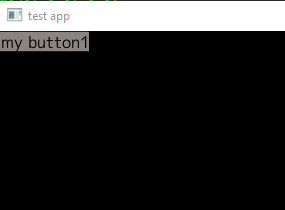

最近，我一直想开发一些桌面（主要是 Windows，但也可以考虑 MacOS 或 Linux）应用程序。虽然 Go 不是开发 UI 应用程序时首选语言，但是该语言的简单性和健壮性仍然使它成为我的首选语言。是的，这是我的锤子（hammer）... 但这是一个该死的漂亮锤子。

以前，我曾将 Ebiten 图形库用于 Go，以便与孩子们一起编写一些游戏。但是，对于一般的“应用程序”开发（即需要“小部件 widgets”，例如按钮，菜单等），Ebiten 并非真的适合。因此，我一直在寻找可以使用的 Go UI 库。然而大多数都使用 cgo，但我真的希望我的应用程序是纯 Go。这纯粹是个人喜好，我不知道使用 cgo 而不是纯 Go 会有什么影响。如果我要使用 cgo，我认为首选的 UI 库肯定是 [Fyne](https://fyne.io/)。Fyne 看起来是一个非常全面的框架，如果您不介意 cgo，我绝对会建议你看看看 Fyne。

还有其他一些库，但没有吸引我。他们说你永远不应该编写自己的安全性代码，并且我也相信你不应该编写自己的 UI 库。但是我忽略了这个建议...

因此，我写了一个 [GoUI](https://github.com/kpfaulkner/goui) !!

这纯粹是那些“抓痒”的项目之一。虽然现在还很早，但 UI 库的基本知识（由 Ebiten 进行实际渲染）正在慢慢融合。在详细介绍下面细节之前，我想先说明一下，我认为程序在 CLI 达到了顶峰。其次，我不是 UI 编程人员……写这些是我个人的兴趣。

GoUI 的基本思想是两种类型的图形元素。一个是可以包含其他面板或小部件的面板（Panel）。另一个是小部件，它是基本的 UI 元素（按钮，文本输入等）。我们目前使用的面板类型有 HPanel（水平添加）和 VPanel（我让你猜）。从技术上讲，我们确实有其他面板，例如工具栏，但这实际上只是 HPanel，需要一点点定制工作。总体而言，如果我可以结合其他现有面板/小工具来构造一些“新”东西，那么我会做的。如果我需要优化或与已有产品脱节，那么我将做一些全新的事情。

我们目前拥有的小部件是：

- ImageButton：（由应用程序提供的单击/未单击的图像）。

- TextButton：基本的彩色矩形，其中包含您想要的任何文本。

- Checkbox：与 TextButton 相同，但是旁边有一个小方框，可以打对勾。

- EmptySpace：完全由我控制。用于强制其他小部件之间的空间。一旦添加适当的填充，该填充可能会消失。

- Label：文本标签，不能输入。

- Text Input：文本输入框。

- RadioButtonGroup：这是一个面板，其中包含 vpanel 或 hpanel（取决于标志），然后其中包含许多复选框。复选框将图像（带有刻度）替换为常规的单选按钮。这是重新使用现有窗口小部件的好例子。如果事实证明我需要对复选框进行足够的修改以使其不适合用作单选按钮，那么我将不得不放入一个真正的单选按钮。但是目前，它运行良好。

我还没有完成菜单，模态窗口等，但是正如我所说的……这还是早期。

现在，让我们尝试一个超级简单的 Demo。

```go
package main
 
import (
    "github.com/hajimehoshi/ebiten"
    "github.com/kpfaulkner/goui/pkg"
    "github.com/kpfaulkner/goui/pkg/widgets"
    log "github.com/sirupsen/logrus"
    "image/color"
)
 
type MyApp struct {
    window pkg.Window
}
 
func NewMyApp() *MyApp {
    a := MyApp{}
    a.window = pkg.NewWindow(800, 600, "test app", false, false)
    return &a
}
 
func (m *MyApp) SetupUI() error {
    vPanel := widgets.NewVPanel("main vpanel", &color.RGBA{0, 0, 0, 0xff})
    m.window.AddPanel(vPanel)
    button1 := widgets.NewTextButton("text button 1", "my button1", true, 0, 0, nil, nil, nil, nil)
    vPanel.AddWidget(button1)
    return nil
}
 
func (m *MyApp) Run() error {
    m.SetupUI()
    ebiten.SetRunnableInBackground(true)
    ebiten.SetWindowResizable(true)
    m.window.MainLoop()
    return nil
}
 
func main() {
    log.SetLevel(log.DebugLevel)
    app := NewMyApp()
    app.Run()
}
```

让我们解释一下以上代码。

首先，该程序的核心仍然是直接调用 Ebiten。这些尚未封装。因此，你将在 main 和 Run 函数中看到，我们基本上已经制作了 MyApp 结构的实例，然后调用 SetupUI，设置一些 Ebiten 标志，然后调用 MainLoop。

NewMyApp 函数调用 pkg.NewWindow 函数。这是应用程序的主窗口。一旦添加了模态/其他窗口，这可能会更改，但是就目前而言，这将创建给定大小的主 UI 窗口。

SetupUI 是你需要注意的地方。我们要做的第一件事是创建一个 VPanel。请记住，VPanel 把小部件垂直堆叠放置。我们将 vPanel 添加到主窗口。实际上（当前），我们应该只在主窗口中添加 1 个面板，其他所有内容都应放入该面板中。因此，在这种情况下，我们创建 button1（新的 TextButton）并将其添加到 vPanel。



花点时间来学习理解一下上面的 UI 技能。

下面，让我们做一些更有趣的事情。假设我们要在按下按钮时做出响应。创建 TextButton 的行是：

```go
button1 := widgets.NewTextButton("text button 1", "my button1", true, 0, 0, nil, nil, nil, nil)
```

所有细节就不描述了，但是最后一个参数是带有 **func (event IEvent) error** 签名的事件处理程序。因此，如果我们创建一个带有该签名的方法，并将其作为最后一个参数传递给 NewTextButton。

```go
func (m *MyApp) ButtonAction1(event events.IEvent) error {
    log.Debugf("My button1 action 1!!!")
    return nil
}
```

然后我们将按钮创建修改为

```go
button1 := widgets.NewTextButton("text button 1", "my button1", true, 0, 0, nil, nil, nil, m.ButtonAction1)
```


现在，当单击按钮时，将调用 ButtonAction1 函数，我们可以触发所需的任何功能。

是不是很简单。

现在，如果我想要在按钮旁边放点东西该怎么办？我们在这里要做的是创建一个 HPanel，并将其首先放入 VPanel。然后，将按钮添加到 HPanel。如果这样做，我们最终将得到如下代码：

```go
func (m *MyApp) SetupUI() error {
 
    vPanel := widgets.NewVPanel("main vpanel", &color.RGBA{0, 0, 0, 0xff})
    m.window.AddPanel(vPanel)
 
    hPanel := widgets.NewHPanel("hpanel1", &color.RGBA{0, 100, 0, 255})
    vPanel.AddWidget(hPanel)
 
    button1 := widgets.NewTextButton("text button 1", "my button1", true, 0, 0, nil, nil, nil, m.ButtonAction1)
    hPanel.AddWidget(button1)
 
    return nil
}
```

从视觉上看，什么都不会改变。我们仍然只显示 1 个小部件。

现在，如果我们在同一 HPanel 中添加一个复选框怎么办？

```go
func (m *MyApp) SetupUI() error {
 
    vPanel := widgets.NewVPanel("main vpanel", &color.RGBA{0, 0, 0, 0xff})
    m.window.AddPanel(vPanel)
 
    hPanel := widgets.NewHPanel("hpanel1", &color.RGBA{0, 100, 0, 255})
    button1 := widgets.NewTextButton("text button 1", "my button1", true, 0, 0, nil, nil, nil, m.ButtonAction1)
    hPanel.AddWidget(button1)
 
    cb1 := widgets.NewCheckBox("my checkbox1", "check me please", "", "", nil)
    hPanel.AddWidget(cb1)
 
    vPanel.AddWidget(hPanel)
    return nil
}
```

因此，与之前完全相同，但只有这额外的两条：创建复选框，然后添加到 hPanel。

现在 UI 看起来是这样：


现在不担心这里的间距了。

现在让我们在 TextButton 下面添加一个 ImageButton。这意味着我们将向 vPanel 添加第二项（第一项是 hPanel）

```go
imageButton := widgets.NewImageButton("ib1", "images/pressedbutton.png", "images/nonpressedbutton.png",nil )
vPanel.AddWidget(imageButton)
```

这是效果如下：


这时，我们有了 2 张图片（屏幕截图中只显示了一张）。按下按钮时一个，不按下时一个（只更改了阴影）。懂了吧。

好了，介绍就这么多。虽然该 UI 库还不完善，但 GUI 的基本功能已经可以实现了。再次放上该库的地址：<https://github.com/kpfaulkner/goui>。

> 作者：[kpfaulkner](https://kpfaulkner.wordpress.com/author/kpfaulkner/)
>
> 日期：2020 年 8 月 17 日
>
> 原文链接：<https://kpfaulkner.wordpress.com/2020/08/17/goui-a-very-simple-ui-framework/>
>
> 译者：polaris

