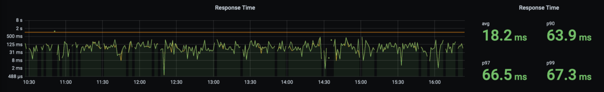
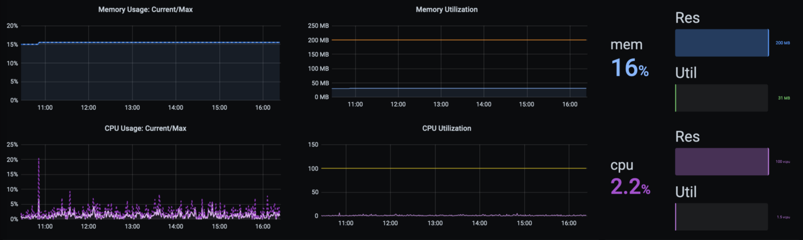

这是真实案例，不是标题党。

长话短说，我们使用 Go 语言重写了现有的 API。它以前是用 C# 和 .Net Core 编写的。

我必须说，重写过程及其付诸实践是艰辛的，而且花费的时间比我想象的要长。我们获得了一些新的经验，并获得了多个关键点，这些成功使新 API 取得了成功，我们希望与您分享这些经验。

我必须说，重写过程及其付诸实践是艰辛的，而且花费的时间比我想象的要长。我们获得了一些新的经验，并获得了多个关键点，这些使新 API 取得了成功，我们希望与您分享这些经验。

## 重写过程是如何开始的？

开始是因为我试图提高[并发性](https://medium.com/@akselarzuman/concurrency-and-parallelism-difference-9a3e394a1e9d)，这么认为的原因之一是我们的 API 很适合它，后来我们也可以获得[并行性](https://medium.com/@akselarzuman/concurrency-and-parallelism-difference-9a3e394a1e9d)的力量。此外，该 API 进行了大量按位运算，我们认为 Go 可以在其中表现更好。

我必须承认，这是我处理过的最困难的 API，大约花了一个星期才能完成逆向工程。之后，我开始在业余时间使用 Go 重写它。我一直把它当作一个爱好项目，直到最后才向团队展示。

## 重写过程如何进行？

在逆向工程过程中，我发现了一些需要在现有 API 中重构的代码。我已经完成了所有重构，然后开始上线了。因此，我保证新的应用程序将没有它们，并且代码将更干净。

保留方法名称是关键部分，因为在应用程序之间更容易查找。在调试时指出错误也更容易。

最初，我不想实现[并发和并行性](https://medium.com/@akselarzuman/concurrency-and-parallelism-difference-9a3e394a1e9d)，因为我希望两个 API 相同。但是，我自已无法实现它们。

用 Go 编写单元测试要比 C# 复杂一些。我花了一段时间习惯了 mocking 部分。在我看来，关于 Go 中的 mock 方法/层的文章（和最佳实践）并不多。我阅读的几乎所有涉及测试的文章/帖子都不包含要 mock 的方法/层。我觉得我应该写下一些东西并分享我的经验。

幸运的是，现有的 API 具有单元测试。我们的首席开发人员说：“如果一个应用程序具有单元测试，那么将它移植到另一种语言真的很容易。”，他非常正确。

## Go 进程的测试情况

完成单元测试后，我就开始在两个 API 之间进行一些 monkey 测试。这部分非常有趣，因为我在比较**响应，响应时间**和**资源使用情况**。

除了一些小差异外，**响应是相同的**。对于其余部分，我必须进行一些修复。

从响应时间看，Go 的性能**绝对**更好。现有的 API 响应时间在 800 毫秒至1.2秒，而 Go 会在 120 毫秒至 200 毫秒内响应相同的请求。

如果仅通过比较响应和响应时间就足以使用新的 API ，那么您可能会犯很大的错误。一旦检查了新 API 中的内存和 CPU 使用率，便确定存在问题。我使用 Go 编写了多个 API，但没有一个使用超过 50mb 的内存，而现在这个 API 使用了大约200mb。在 CPU 部分中，它使用了分配给容器的所有 CPU。我认为这没问题，因为我实现了并行性。

## 我的时间花在哪了

独自在黑暗中呆一会儿是可以的，这会让你学习如何找到光的方法。如果您在那里呆的时间太长，您可能会忘记为什么在那里并且可能以为失明，迷失自我。

因为通过使用 channel 来复制数据，并通过 goroutines 来使用 CPU，我相信这个问题是关于并发/并行执行的，花了这么多时间阅读关于它的文章和最佳实践。尽管我的想法错了，但我对并发和并行性学到了很多，因此，我不能说浪费了时间。

## 是时候找到光明了

在尝试了多种方法之后，我不得不承认我失败了。这是我与后端团队共享项目的时间。我们的首席开发人员，也是我的密友也为新 API 花费了些时间。

是他，对 API 进行了最后的润色。

我向他解释了 API 的工作原理以及我使用的技术（例如 Redis，SQL Server 等）……我们在半小时内解决了我们的 CPU 问题，也许更少。该 API 与 Redis 建立了多个连接，I/O 操作会消耗 CPU 资源。

为了指出是什么导致新 API 中的内存泄漏，我们使用了[pprof 包](https://golang.org/pkg/net/http/pprof/)。为了在 Redis 中使用相同的键使现有 API 和新 API 协同工作，我使用了 [JSON 编码](https://golang.org/pkg/encoding/json/)和解码，我们通过这种方式指出找到了内存泄露的问题。

解决这些问题后，我编写了一个端点测试应用程序，Yiğit 从 [ELB](https://aws.amazon.com/elasticloadbalancing/) 那里获得了最常用的端点及其参数。我们向现有 API 和新 API 发送了相同的请求，并将它们的响应与代码进行了比较。

一切都变得很酷之后，我们上线了！请在下面查看我们新的 API 响应时间和资源使用情况。

响应时间

资源使用

如您所见，我们实际上将响应时间减少了 87％ 以上。容器分配了**100vcpu** 和 **200mbs** 的内存。现有的 API **资源值是相同的**，但是，它正在扩展到最少 2 个，最多 4 个容器。使用 Go 构建的新 API 在**单个**容器中运行。我们同时减少了响应时间和资源使用量！我们确信这会以很好的方式影响我们的**转化率**，但现在就分享该信息还为时过早。

到这，项目还未完成。我们重构了现有的 API，并删除了 Redis 查询。这就是我们想要检查 Go 在本例中是否比 .Net Core 强大。好吧，我们对结果感到惊讶。

我们使用了一个名为 [Bombardier](https://github.com/codesenberg/bombardier) 的工具，并再次对这两个 API 进行了基准测试！.Net Core 已扩展为 4 个容器，无法处理请求。然后，所有容器挂了，并报告 503 服务暂时不可用。但是，Go 保持不变，不需要扩展自身，也不会挂！

我想添加一个有关我们测试过程的有趣故事。我们想检查 Go可 以处理多少个请求。我们使用 Alpine 映像，因此，由于Linux OS 的限制，Go 应该处理 1024 个并发请求（您可以增加它，但我们不想这样做）。Yiğit 想在 30 秒内进行 2048 个连接。你能想象发生了什么事吗？Yiğit 分配了路由器上的所有端口，网络不可用了几分钟，但 API 仍然有效。

## 总结一下

当我向团队寻求帮助时，便是该项目的里程碑。拥有一支技术精湛且积极进取的团队是该项目成功的关键。尽管 Yiğit 尚未使用Go构建任何项目，但他在其他语言中的强大背景帮助我们在该项目中取得了成功。这是深入学习语言的重要性。

在项目期间，我也学到了很多东西。我从来没有考虑过浪费任何时间，实际上，我获得了很多经验。我将在以下项目中使用这种经验、学过的知识！

https://labs.armut.com/how-we-decreased-one-of-our-apis-response-time-by-87-and-used-less-resources-ce847e83308