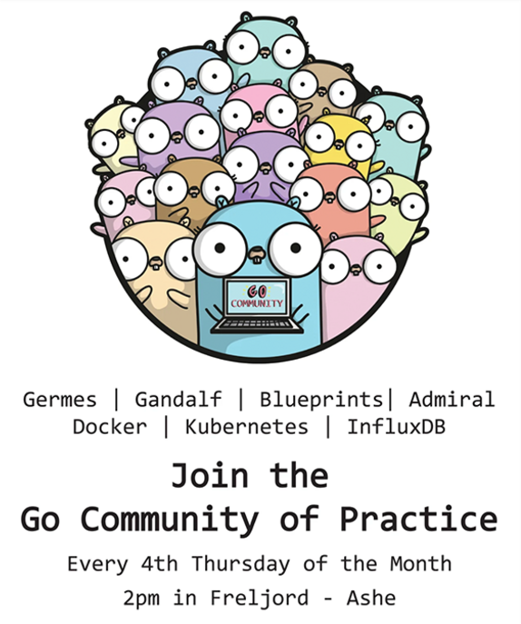

英雄联盟（LOL），这个游戏很多人应该知晓，甚至玩过。但可能你并不知晓，开发它的公司 Riot 大量在使用 Go 语言。今天这篇文章就是介绍 Go 在游戏开发和运营中的运用。

开始前介绍下本文的一些相关情况。

## Riot 公司

国内叫它拳头游戏。是一家美国网游开发商，成立于 2006 年，代表作品《英雄联盟》。2015 年 12 月，腾讯对这拳头游戏公司实现了 100% 控股。

## 本文作者

Aaron Torres，是 Riot 开发者体验团队的工程经理（engineering manager）。他们部门的职责是辅助 Riot 游戏团队进行快速的游戏开发、并且协助进行后台服务的部署和运维。游戏团队所开发的微服务需要在全球范围内进行部署和运维。他在公司工作的 3 年多时间里一直在写 Go 代码。

在加入 Riot 之前，Aaron Torres 写了一本[关于 Go 语言的书](https://www.amazon.com/Aaron-Torres/e/B07WCR72T3?ref_=dbs_p_ebk_r00_abau_000000)，在 Riot 时，他把它更新到了第二版。在学习 Go 的过程中，他也深度参与了将大量单体应用向微服务架构的迁移的项目中，广泛使用 Docker 容器、Kubernetes 等容器编排工具，以及当需要在全球范围内做服务集群部署时所需要的其他相关工具。


下面是 Aaron Torres 的团队和工作情况。

我在 Riot 管理着两个团队，分别是服务生命周期管理团队和云服务集成团队，它们都隶属于 Riot 开发者体验团队（RDX）。RDX 除了负责管理公司的裸机数据中心和云厂商提供的云资源等基础设施之外，还负责管理平台应用与平台服务之间的软件中间层。这些服务中的绝大部分（包括 Docker 等第三方软件）都是用 Go 语言编写的。

我的团队拥有数项服务，包括全球化部署工具和在基于 SDN 软件定义网络之上的、用于管理服务之间网络连接的访问控制管理层。此外，我们拥有一个云基础架构供应商服务，该服务负责扩展和管理供服务所有者使用的 AWS 资源。

在进行软件和编程语言选型时，我们鼓励 Riot 的技术团队为他们的产品寻找最佳选择。在本文中，我们将专门研究几个不同的团队如何使用 Go。我将介绍两位技术专家：来自 RDX Operability 的 Chad Wyszynski 和来自 VALORANT 的 Justin O'Brien，他们分享如何在自己的项目中使用 Go。

## Go 语言背景（Context On Go）

在 Riot，我们的两种主要服务语言是 Java 和 Go。由于我们使用容器化的应用部署方式，而且这两种语言彼此之间可以进行互操作引用，此外对 java 应用和 go 应用来说，打包和部署都相对容易，因此我们将这两种语言都视为头等公民。之所以喜欢 Go，有很多原因，其中包括：

- Go 应用程序的分发和部署就像下载和运行二进制文件一样简单。这种语言特性对于构建 CLI 工具来说是非常友好的；
- Go 语法简单，[语言规范](https://hao.studygolang.com/golang_spec.html)简洁清晰，可以让有其他语言背景的工程师快速上手；
- Go 代码的构建速度如此之快，以至于你的编辑器可以在保存时重建以检查错误；
- Go 标准库功能强大，标准库中甚至包含一个生产级别可用的 `webserver` 实现；
- Go 具有原生的并发能力和以`goroutine` 和 `channel` 为核心的并发原语支持；
- Go 对语言的最佳实践有自己的规范，`gofmt` 命令让每个人的代码看起来都差不多；
- Go 很少破坏向后兼容性，一旦需要破坏，它通常以库的形式而不是语言本身（用于依赖性管理的模块）的形式。
- Go 相对比较流行，这意味着有很好的第三方支持，其他软件厂商常常会开发出包含 go 客户端的第三方软件

科技领域中对 Go 语言的研究在最近也取得了不少进展，尤其是在微服务方面的进展引起了开发者的浓厚兴趣和广泛关注，并推动相关领域的发展。在系统领域，它也变得越来越流行，比如 [etcd](https://etcd.io/)、[Docker](https://etcd.io/)、[Kubernetes](https://kubernetes.io/)、[Prometheus](https://prometheus.io/) 等开源软件。在[结构化日志](https://github.com/sirupsen/logrus)、[选举算法，如 raft](https://github.com/hashicorp/raft)、[websockets](https://github.com/gorilla/websocket) 等方面也有优秀的库。此外，标准库还包含了对 [TLS](https://docs.studygolang.com/pkg/crypto/tls/) 和 [SQL](https://docs.studygolang.com/pkg/database/sql/) 支持的内容。所以使用 go 语言可以快速提升生产力。

## 使用案例：RIOT 部署工具

服务生命周期团队的主要项目是 Riot 部署工具，该工具用于部署和管理在 Docker 运行时中运行的服务的生命周期。如果你阅读过之前的[“运行在线服务”系列](https://technology.riotgames.com/news/running-online-services-riot-part-i)，会更好地了解我们正在处理的问题。我们的部署工具是用 Go 语言编写的，因为它使我们能进行快速版本迭代，也可以让团队新加入的工程师快速的学习和熟悉我们的技术栈，迅速从早期开发过渡到生产级开发。它的数据库使用 MySQL，并且部署工具的单实例可在多个数据中心进行部署和使用。面对上述的需求，Go 的语言特性能够让我们很好的应对这些挑战，诸如:

- JSON/YAML 支持
- HTTP 客户端
- 网络连接
- API 集成

### JSON/YAML 支持

我们的部署工具需要解析和运行一个描述应用运行时所需资源的自定义的 YAML 语法模版。有几个第三方的 Go 库为我们实现了 [JSONschema](https://json-schema.org/implementations.html#validator-go) 的解析。与第三方对 YAML 的支持类似，Go 还提供了将 Go 结构体 Marshaling 和 Unmarshaling 成 JSON 的原生支持。

```yaml
schema_version: 1.0.0
application:
  name: app.server
  version: 1.0.0
  description: "A micro-service that does import things"
  owner: smartperson@riotgames.com
  pack:
    count: 1
    containers:
      -name: platform.core
      image: platform/core
      version: 1.0.0
      resources:
        cpu: 2
        memory: 8192
```

部署工具可能会使用的结构化 YAML 模式。

### HTTP 客户端

我们的运维工具需要与其他一些微服务如服务发现、日志、告警、配置管理、调配数据库等进行网络连接，连接的主要的方式是建立 HTTP 请求。这意味着我们常常要考虑请求的生命周期、互联网突发事件、超时等问题。幸运的是，Go 提供了一个非常可靠的 HTTP 客户端，当然，在使用时 HTTP 客户端的某些默认配置需要调整。例如，默认情况下客户端永远不会超时。

```go
res,err := http.Get("http://www.riotgames.com")
if err!= nil{
    log.Fatal(err)
}
results,err := ioutil.ReadAll(res.Body)
res.Body.Close()
if err!= nil{
    log.Fatal(err)
}
fmt.Printf("%s",results)
```

发起 HTTP Request 请求并且打印出 Response Body

### 网络连接

通常，数据中心可以通过附加的安全层隔离，特别是在与合作伙伴区域合作时。我们用于多个项目的 Go 的一个非常有用的方面是 Go httputil 反向代理。这使我们能够快速代理请求，为请求的生命周期添加中间件以注入额外的身份验证或标头，并使所有内容对客户端都相对透明。

### API 库

在 Riot 公司的服务开发过程中，我们必须与各种第三方服务进行交互，包括 [Hashicorp Vault](https://www.vaultproject.io/)、[DCOS](https://dcos.io/)、[AWS](https://aws.amazon.com/sdk-for-go/) 和 [Kubernetes](https://kubernetes.io/) 等。这些解决方案大多提供 Go 语言版本的 API 客户端库。有时，我们也会根据自己的需要使用或 fork 第三方库。几乎所有情况下，我们都能找到足够的支持来满足我们的需求。

此外，在开发过程中，重新编译并运行本地版本的部署工具是很容易的，通过使用本地版本可以进行快速的测试或[调试](https://github.com/go-delve/delve)，而且通过对`API`库的封装和分发可以使我们轻松地进行代码共享。

现在已经了解了我的团队是如何使用 Go 进行项目部署的，让我们来看看另外两个例子。

## 案例：运维监控

我是来自 RDX 运维团队的 Chad Wyszynski，下面我为大家介绍一下我的团队是如何在我们的运维监控 PipeLine 中使用 Go 来减少请求延迟的。Riot 的大部分日志和指标数据都要流经我团队的监控服务。这部分网络流量很大，而且持续很久，当有服务出现问题时，流量会激增，所以监控服务必须满足高吞吐量和低延迟的要求。没有人会愿意等待几秒钟来记录一个错误信息，而利用 go 语言中的`Go channel`特性使我们的代码很好的满足了这些需求。

运维监控服务存在的目的只有一个：将日志和指标转发到后端的观测平台（例如New Relic）。该服务首先将请求数据转换为后端平台期望的格式，然后将转换后的数据转发到该平台。这两个步骤都很耗时。该服务不是强制客户端等待，而是将请求数据放置到 buffer channel 中，以供另一个 Goroutine 处理。这允许服务几乎立即响应客户端。

但是，当`bounded channel`满了会发生什么情况？默认情况下，Goroutine 会一直阻塞直到通道可以接受数据。我们使用 Go 的`time.After`来对等待时间进行设置。如果通道在超时之前不能接受请求数据，服务就会返回`503`错误。客户端接收到 `503`错误后利用指数退避算法进行请求重试，

```go
select {
	case workQueue <- requestData:
		return nil
	case <-time.After(timeout):
		return errors.New("queue is full")
}
```

> Go 语言中文网注：此处的 time.After 有可能会有内存泄露（没有触发超时，内部生成的 timer 实例不会被回收），具体参考该文：<https://studygolang.com/articles/22617>。

基于 go-channel 设计的另一个优势在于当需要从一个可观测后端迁移到另一个后端时。[Riot 最近将所有的指标和日志从手动管道转移到 New Relic](https://newrelic.com/resources/case-studies/riot-games)。运维监控服务必须将数据转发到两个后端，同时技术团队需要在新平台上配置显示仪表盘和报警规则。得益于 Go 语言的管道特性，双向 channel 的数据发送基本上没有给客户请求增加任何延迟。我们的服务代码只需将请求数据添加到另一个 bouned-channel 中。那么，最大的服务器响应时间是基于 Goroutine 将数据转发到目标管道上所等待的时间，而不是目标服务器的响应时间。

```go
var wg sync.WaitGroup
wg.Add(len(destinations))

for _,destination := range destinations{
    // enqueue data in parallel
    go func() {
        defer wg.Done()
        enqueue(requestData) //will block until data is queued or times out
    }()
}
//wait until data is enqueued or timed out for each destination
wg.Wait()
```

当我刚加入 Riot 公司时，我还是一个 Go 语言新手，所以当我看到 go channel 和 go Goroutines 的实际使用案例时我非常高兴。我的同事 Ayse Gokmen 设计了最初的工作流程；我很高兴能分享我们的工作。

## 案例：VALORANT

Justin O'Brien 来自 Valorant 的竞争团队！我的团队和 Valorant 的其他所有团队一样都使用 Go 来开发和实现所有的后端服务。我们的整个后端微服务架构都是用 Golang 构建的。这意味着，从服务初始化到管理游戏服务进程再到游戏中购买虚拟物品，所有的事情都是用 Go 代码来实现。尽管使用 Golang 为我们的所有服务带来了很多好处，但我将谈论三个特定的语言特性：并发原语、隐式接口和模块化包管理。

### 并发原语

当系统开始慢下来的时。我们利用 Go 并发原语来提升系统吞吐，在应用程序中并行运行后台进程。一个例子是我们经常发现自己在一场比赛处于执行链中，需要为每个球员做些事情，例如在比赛开始时为每个球员加载皮肤数据。我们对共享函数的要求是完成所有子例程的执行后返回，并返回所有发生的错误的列表。

```go
func Execute(funcList []func() error) []error
```

我们通过使用两个 channel 和一个 waitgroup 来实现。另外创建一个通道用来在每个[thunk](https://en.wikipedia.org/wiki/Thunk)执行时捕获错误，而另一个管道是一个接收子进程是否完成的管道，当 waitgroup 完成时，一个 Goroutine 就会发送上去。go 语言的语言特性原生支持这种模式的实现。

### 隐式接口（implicit interfaces）

我们广泛使用的另一个 Go 语言特性是隐式接口。我们非常充分地利用它们来测试我们的代码，并将其作为创建模块化代码的工具。例如，我们很早就开始声明我们在所有服务中都将有一个通用的数据存储接口。这是我们所有服务中的一个接口，用于与数据源进行交互。

```go
type Datastore interface {
    Fetch(ctx context.Context,key string)(interface{},error)
    Update(ctx context.Context,key string,f func(current interface{})(interface{},error))(interface{},error)
}
```

这个简单的接口使我们能够实现许多不同的后端，以完成不同的事情。我们通常在大多数测试中使用内存实现，而较小的接口使其非常轻巧，并且可以在测试文件中对访问次数等特殊情况进行内联实现，或者对错误处理逻辑也进行测试。我们还将 SQL 和 Redis 混合用于我们的服务，并为这两种数据库服务都进行了接口代码实现。对新服务中新增数据存储的操作变得特别容易，并且还能够添加更多特性，例如由 Redis 支持的直写式内存高速缓存。

> Go 语言中文网注：这里说的隐式接口指的是，不像其他语言，实现接口需要通过关键字来明确指定。Go 语言的接口实现的实现是类鸭子类型，不需要明确指定实现，因此叫做“隐式”。

### 模块化包管理

最后，我想指出一些语言特性之外的东西，那就是可广泛选择使用的第三方包，并且这些第三方包通常可以与内置包互换使用。由于 golang 包的模块化特性，可以使得我们在进行项目重构时只需要做很小的改动就可以完成重构工作。例如，我们的一些服务在序列化和反序列化 JSON 时消耗了大量的 CPU 时间。原因在于我们在第一次编写服务时，使用了 Golang 的开箱即用的 [json](https://studygolang.com/pkg/encoding/json/) 包。当然这个包可以适用于 95%的用户使用情况，通常 json 序列化不会在火焰图上显示出来（现在想来 golang 内置的性能剖析工具也是很棒的）。有几个案例专门围绕 golang 中大对象的序列化，通过分析，我们发现服务的大量时间都花在了 json 序列化上。我们开始进行服务优化，在优化过程中发现有很多可替代的第三方 json 包与内置包是相互兼容的。这样一来，代码重构优化就只需要修改下面的这个一行代码。

```go
import "json"
```

调整为:

```go
import "github.com/custom-json-library/json"
```

代码调整之后，对 JSON 库的任何调用都会转向调用第三方库，这种调整过程也使得对不同包的性能剖析和测试变得十分容易。

> Go 语言中文网：不知道英雄联盟有没有使用 Go 语言！

## Gopher 社区实践

上面已经向大家介绍了在 Riot 公司中使用 Go 的相关案例，现在继续分享 Riot 在技术选型和团队协作方面的情况。团队在选择技术堆栈时所具有的灵活性取决于 Rioter 技术人员的协作环境。

Riot 游戏是一家非常社会化的公司，我们的[技术部门鼓励 Riot 公司员工](https://www.riotgames.com/en/work-with-us/disciplines/engineering/riots-tech-community)积极参与社区活动并且在社区中学习。例如，我们的各种实践社区使得有共同兴趣的 Rioter 团队能够定期聚集在一起学习和分享。其中最活跃的技术社区是我目前负责的 Go 社区。我们也创建了一个专门 Slack 频道来讨论新的提案，我们每月都有一次见面会，社区成员们会在会上会针对他们目前所学习的主题或对了解到的其他比如用 Golang 编写的其他 Riot 项目等信息进行分享。

我们也非常期待 Riot 之外的社区参与到开源库维护中来。当开源库有变动时且变动会影响到多个团队时，我们可以在 COP 中进行讨论和协调。比如可以在 COP 中讨论[模块镜像](https://blog.golang.org/module-mirror-launch)启动时的相关安全问题。此外，我们也会讨论诸如在构建容器时可能会遇到的问题等等，当然也可以针对某个方法、软件工具、代码库等一般性问题向领域专家提出疑问从而来寻求解答。

我个人很喜欢拥有一个由跨团队和跨学科的 Go 爱好者组成的频道来交流想法，讨论语言变化并分享我们遇到的代码库。当我们从旧的依赖解决方案过渡到 Go Module 时，该交流频道是讨论的中心点，在这个频道中认识了很多对 Go 语言充满热情的工程师。



## 结尾

在 Riot，许多团队维护 Go 语言编写的服务和工具。Go 提供了强大的标准库和强大的第三方社区支持，可帮助满足我们的开发需求。

我们的实践社区是开发人员在 Riot 上使用Go并分享他们的经验和教训的一种好方法。我们对 Riot Go 的未来感到兴奋，因为它能够保持灵活性并在整个公司中保持高度的沟通。

> 对大型网络游戏开发了解的，分析分析，LOL 所使用的技术栈？！

觉得本文不错，欢迎传播！期待 Go 更好的发展！

> 本文作者：Aaron Torres
>
> 原文链接：<https://technology.riotgames.com/news/leveraging-golang-game-development-and-operations>
