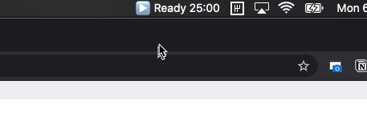

> 本文是 macdriver 作者写的，这是一个 Go 语言的 Objective-C 桥接器，使得 Go 可以使用 Mac API。如果做过 Apple 相关应用开发，可以试试这个。

如果你使用 Apple 设备并且是 Go 程 序员，或者正在考虑学习 Go，那么我们会获得一些非常酷的新功能。今天，我发布了 [macdriver](https://github.com/progrium/macdriver) 的 Alpha 版，这是一个 Go 语言的 Objective-C 桥，具有与常见 Mac API 的绑定。

那些关注我的上一篇有关 [Large Type in 80 lines of Go](https://dev.to/progrium/large-type-legacy-celebrated-in-80-line-go-program-1mob) 的文章的人可能已经找到了 macdriver。 largetype 程序是 macdriver 的示例项目之一。

macdriver repo 中的另一个示例是这个额外的小菜单栏（又名 systray 或状态图标），它为您提供了 Pomodoro 计时器。这个小程序也使用 macdriver 的[不到 80 行代码](https://github.com/progrium/macdriver/blob/main/examples/pomodoro/main.go)。

最后，如果您正在使用 Go 1.16 beta，或者可以等待它的正式发布，也有一个示例可以为您提供具有透明背景的全屏 Web 视图，让您可以使用 Web 技术在屏幕上绘制 overlays 之类的东西。Twitch streamers 可能也加入其中，是不是很棒！

## 多年的打磨

MacDriver 的动机是方便通过 Go 来使用 Mac 系统 API（例如 Cocoa）制作 GUI 应用程序，就是说，我的大部分工作现在都将网络技术用于用户界面，即 la Electron。

去年，我使用 [webview](https://github.com/webview/webview) 项目在 Go 中启动了一个替代的 Electron 堆栈，该项目使用您平台的本机浏览器引擎并创建一个带有 webview 的窗口。尽管绝对简单且跨平台，但该项目并未优先考虑任何平台特定的功能。

最重要的是，如果您还想在同一程序中制作一个类似于 Pomodoro 计时器的小菜单小程序（并非罕见），您可以找到另一个独立的跨平台 Go 库来存放系统托盘内容，但是这些一次性库通常会有 API 不完整的困扰。更重要的是，它们是不可组合的！您不能将 systray 库与 webview 库一起使用，因为它们都假定拥有主 Cocoa 线程。

因此，像往常一样，我感到沮丧的是，没有一个更广泛思考，更通用的解决方案。如果我想使用其他 Mac API，该怎么办？等待另一个不完整，不可组合的项目？不，我们在这里建立自己的未来。

早在 2013 年，我就发现了一个丹麦人 Mikkel 创建的项目：[Objective-C bridge for Go](https://github.com/mkrautz/objc)，虽然它不能正常工作。

这整个过程应该很简单。 [Objective-C 运行时](https://developer.apple.com/documentation/objectivec/objective-c_runtime)实际上是一个名为 libobjc 的 C 库。因此，从理论上讲，您应该能够像其他 C 库一样使用 cgo 调用 libobjc 并在 Go 中使用 Objective-C 对象。

不幸的是，libobjc 中调用函数（对于任何方法/函数调用都是通用的）的参数是可变的（接受任意数量的参数）。 Cgo 不支持可变参数函数调用！因此，Mikkel 使用了[汇编操作](https://github.com/mkrautz/variadic)，以使几乎任何可变的 C 函数都可调用。惊人！但是自 2013 年以来，对 Go 运行时的更改打破了这一点，他很早就转向其他项目。

有了一定的决心，我又进行了黑客般的工作。我甚至忘了我在 2018 年在 dev.to 上发布了有关此问题的信息。还有更多的事情需要解决，但是直到去年初我需要解决此 Webview 和系统托盘可组合性问题时，我都是将其搁置的。我引入了废弃的 objc bridge 程序包（我已修复的可变参数程序包），并开始为某些更常见的 Mac API 制作本机 Go 包装器。结果是 macdriver！

## 好处

现在，您可以在 Go 中制作可以处理 Mac 的快速，本机二进制文件。不仅仅意味着制作 MacOS 应用程序。有许多 API 只是开辟了新的可能性。例如，我很兴奋能使用 Core ML API 在新的 M1 设备上使用神经引擎。

另一个好处是能够使用 Go 构建工具链快速制作 Mac 应用。没有 Xcode！只需要 go build。

## 后续计划

我很高兴看到人们使用 macdriver。在 [README](https://github.com/progrium/macdriver) 中有很多有关使用它的信息，但我仍在研究文档。在这一点上，它应该主要是自我解释，但随时可以在[论坛](https://github.com/progrium/macdriver/discussions)中提问。

如果您有兴趣与我一起探索新的可能性，我一直想尝试将 macdriver 用于 Apple Watch 应用程序。 Mikkel 的原始桥包中有一个 iOS 概念验证，但我还没有尝试过。假设它可以工作（可能涉及 Xcode 或其他开发人员工具），似乎也可以用于 Apple Watch 甚至 Apple TV。

> 原文链接：<https://dev.to/progrium/use-mac-apis-and-build-mac-apps-with-go-ap6>
>
> 本文作者：Jeff Lindsay
>
> 编译：polarisxu