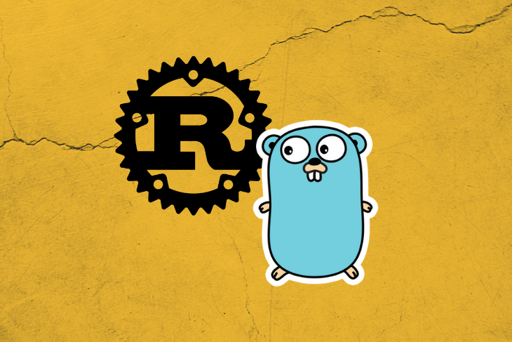
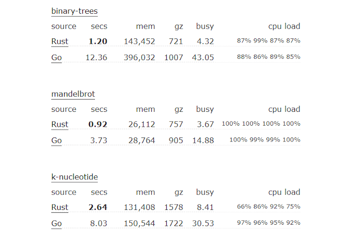
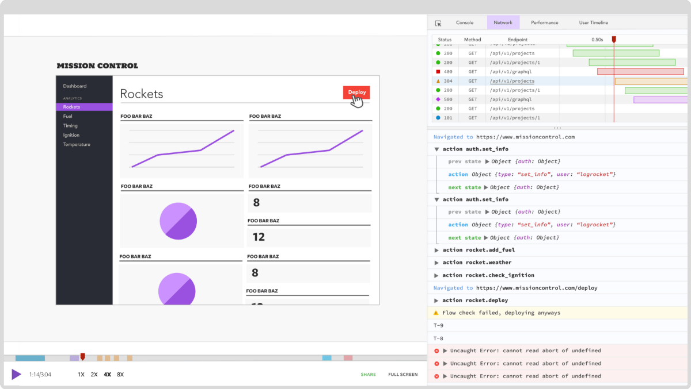

Golang 和 Rust 之间有明显的区别。Golang 更加注重构建可以无限扩展的 Web API 和小型服务，尤其是在 goroutine 的强大支持下。Rust 也可以用于小型服务，但是从开发人员的经验来看，事情要困难得多。

Rust 非常适合处理大量数据和其他 CPU 密集型操作，例如执行算法。这是 Rust 超过 Golang 的最大优势。要求高性能的项目通常更适合 Rust。

在本教程中，我们将就 Golang 和 Rust 进行比较和对比，评估这两种编程语言的性能，并发性，内存管理和整体开发人员体验。我们还将概述这些元素，以帮助您一目了然地为项目选择正确的语言。

如果您刚开始使用 Rust，那么在继续阅读之前，最好先阅读一下[初学者指南](https://blog.logrocket.com/getting-up-to-speed-with-rust/)。

如果您全都都准备好了，那就让我们开始吧！

## 性能

Golang 最初是由 Google 的工程师设计的，于 2009 年向公众推出。它的创建是为 C++提供替代方案，该替代方案易于学习和编码，并且经过优化可在多核 CPU 上运行。

从那时起，Golang 对于希望利用该语言提供的并发性的开发人员来说非常有用。该语言提供了 goroutine，使您可以将函数作为 goroutine 运行。

Golang 的一大优势是您可以轻松使用 goroutines。只需将`go`添加到函数前即可使其作为 goroutine 运行。Golang 的并发模型允许您跨多个 CPU 内核部署工作负载，从而使其成为一种非常有效的语言。

```go
package main

import (
    "fmt"
    "time"
)

func f(from string) {
    for i := 0; i < 3; i++ {
        fmt.Println(from, ":", i)
    }
}

func main() {

    f("direct")

    go f("goroutine")
    time.Sleep(time.Second)
    fmt.Println("done")
}
```

尽管有多核 CPU 支持，Rust 仍然跑赢 Golang。Rust 在执行算法和资源密集型操作方面效率更高。该[基准测试游戏](https://benchmarksgame-team.pages.debian.net/benchmarksgame/fastest/rust-go.html)比较了 rust 和 golang 的不同算法，如二叉树。对于所有经过测试的算法，Rust 至少快 30％；在二叉树计算的情况下，最高可达 1,000％。[Bitbucket 的](https://bitbucket.org/blog/why-rust)一项研究表明，Rust 与 C++的性能相似。



_（来源：[基准测试游戏](https://benchmarksgame-team.pages.debian.net/benchmarksgame/fastest/rust-go.html)）_

## 并发

如上所述，Golang 支持并发。例如，假设您正在运行一个处理 API 请求的 Web 服务器。您可以使用 Golang 的 goroutine 程序将每个请求作为 goroutine 运行，通过将任务分发到所有可用的 CPU 内核来最大程度地提高效率。

Goroutines 是 Golang 内置功能的一部分，而 Rust 仅支持本地 async/await 语法来支持并发。因此，在并发方面，Golang 的开发人员有经验优势。但是，Rust 在保证内存安全方面要好得多。

这是 Rust 的简化线程的示例：

```rust
use std::thread;
use std::time::Duration;

fn main() {
   // 1. create a new thread
   thread::spawn(|| {
      for i in 1..10 {
         println!("thread: number {}!", i);
         thread::sleep(Duration::from_millis(100));
      }
   });

  println!("hi from the main thread!");
}
```

并发一直是开发人员的棘手问题。在不影响开发人员体验的情况下保证内存安全的并发性并不是一项容易的任务。但是，这种极端的安全重点导致创建了[可证明正确的并发](https://blog.rust-lang.org/2015/04/10/Fearless-Concurrency.html)。Rust 尝试使用所有权概念来防止未经请求的资源访问，以防止出现内存安全错误。

Rust 提供了四种不同的并发范例，以帮助您避免常见的内存安全陷阱。我们将仔细研究两个常见的范例：channel 和锁。

### Channel

[channel](https://doc.rust-lang.org/stable/rust-by-example/std_misc/channels.html) 有助于从一个线程传送消息到另一个。虽然 Golang 也存在此概念，但 Rust 允许您将[指针](https://doc.rust-lang.org/std/primitive.pointer.html)从一个线程转移到另一个线程，以避免争用资源。通过传递指针，Rust 可以对 channel 强制执行线程隔离。同样，Rust 在并发模型方面表现出对内存安全的痴迷。

### 锁

仅当持有[锁](https://doc.rust-lang.org/std/sync/struct.Mutex.html)时才能访问数据。Rust 依赖于锁定数据而不是 cod 的原理，而 cod 经常在诸如 Java 之类的编程语言中找到。

有关所有权和所有并发范例的更多详细信息，请查看“[使用 Rust 进行无所畏惧的并发](https://blog.rust-lang.org/2015/04/10/Fearless-Concurrency.html)”。

## 内存安全

较早的所有权概念是 Rust 的主要卖点之一。Rust 将[类型安全](https://en.wikipedia.org/wiki/Type_safety)提升到了新的水平，这对于实现内存安全的并发性也很重要。

根据[Bitbucket 博客](https://bitbucket.org/blog/why-rust)，“ Rust 非常严格和繁琐的编译器会检查您使用的每个变量以及您引用的每个内存地址。它避免了可能发生的数据争用情况，并通知您未定义的行为。”

这意味着由于 Rust 对内存安全性的极度痴迷，您最终不会出现缓冲区溢出或争用情况。但是，这也有其缺点。例如，您在编写代码时必须非常了解内存分配原则。始终保持您的内存安全防护并不容易。

## 开发人员体验

首先，让我们看一下每种语言的学习曲线。Golang 在设计时考虑了简单性。开发人员经常将其称为“无聊”语言，也就是说，其有限的内置功能集使 Golang 易于学习、使用。

此外，Golang 提供了比 C++更简单的替代方案，隐藏了诸如内存安全性和内存分配等方面的内容。Rust 采用了另一种方法，迫使您考虑诸如内存安全性的概念。所有权的概念和传递指针的能力使 Rust 失去了学习的吸引力。当您不断考虑内存安全性时，您的工作效率就会降低，并且您的代码注定会变得更加复杂。

与 Golang 相比，Rust 的学习曲线非常陡峭。值得一提的是，与 Python 和 JavaScript 等动态语言相比，Golang 的学习曲线较为陡峭。

## 何时使用 Golang

Go 在各种用例中都能很好地工作，使其成为创建 Web API 的 Node.js 的绝佳替代品。正如[Loris Cro](https://kristoff.it/blog/why-go-and-not-rust/)指出的那样，“ Go 的并发模型非常适合必须处理多个独立请求的服务器端应用程序”。这正是 Golang 提供 goroutines 的原因。

此外，Golang 内置了对 HTTP Web 协议的支持。您可以使用内置的 HTTP 支持快速设计一个小型 API，并将其作为微服务运行。因此，Golang 非常适合微服务架构并满足 API 开发人员的需求。

简而言之，如果您重视开发速度并且更喜欢语法简单而不是性能，那么 Golang 是一个很好的选择。最重要的是，Golang 提供了更好的代码可读性，这对于大型开发团队而言是一个重要标准。

在以下情况下选择 Golang：

- 您关心简单性和可读性
- 您需要一种简单的语法来快速编写代码
- 您想使用支持 Web 开发的更灵活的语言

## 何时使用 Rust

当性能很重要时，例如在处理大量数据时，Rust 是一个不错的选择。此外，Rust 为您提供了对线程行为以及线程之间资源共享方式的细粒度控制。

另一方面，Rust 具有陡峭的学习曲线，并且由于内存安全性的额外复杂性而减慢了开发速度。这并不一定是不利的。Rust 还保证当编译器检查每个数据指针时，您不会遇到内存安全性错误。对于复杂的系统，此保证会派上用场。

在以下情况下选择 Rust：

- 您关心性能
- 您想要对线程进行细粒度的控制
- 您重视内存安全而不是简单性

## Go vs. Rust：我的大实话

让我们从突出相似之处开始。Go 和 Rust 都是开源的，旨在支持微服务架构和并行计算环境。两者都通过并发优化了可用 CPU 内核的利用率。

但归根结底，哪种语言是最好的？

有很多方法可以解决这个问题。我建议考虑要构建哪种类型的应用程序。Golang 可很好地用于创建 Web 应用程序和 API，这些应用程序和 API 利用其内置的并发功能，同时支持微服务体系结构。

您还可以使用 Rust 来开发 Web API，但并不是在设计时考虑到此用例。Rust 对内存安全性的关注增加了复杂性和开发时间，尤其是对于相当简单的 Web API。但是，对代码的大量控制使您可以编写更优化，内存效率更高且性能更高的代码。

简而言之，Golang 与 Rust 的争论实际上是一个简单与安全的问题。

有关更多观点，请查看“[在 Go 和 Rust 之间选择](https://sdtimes.com/softwaredev/the-developers-dilemma-choosing-between-go-and-rust/)”。

## LogRocket：全面了解线上 Rust 应用程序

调试 Rust 应用程序可能很困难，尤其是当用户遇到难以重现的问题时。如果您对监控和跟踪 Rust 应用程序的性能，自动显示错误以及跟踪缓慢的网络请求和加载时间感兴趣，请[尝试 LogRocket](https://logrocket.com/signup)。



[LogRocket](https://logrocket.com/signup)就像 Web 应用程序的 DVR，实际上记录了 Rust 应用程序中发生的所有事情。您可以汇总并报告问题发生时应用程序所处的状态，而不用猜测为什么会发生问题。LogRocket 还监视您的应用程序的性能，报告诸如客户端 CPU 负载，客户端内存使用情况等指标。

> 原文链接：https://blog.logrocket.com/when-to-use-rust-and-when-to-use-golang/
>
> 原文作者：Michiel Mulders
>
> 译者：polarisxu
