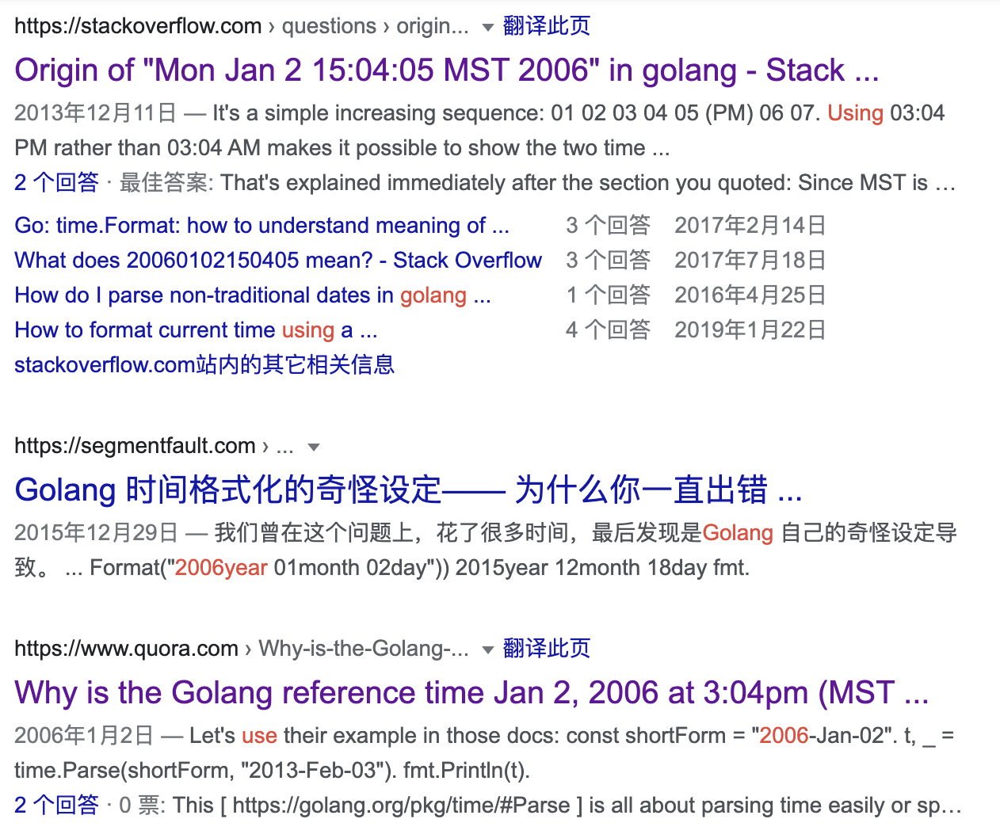

大家好，我是 polarisxu。

没有什么是完美的！而且，有些东西，有些人认为好，有些人认为很糟糕。Go 也是如此。喜欢 Go 语言的朋友，大概率对其中某些地方不喜欢。比如，你喜欢 Go 中时间格式化固定的 `2006-01-02 15:04:05 -0700` 吗？为什么是这么一个时间？今天来一探究竟！

## 01 新手的困惑

无论是各种群里还是网上搜一下，包括国外的，对 2006-01-02 15:04:05 -0700 都很困惑。



一般的困扰主要有：

- 不知道只能固定要这个时间，换其他的，出来的结果莫名其妙，然后一脸懵逼；
- 为什么没有像其他语言一样，yyyy-mm-dd 这样的形式？
- 这个时间有什么特殊意义吗？为什么挑这么个时间，完全记不住；

这很正常，毕竟这一点上，Go 很另类，也可以说很“奇葩”。甚至有人注册了一个域名：<http://fuckinggodateformat.com/>，我也是醉了。。。

但是这真的不好？

## 02 为什么这么设计？

为什么选择这个时间？不少人有这样的疑问。有人猜测是 Go 项目启动的时间等。但仔细研究，发现 Go Team 还是用心良苦，目的是解决大家记忆问题。

比如常规的 ymd 格式，以 PHP 为例，一般这样 `Y-m-d H:i:s`，输出类似：2021-08-03 09:30:00，但如果我想输出：`21-8-4 9:30:00`，你不查手册，能写出来吗？你看看 PHP 文档中关于 date 格式化的说明，头有点大，竟然那么多，虽然常用的形式，大部分人都记得，但遇到不怎么常用的，就得查手册了。

反观 Go 语言，它直接使用一个具体的时间来当做格式化字符串，需要什么格式，改这个时间格式即可。比如上面的例子，常规方式：2006-01-02  15:04:05，而 21-8-4 9:30:00 这种格式，只需要对应的改变值即可：06-1-2 3:04:05。而且，我查了下，PHP 没法表示没有前导零的分钟数和秒数，而 Go 很容易实现。很显然，Go 的方式是更合理、更易用的，对于各种变化，也能够更自如的应对。

只不过，很多人对这个具体的时间觉得记不住。这一点，Go 官方也考虑到了。毕竟采用特殊的时间，目的就是为了解决大家记忆问题，因此要确保这个特殊时间也好记。Go 是这么设计的：

```bash
1: month (January, Jan, 01, etc)
2: day
3: hour (15 is 3pm on a 24 hour clock)
4: minute
5: second
6: year (2006)
7: timezone (GMT-7 is MST)
```

刚好是 1 2 3 4 5 6 7，据此进行变化即可。

比如官方定义的常量：

```go
const (
    ANSIC       = "Mon Jan _2 15:04:05 2006"
    UnixDate    = "Mon Jan _2 15:04:05 MST 2006"
    RubyDate    = "Mon Jan 02 15:04:05 -0700 2006"
    RFC822      = "02 Jan 06 15:04 MST"
    RFC822Z     = "02 Jan 06 15:04 -0700" // RFC822 with numeric zone
    RFC850      = "Monday, 02-Jan-06 15:04:05 MST"
    RFC1123     = "Mon, 02 Jan 2006 15:04:05 MST"
    RFC1123Z    = "Mon, 02 Jan 2006 15:04:05 -0700" // RFC1123 with numeric zone
    RFC3339     = "2006-01-02T15:04:05Z07:00"
    RFC3339Nano = "2006-01-02T15:04:05.999999999Z07:00"
    Kitchen     = "3:04PM"
)
```

按 ANSIC 标准的日期格式，月、日、时、分、秒、年，最后加 MST 时区。对应就是 1 2 3 4 5 6 7。同时还可以随意加星期几。

发现没有？围绕着 1 2 3 4 5 6 7 随意变化，真的不要太爽。我相信你用习惯了会发现 Go 这个设计真的太好了。

## 03 总结

Go 的设计原则之一：大道至简。尽量简洁，让大家开心编程。我认为这个格式化时间的设计也体现了这一点，他们设计的很用心。

知晓了为什么这么设计，我相信你看完这篇文章会从此爱上 Go 的时间格式化形式。