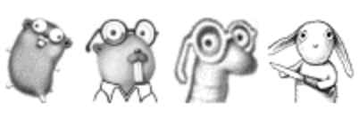

大家好，我是 polarisxu。

Go 语言的诞生，伴随着出现了 Gopher。现在 Go 爱好者通常自称为 Gopher。实际上，Gopher 最开始只是表示 Go 的吉祥物：

那 Gopher 这个吉祥物前世今生为何？据说，有些人学 Go 是因为 Gopher 这个吉祥物~

大约在 1999 年（远早于 Go 的诞生日）—— gopher 第一次出现在新泽西州的 [WFMU radio station](https://wfmu.org/)，作为广播电台的宣传物。当时，[Renée French](http://reneefrench.blogspot.com/) 被委托为年度筹款活动设计一件 T 恤，结果这只地鼠（gopher）出现了。WFMU 上 gopher 的形象是这样的：

之后，基于该形象，还为贝尔实验室设计了一系列形象，包括 ken、r、rsc 几个人的化身：

了解 Go 演化进程的应该知晓，Go 底层不少内容有 Plan 9 操作系统的影子。Renée French 为 Plan 9 也设计过一个吉祥物，叫 [Glenda](https://9p.io/plan9/glenda.html)：

所以，当 Bell Labs 的几个大牛想开发一个新语言时，Renée French 自然自告奋勇，为其设计一个吉祥物。可能是因为 Go 和 Gopher 有点关联，2009 年，Go 开源时，Renée French 建议在 WFMU gopher 的基础上改进，为 Go 设计一个吉祥物，于是 Go gopher 诞生了。

Gopher 还有一张模型表，说明了它的特征以及如何正确表示它们：<https://go.dev/doc/gopher/modelsheet.jpg>

这个模型表是 Renée French 在  2016 年 Gophercon 的一次[演讲](https://www.youtube.com/watch?v=4rw_B4yY69k)中首次展示的。

基于此，网络上越来越多各种设计的 Gopher，也有各种毛绒绒玩具。在网络上可以找到很多漂亮的 Gopher 图片，我也收集了很多，需要的可以在公众号「polarisxu」回复 **gopher ** 获取。

**参考**：<https://docs.studygolang.com/blog/gopher>