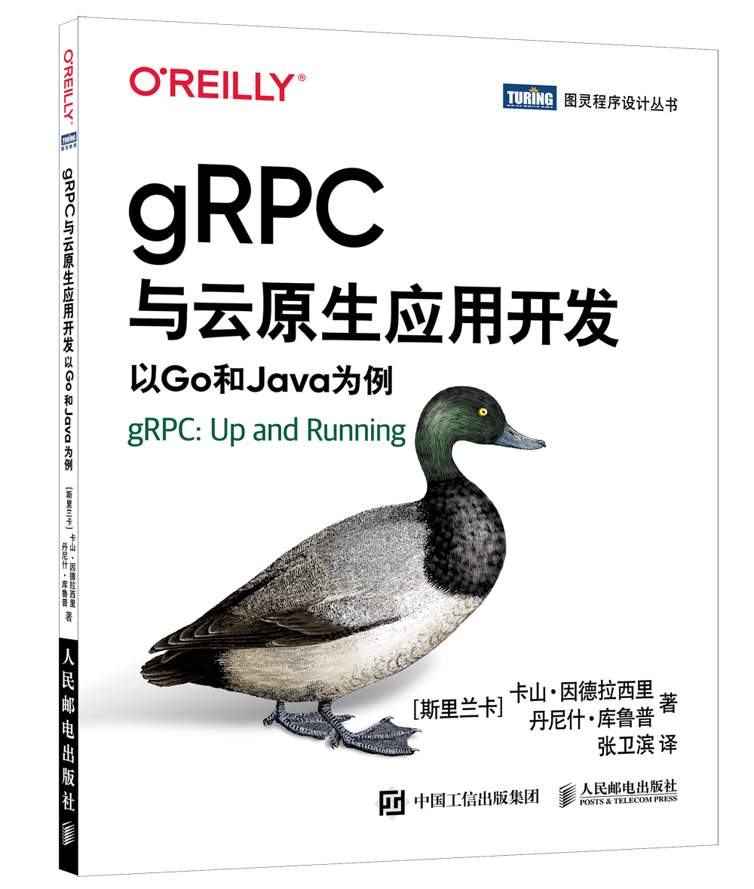

大家好，我是站长 polarisxu。

牛年春晚，Go语言中文网组织的活动，送了 10 本 《gRPC与云原生应用开发：以Go和Java为例》。上周末，我翻了下这本书，决定对该书做一个介绍，同时再送 10 本给我的读者。

## 01 gRPC 是什么？

这是一本关于 gRPC 的书，所以简单介绍下 gRPC 是什么，相信很多人不陌生。

2015 年 2 月 26 日，谷歌宣布开源 gRPC，并称其「基于公司多年的分布式系统构建经验」。因为在这之前，谷歌使用一个名为 Stubby 的通用 RPC 基础设施连接其数据中心内部和跨中心运行的大量微型服务已有十多年，可以认为 gRPC 是 Stubby 的下一个版本。自那之后，人们给 gRPC 贴上了许多漂亮的「标签」：**极速、高性能、微服务间通信首选、多语言支持、双向流模式、protobuf、HTTP/2 等等。**

借用官方的一张图展示 gRPC 多端交互：

关于 gRPC，官方一句话描述是：

> A high performance, open source universal RPC framework

gRPC 官网：<https://grpc.io/>，目前已经是 CNCF 的孵化项目。

## 02 gRPC 的应用场景

总的来说，gRPC 可以高效地连接数据中心内部和跨数据中心的服务，并为负载平衡、跟踪、健康检查和身份验证提供可插拔的支持。它也适用于最后一英里的分布式计算连接设备，移动应用程序和浏览器的后端服务。主要使用场景有：

- 在微服务风格的体系结构中有效连接多语言服务；
- 连接移动设备、浏览器客户端和后端服务；
- 开发与云服务器通信的移动客户端；
- 构建高可扩展、低延迟的分布式系统和微服务；
- 设计一个新的协议，需要准确，高效和语言独立；
- 分层设计，以支持扩展，例如身份验证、负载平衡、日志记录和监控等；
- 。。。

## 03 gRPC 的主要优点

相比 RESTful 服务或其他 RPC 框架，gRPC 有哪些突出的优点？

1）极速

gRPC 使用 protocol buffers（简称 protobuf）作为消息编码格式。protobuf 的特点是语言中立、平台无关、高可扩展，它可以序列化和反序列化结构化数据。

与采用文本格式的 JSON 相比，采用二进制格式的 protobuf 在速度上可以达到**前者的 5 倍**！

2）使用 HTTP/2

gRPC 使用 HTTP/2 作为传输协议。我们来看看 HTTP/2 与 HTTP/1.X 相比有何优势。

- 二进制传输
- 多路复用，即可以在一个 TCP 连接上并行发送多个数据请求
- 双向同时通信，即可以同时发送客户端请求和服务器端响应
- 头部压缩技术，降低网络使用率

3）多语言支持、社区活跃

目前，gRPC 支持 11 种语言，GitHub 项目总星数近 6 万，其中 Go 实现和J ava 实现的星数最多。

- Go
- Java
- C#
- C++
- Dart
- Kotlin/JVM
- Node
- Objective-C
- PHP
- Python
- Ruby

此外，gRPC 还支持多平台，比如 Web、Android，以及 Flutter、iOS 等。

## 04 gRPC 与云原生应用开发

拿到这本书时，我是有点吃惊的：我去，这么薄呢！？翻开一看，才 160 页，而实际正文大概 150 也左右。但当我阅读该书时，发现虽然篇幅不长，但包含的内容还是挺多的。

本书一共 8 章，章节内容如下：

**第 1 章 gRPC 入门**

介绍 gRPC 的基础知识，并将它与 REST、GraphQL 和其他 RPC 技术等类似的进程间通信风格进行对比。

**第 2 章 开始使用 gRPC**

通过一个具体例子，完整的体验 gRPC 应用程序，而且是同时使用 Go 和 Java 实现。

**第 3 章 gRPC 的通信模式**

通过真实的示例探索 gRPC 的通信模式，包括一元 RPC 模式、服务器端流 RPC 模式、客户端流 RPC 模式、双向流 RPC 模式。

**第 4 章 gRPC 的底层原理**

作为一个合格的码农，我们不能停留在简单使用上，否则换工作面试后怎么办？！即使不面试，作为一个“上进”的码农，我们也应该了解了解 gRPC 的底层原理，而这章就设计相关知识。

**第 5 章 超越基础知识**

这一章属于应用的进阶。讲解了 gRPC 的一些非常重要的高级特性，如拦截器、截止时间、元数据、多路复用、负载均衡等。

**第 6 章 安全的 gRPC**

互联网时代，安全是很重要的。本章带你全面理解如何保护通信通道、如何认证以及如何控制用户对 gRPC 应用程序的访问。

**第 7 章 在生产环境中运行 gRPC**

学习完前面的章节，你大概已经搞定了 gRPC 服务。接下来就该测试、上线部署了。本周讲解 gRPC 应用程序的整个开发生命周期，包括测试 gRPC 应用程序、与 CI/CD 集成、在 Docker 和 Kubernetes 上部署与运行。

**第 8 章 gRPC 的生态系统**

最后一章介绍 gRPC 相关的支撑组件，得益于 gRPC 的可扩展性，社区有很不错的组件可用，这些构成了 gRPC 的生态。在实际项目中，这些生态组件会很有用哦。

附上一张我整理的评价微服务框架好坏的思维导图，供参考：

## 05 重点来了：送书

相信你是冲着白嫖来的，但我希望你看了上面我啰嗦的内容。

如何得到该书？借用书中的一个小点：**留言说说 gPRC 中的 g 代表什么**。2021 年 3 月 17 日 22 点前，从留言点赞最多的 20 位中随机选 10 位幸运小伙伴。（我会**优先送给本公众号的忠实读者**，包括经常阅读我的文章，转发、点赞、在看、留言、打赏等互动行为，因为后台是可以看到的哦！所以，**对本文来个四连吧，很可能中奖的就是你了**！）

（注意：以上只针对 「polarisxu」公众号，其他渠道无效）

最后也欢迎大家直接通过扫码购买本书。支持本书，支持中文翻译者。

