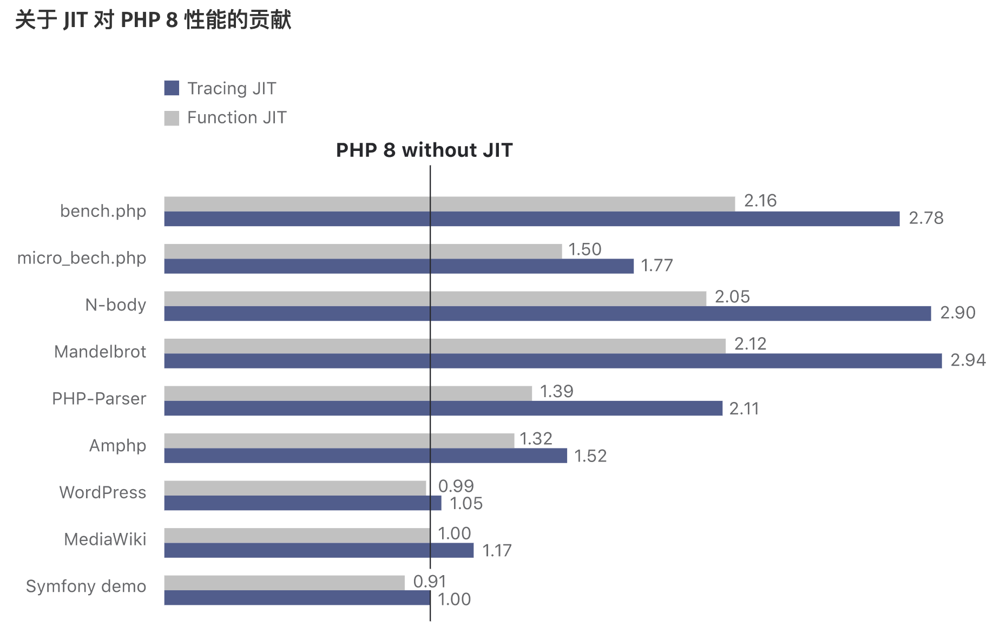

大家好，我是站长 polarisxu。

看到标题，大家应该知晓今天聊的主角是谁。是的，它就是 PHP。

PHP 曾经很辉煌，现在怎么样？不做过多评价，前几天好未来不刚组织了一届 PHP 大会吗？！正因为曾经很辉煌，很多现在的 Go 爱好者曾经都是 PHPer，应该还有不少还在用着 PHP。我觉得完全没必要非得贬低一门语言去抬高另外一门语言，自己喜欢就好。而且掌握多门语言是自己的优势。

为什么聊 PHP，因为我也写了好几年 PHP，而且现在也会关注 PHP 的一些动态。PHP 8 发布差不多半个月了，有些人可能根本不知晓，还停留在 PHP 5.x。没想到吧，一眨眼，PHP 8 都发布了。

关于版本的那些事，这里不探讨，主要看看 PHP 8 有哪些新特性。另外，本文只会讲述新特性的一些关键点，因为官方文档对它们已经有更详细的介绍，你应该认真阅读官方文档。

## 01 Union Types（联合类型）

说明一点，从 PHP 7 开始，支持下面这样的语法：

```php
function sum(int $a, int $b): int 
{
    return $a + $b;
}
```

是不是越来越强类型的感觉？虽然如此，但在非严格类型模式下（strict_types=0，这是默认值），你依然可以这么调用：

```php
sum(1.2, 3);
```

但因为函数参数接收 int 类型（返回值也是 int 类型），因此上面结果是 4，而不是 4.2。如果是严格模式下，只允许传递 int 类型了。（`sum('1.2', 3.0)` 结果也是 4）

如果希望结果输出 4.2，同时又保持类型约束，怎么办？PHP 不支持方法重载。这就有了 PHP 8 的联合类型。

> 联合类型接受多个不同的类型做为参数。声明联合类型的语法为 T1|T2|...。

所以，上面代码可以改为：

```php
function sum(int|float $a, int|float $b): int|float
{
		return $a + $b;
}
```

这样 `sum(1.2, 3)` 的结果就是 4.2 了。

一些注意事项：

- 联合类型也可用于类成员变量；

- null 可以用于联合类型中，但不能单独作为类型。比如 `int|null` 允许，但 null 作为类型不允许；

- 下面的函数是合法的：

  ```php
  function index(): int|false
  {
  		return false;
  }
  ```

  但返回值改为：`int|true` 却是非法的。这是出于历史原因，很多内部函数在失败时返回了 false 而不是 null。 这类函数的典型例子是 strpos()。因此允许联合类型中使用 false，但不允许使用 true。注意 false 并非是类型，这里看出是伪类型，不能单独使用。

还有其他一些细节点，详情请访问官方文档查看：<https://www.php.net/manual/zh/language.types.declarations.php>。

> 不得不说，也许越来越意识到弱类型的问题，PHP 这是在做强类型的事情。然而，不少人要说了，搞这么费劲、这么复杂，还不如直接换强类型语言呢？！你觉得呢？

当然，你完全可以忽略联合类型，继续使用 5.x 的方式写 PHP。

## 03 Named Arguments（命名参数）

这个特性还是很棒的。了解 Python 的朋友应该对这个特性很熟悉。这样一来，PHP 的函数支持不定参数、参数默认值、命名参数等。相对来说，Go 的函数还是弱很多。

比如 htmlspecialchars 函数签名如下：

```php
htmlspecialchars ( string $string [, int $flags = ENT_COMPAT | ENT_HTML401 [, string $encoding = ini_get("default_charset") [, bool $double_encode = TRUE ]]] ) : string
```

PHP 8 之前，如果想要最后一个参数传递 false，需要这么调用：

```php
htmlspecialchars($string, ENT_COMPAT | ENT_HTML401, 'UTF-8', false);
```

而有了命名参数后（PHP 8），可以这么调用：

```php
htmlspecialchars($string, double_encode: false);
```

简单清晰。

总结一下就是：

- 仅需指定必需的参数，可跳过可选的参数。
- 参数是与顺序无关的且具有自记录功能。

命名参数确实带来了不少便利。不过我觉得也有一些要注意的点:

- 函数参数可能会很多，Python 中很多函数一大堆参数，可维护性可能是一个问题；
- 原本函数参数名称是不重要的，但命名参数使得参数名称不能随便改，因为调用者可能依赖它了；

## 04 Match 表达式

实际中我们经常通过 state 来表示各种状态，比如：0-待审核；1-上线；2-下线；3-删除。因为数据库中存的数字，但显示希望是文字说明。这时一般有两种做法：

```php
switch ($state) {
  case 0:
    $stateDesc = '待审核';
    break;
  case 1:
    $stateDesc = '上线';
    break;
  case 2:
    $stateDesc = '下线';
    break;
  case 3:
    $stateDesc = '删除';
    break;
}

echo $stateDesc;
```

我个人喜欢通过 map 来实现：

```php
$stateMap = [
  0 => '待审核',
  1 => '上线',
  2 => '下线',
  3 => '删除',
];

echo $stateMap[$state];
```

PHP 8 针对这样的场景提供了 match 表达式：

```php
echo match($state) {
  0 => '待审核',
  1 => '上线',
  2 => '下线',
  3 => '删除',
};
```

可见 match 类似于 switch 语句，有如下特点：

- Match 是一个表达式，因此其结果可以存储在变量中或返回；
- Match 分支仅支持单行表达式，不需要 break 语句；
- switch 相当于使用 `==` 比较，而 Match 使用 `===` 比较；
- 如果没匹配到任何项，会抛 UnhandledMatchError 错误；
- 也支持 default；

更多信息查看官方文档：<https://www.php.net/manual/zh/control-structures.match.php>。

## 05 Nullsafe 运算符（Nullsafe operator）

了解 Swift 之类的语言，应该知晓其中的可选型。PHP 8 新增的这个特性，我觉得多少有点可选型的意思。

在 PHP 7 中的如下代码：

```php
$country =  null;

if ($session !== null) {
  $user = $session->user;

  if ($user !== null) {
    $address = $user->getAddress();
 
    if ($address !== null) {
      $country = $address->country;
    }
  }
}
```

在 PHP 8 中简化为：

```php
$country = $session?->user?->getAddress()?->country;
```

## 06 构造器属性提升

PHP 8 起构造器的参数可以提升为类的属性。构造器的参数赋值给类属性的行为很普遍，否则无法操作。 而构造器提升的功能则为这种场景提供了便利。 例如下面的代码：

```php
class Point {
  public float $x;
  public float $y;
  public float $z;

  public function __construct(
    float $x = 0.0,
    float $y = 0.0,
    float $z = 0.0
  ) {
    $this->x = $x;
    $this->y = $y;
    $this->z = $z;
  }
}
```

改为 PHP 8 的方式：

```php
class Point {
  public function __construct(
    public float $x = 0.0,
    public float $y = 0.0,
    public float $z = 0.0,
  ) {}
}
```

## 07 字符串与数字的比较更符合逻辑

PHP 8 比较数字字符串（numeric string）时，会按数字进行比较。 不是数字字符串时，将数字转化为字符串，按字符串比较。

这一点要注意，之前这样的代码：

```php
0 == 'foobar' // true
```

现在是 false：

```php
0 == 'foobar' // false
```

更多说明参见这里：<https://wiki.php.net/rfc/string_to_number_comparison>。

## 08 注解（attributes）

现在可以用 PHP 原生语法来使用结构化的元数据，而非 PHPDoc 声明。

之前这么写：

```php
class PostsController
{
    /**
     * @Route("/api/posts/{id}", methods={"GET"})
     */
    public function get($id) { /* ... */ }
}
```

现在这么写：

```php
class PostsController
{
    #[Route("/api/posts/{id}", methods: ["GET"])]
    public function get($id) { /* ... */ }
}
```

## 09 即时编译

PHP 8 引入了两个即时编译引擎。 Tracing JIT 在两个中更有潜力，它在综合基准测试中显示了三倍的性能， 并在某些长时间运行的程序中显示了 1.5-2 倍的性能改进。 典型的应用性能则和 PHP 7.4 不相上下。

官方给了一个性能测试：



## 10 总结

PHP 8 还有很多其他改动，在这里有详细的说明：<https://www.php.net/releases/8.0/zh.php>。其中新增了 3 个函数实用的函数：str_contains()、str_starts_with() 和 str_ends_with()。（Go 表示第一天就有了）

这里面的新特性，命名参数我个人还是比较喜欢。你呢？