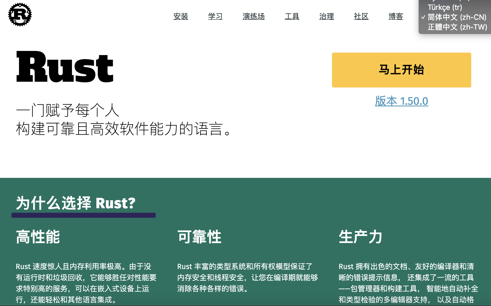

大家好，我是站长 polarisxu。

有些朋友应该知道，我最近在看 Rust，在朋友圈我发了一些关于 Rust 相关的东西。2021 年，会陆续写一些 Rust 相关的文章。今天先来一篇。

这篇文章不谈具体的语法，主要从总体上介绍下 Rust，更确切说是 Rust 给我的第一印象，文章（包括后续 Rust 的文章）会和 Go 对比着来，方便 Go 朋友们一起学习、交流。

## 01 官网

对于中国开发者来说，我认为 Rust 的官网相比 Go 官网至少有两大优势：

- 可以正常访问；
- 多国语言支持很好；

官网中文版：<https://www.rust-lang.org/zh-CN/>，而 Go 语言官网的中文版呢？残缺不全，不权威，不是核心团队组织领导弄的。

这些当然不是大问题，但一定程度上能反映出 Rust 社区的强大，由社区驱动 Rust 的发展，特别是 Mozilla 裁员，不少人担心 Rust。前些天 [Rust Foundation](https://foundation.rust-lang.org/) 成立，成员包括 Mozilla、Google、Microsoft、华为、AWS 等，这表明，Rust 不会由某一个公司掌控，是完全社区驱动的，从官网的相关团队也可以看出一二：

此外还有相应的工作组，分工明确。

浏览官方，你会发现，和 Rust 相关的大部分内容都是官方团队在维护，比如 Rust By Example，竟然有专门的工作组。而 Go By Example 是一个 Go 爱好者写的。

只看官网，Rust 明显胜过 Go。

注：Go 除了 golang.org，还有 go.dev，这个站点在不断变强大。

## 02 学习文档

这里说的文档指官方的。

Rust 有一本“圣经”，The Rust Programming Language，即《Rust 程序设计语言》，这不是出版的图书，而是官方提供的供免费阅读。Go 也有“圣经”，不过不是官方免费阅读的。Go 官方提供的是 Effective Go，比“圣经”还是简单很多。

在工具方面的文档，Rust 和 Go 一样，文档挺详细的，但 Rust 在展现形式上，采用书籍的形式，更有利于阅读。

Go 有语言规范，而 Rust 目前还没有规范，只是有一个参考手册（reference）。

## 03 安装和工具链

如果是类 Unix 系统（MacOS、Linux 等），一条命令即可搞定 Rust 的安装。当然也可以和 Go 的安装方式一样，下载预编译好的安装包，进行安装。

Rust 提供的 rustup 可以方便的管理 Rust 自身，包括安装稳定版本、测试版本或 Nightly 版本，也可以方便的卸载 Rust。

Go 爱好者们都感慨其工具链的强大。Rust 也有强大的工具链，特别是 cargo（竟然有 go，哈哈哈哈），很强大，它既是包管理工具也是系统构建工具。 

## 04 特性很多

上图是从 Rust 官网截取的，各种黑魔法、未稳定特性手册，这让人多少就感觉特性不少，还不断在加入。

## 05 欢迎一起学习

你准备好一起学习 Rust 了吗？都说 Rust 难，有没有自己实际学习看看，是不是真的那么难？也许可以验证一下学习能力？！哈哈哈~

手动内存管理，如 C、C++；带 GC，如 Java、Go。你想过还有第三种选择吗？一起开启 Rust 之旅吧！