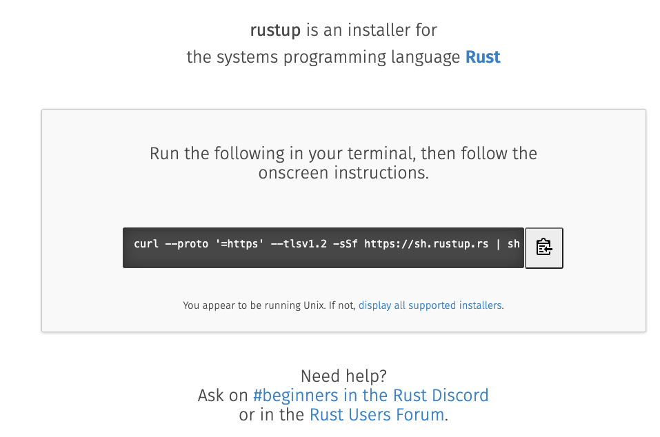
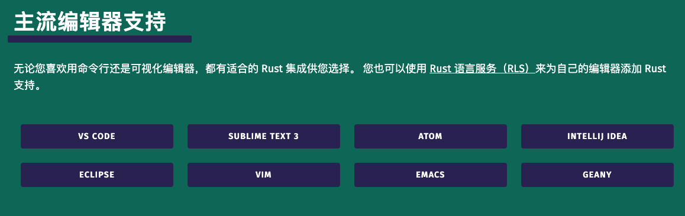
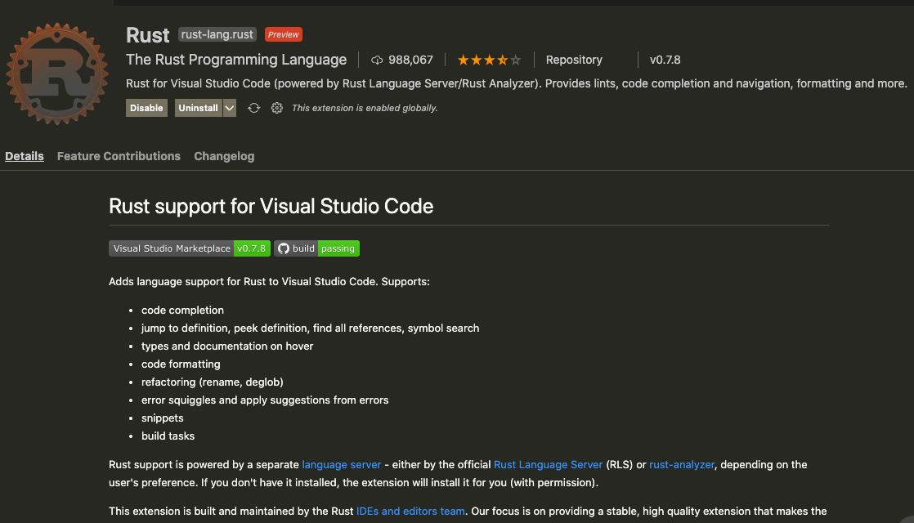

大家好，我是站长 polarisxu。

今天起正式 Rust “劝退”之旅。我也是在学习中，大家一起探讨交流，看谁先被劝退。在这个系列教程中，我通过和 Go 对比学习，同时只讲 Rust 最常用的特性，尽量避免入门就劝退。

工欲善其事必先利其器！本文我们先打造一个 Rust 的开发环境。

## 01 安装 Rust

打开 Rust 官网：<https://rust-lang.org>，可以切换到简体中文界面。在顶部菜单有「安装」。

对于类 Unix 系统（MacOS、Linux 等），官方推荐下载 Rustup 并安装 Rust（如果是 Windows，但使用 Linux 子系统，即 WSL，安装方式和 Linux 一样），在终端执行如下命令进行安装：

```bash
curl --proto '=https' --tlsv1.2 -sSf https://sh.rustup.rs | sh
```

如果是 Windows 用户，会让你下载预编译好的 RUSTUP-INIT.exe 文件（32 位或 64 位），一步步操作即可。

安装完成后，在终端执行 `rustup --version`，看到了版本信息即表示安装成功。

也可以 <https://rustup.rs> 网站可以看到查看 rustup：



### rustup 是什么

在终端执行 rustup，看到类似如下信息：

```bash
$ rustup	
rustup 1.23.1 (3df2264a9 2020-11-30)
The Rust toolchain installer
...
```

这是一个 Rust 工具链安装器，专门用于安装 Rust，管理 Rust 很方便：安装、升级、卸载等，还可以切换版本，包括 nightly，beta 和 stable。

相比较而言，Go 语言的安装、卸载、更新，多版本管理就麻烦很多，所以 Go 社区出现了好几个 Go 自身版本管理的工具，比如我之前介绍的 [goup](https://mp.weixin.qq.com/s/yTblk9Js1Zcq5aWVcYGjOA)。（我之前写过一篇文章：[《Go 官方应该搞一个类似 Rustup 的管理工具》](https://mp.weixin.qq.com/s/uqKl8u8Tyz1-d0Ew3dpVJQ)）

Go 的安装，如果不用第三方工具，一般通过下载对应操作系统的预编译版本，然后跟普通软件一样安装即可。也可以通过对应系统的工具进行安装，比如 Mac 下的 homebrew，不过很可能安装的不是最新版本的 Go。此外，还可以通过源码安装 Go。

一般地，为了省事，我推荐使用类似 goup 这样的工具来安装、管理 Go 版本，就跟 Rust 自带的 rustup 工具一样。

回到 rustup 命令，看看帮助文档：

```bash
$ rustup
rustup 1.23.1 (3df2264a9 2020-11-30)
The Rust toolchain installer

USAGE:
    rustup [FLAGS] [+toolchain] <SUBCOMMAND>

FLAGS:
    -v, --verbose    Enable verbose output
    -q, --quiet      Disable progress output
    -h, --help       Prints help information
    -V, --version    Prints version information

ARGS:
    <+toolchain>    release channel (e.g. +stable) or custom toolchain to set override

SUBCOMMANDS:
    show           Show the active and installed toolchains or profiles
    update         Update Rust toolchains and rustup
    check          Check for updates to Rust toolchains
    default        Set the default toolchain
    toolchain      Modify or query the installed toolchains
    target         Modify a toolchain's supported targets
    component      Modify a toolchain's installed components
    override       Modify directory toolchain overrides
    run            Run a command with an environment configured for a given toolchain
    which          Display which binary will be run for a given command
    doc            Open the documentation for the current toolchain
    man            View the man page for a given command
    self           Modify the rustup installation
    set            Alter rustup settings
    completions    Generate tab-completion scripts for your shell
    help           Prints this message or the help of the given subcommand(s)

DISCUSSION:
    rustup installs The Rust Programming Language from the official
    release channels, enabling you to easily switch between stable,
    beta, and nightly compilers and keep them updated. It makes
    cross-compiling simpler with binary builds of the standard library
    for common platforms.

    If you are new to Rust consider running `rustup doc --book` to
    learn Rust.
```

其中的具体选项和子命令不一一介绍，大概有一个印象即可，知道 rustup 是干嘛的后，有相应需求时，可以看看这个文档应该就知道怎么处理了。

值得一提的时候，安装 Rust 后，很多文档都在本地有一份，你可以通过 **rustup doc** 查看。

## 02 编辑器

安装了 Rust，接下来需要搞定 Rust 的编辑器。目前还没有专门为 Rust 开发的 IDE，但主流的文本编辑器都有插件支持 Rust 开发。得益于微软发起的（很大程度因为 VSCode 的存在） Language Server Protocol，让文本编辑器拥有很多 IDE 的特性。（关于 LSP 相关知识可以阅读我[之前写的文章](https://mp.weixin.qq.com/s/vMWvSs2h3LwpghS27VQ9rg)。）



（官方列表中没有直接列出 CLion，这是 JetBrains 专门为 C/C++ 打造的 IDE。据说很多 Rust 喜欢基于它，安装 Rust 插件进行开发）。

因为写 Go 一直使用 VSCode，因此写 Rust 也使用它了。

在 VSCode 中搜索 Rust，排在前面的两个插件：

- Rust：这是官方开发的；
- rust-analyzer：这是社区开发的；

官方的 Rust 插件截图：



社区的 rust-analyzer 截图：


官方的 4 星，社区的 5 星。

一般我们都会安装官方的。但我用了后，发现官方的有些功能缺失，比如没法在 VSCode 中直接运行 Rust。于是我换成社区的，发现可以。查了一些资料，目前看社区版本确实比官方的好。因此目前建议大家安装社区版的 rust-analyzer。该插件的完整手册地址：<https://rust-analyzer.github.io/manual.html>。（如果两个都安装了，记得把官方的 disabled，否则很可能冲突）

安装 rust-analyzer 后，如果提示你安装其他组件，按提示安装即可。

反观 Golang 开发工具，JetBrains 为其定制了 GoLand IDE，这一定程度也说明 Go 的欢迎程度，期待其为 Rust 定制 IDE 的那一天。而 Go 的 VSCode 插件：vscode-go，最开始并不是 Go 官方开发的，而是 VSCode 团队开发的，只是后来转给了 Go 官方维护。

和 Rust 插件不同的是，Go 安装完 VSCode 插件后，会提示用户安装一堆工具，因为很多的功能是通过一堆工具组装的。在安装这些工具过程中，很可能会安装失败，幸好有了 GOPROXY，让安装更顺畅。关于 VSCode 打造 Go 开发环境，可以参考我之前写的文章：[《VSCode 开发 Go 程序也可以和 GoLand 一样强大》](https://mp.weixin.qq.com/s/J01LY7s6xMB8Lk10sxTFhg)。

## 03 小结

环境是第一步，打造一个好的环境，对后面的学习会有极大的帮助。

在本节，安装完 Rust 后，我主要介绍了 rustup 工具，关于 Rust 工具链的其他工具，后面用到时再一一介绍。

准备好了吗？Rust “劝退”之旅，看你能坚持多久~

