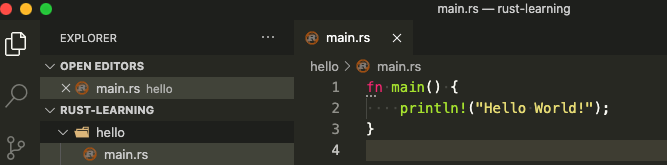
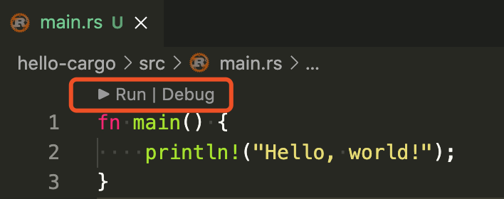

大家好，我是站长 polarisxu。

上节我们准备好了 Rust 环境，现在开始我们的第一个 Rust 程序。

## 01 Hello World

在终端执行如下命令，创建相关目录结构：

```bash
$ mkdir ~/rust-learning
$ cd ~/rust-learning
$ mkdir hello
$ cd hello
```

启动 VSCode，在 Welcome 页面选择打开文件夹：~/rust-learning，在 hello 目录下创建 main.rs 文件，输入如下代码：



细心的读者可能看到了 fn 下面的三个点，鼠标放上去提示：

```bash
file not included in module tree rust-analyzer(unlinked-file)
```

这个提示的详细说明见链接：<https://rust-analyzer.github.io/manual.html#unlinked-file>。大意是，当前文件不在任何 crate 中。也就是说，rust-analyzer 插件要求标准的 cargo 目录。因此，编译运行该程序得通过终端：

```bash
$ rustc main.rs
$ ./main
Hello World!
```

这就是你的第一个 Rust 程序。关于 rustc，目前我们只需要知道它是 Rust 的编译器即可，因为实际中很少直接使用它。

## 02 cargo 版 Hello World

上文说，编译 Rust 项目，很少直接使用 rustc 这个 Rust 编译器，那应该用什么呢？

简单的程序（比如上面的单个文件）可能偶尔会用 rustc，但绝大部分时候，特别是项目中，我们应该一直使用 Rust 的生成工具和依赖管理器 Cargo。

现在就介绍下 Cargo 这个工具。

### Cargo

在安装完 rustup 后，Rust 工具链会默认安装上，这包括 Cargo 这个工具。

因为这个工具很重要，官方直接提供了一个 Cargo 的手册：<https://doc.rust-lang.org/cargo/index.html>。

> Cargo 是 Rust 的包管理器。它能够下载 Rust 包的依赖，编译包，制作可分发的包，并将它们上传到 crates.io 上（这是 Rust 社区的包注册中心）。

这个手册内容较多，有兴趣可以通读下，后续也可以用于查阅。我们这里只介绍经常使用的相关命令。先看一眼 Cargo 命令的相关帮助：

```bash
$ cargo
Rust's package manager

USAGE:
    cargo [+toolchain] [OPTIONS] [SUBCOMMAND]

OPTIONS:
    -V, --version           Print version info and exit
        --list              List installed commands
        --explain <CODE>    Run `rustc --explain CODE`
    -v, --verbose           Use verbose output (-vv very verbose/build.rs output)
    -q, --quiet             No output printed to stdout
        --color <WHEN>      Coloring: auto, always, never
        --frozen            Require Cargo.lock and cache are up to date
        --locked            Require Cargo.lock is up to date
        --offline           Run without accessing the network
    -Z <FLAG>...            Unstable (nightly-only) flags to Cargo, see 'cargo -Z help' for details
    -h, --help              Prints help information

Some common cargo commands are (see all commands with --list):
    build, b    Compile the current package
    check, c    Analyze the current package and report errors, but don't build object files
    clean       Remove the target directory
    doc         Build this package's and its dependencies' documentation
    new         Create a new cargo package
    init        Create a new cargo package in an existing directory
    run, r      Run a binary or example of the local package
    test, t     Run the tests
    bench       Run the benchmarks
    update      Update dependencies listed in Cargo.lock
    search      Search registry for crates
    publish     Package and upload this package to the registry
    install     Install a Rust binary. Default location is $HOME/.cargo/bin
    uninstall   Uninstall a Rust binary

See 'cargo help <command>' for more information on a specific command.
```

常用的命令如下：

- 使用 `cargo new` 创建新的 package（包），包括可执行的和普通包。
- 使用 `cargo build` 构建你的包。
- 使用 `cargo run` 生成和运行包。
- 使用 `cargo test` 测试你的包。
- 使用 `cargo check` 进行包分析，并报告错误。
- 使用 `cargo doc` 为你的包（以及依赖包）生成文档。
- 使用 `cargo publish` 将包发布到 crates.io。
- 使用 `cargo install` 安装 Rust 可执行程序。

借助 VSCode，很多命令不需要我们手动输入执行。

注：帮助说明中，都是 package，你可以理解成项目，下文有时会用项目的说法。

### Cargo 使用

使用 Cargo 创建一个新项目：

```bash
$ cd ~/rust-learning
$ cargo new hello-cargo
     Created binary (application) `hello-cargo` package
```

生成了 hello-cargo 目录，其中包含如下文件：

```bash
$ tree hello-cargo
hello-cargo
├── Cargo.toml
└── src
    └── main.rs
```

其中 Cargo.toml 是 Rust 的清单文件（toml 格式，这种格式和 ini 文件有点像，但更强大），用于保存项目和依赖的元数据信息，类似 Go Module 中的 go.mod 文件。看下其中的内容：

```toml
[package]
name = "hello-cargo"
version = "0.1.0"
authors = ["xuxinhua <polaris@studygolang.com>"]
edition = "2018"

# See more keys and their definitions at https://doc.rust-lang.org/cargo/reference/manifest.html

[dependencies]
```

其中，edition 字段目前可以是 2015 和 2018，默认是 2018，具体什么区别，可以认为 2018 是一个 Rust 大版本（虽然向下兼容）。

关于 authors 字段怎么获取的，可以参考 <https://doc.rust-lang.org/cargo/commands/cargo-new.html>，里面有详细的解释。（也可以通过 cargo help new 帮助中查到）

因为我们的项目还没有依赖，所以 dependencies 项是空的。

除了看到的文件，Cargo 还生成了 git 相关的隐藏文件和文件夹：`.git` 和 `.gitignore`。也就是说，默认情况下，该项目就通过 git 进行版本控制，可以通过 `--vcs` 选项控制。

最后是 Rust 源代码。Cargo 要求，源代码必须在 src 目录下，现在 main.rs 中就是一个简单的 Hello World：

```rust
fn main() {
    println!("Hello, world!");
}
```

在 VSCode 中打开会发现顶部多出了两个按钮：



点就 「Run」，会在 VSCode 下方 Terminal 窗口输出类似如下信息：

```bash
> Executing task: cargo run --package hello-cargo --bin hello-cargo <

   Compiling hello-cargo v0.1.0 (/Users/xuxinhua/rust-learning/hello-cargo)
    Finished dev [unoptimized + debuginfo] target(s) in 1.61s
     Running `target/debug/hello-cargo`
Hello, world!

Terminal will be reused by tasks, press any key to close it.
```

这里用的是 cargo run 这个命令：先编译，显示编译完成相关信息，然后运行。`--package` 指定要运行的目标包名， `--bin` 指定要运行的目标二进制文件名。（实际上，针对当前 hello-cargo 项目，执行运行 cargo run 效果是一样的）

这时，项目根目录会生成一个 target 目录，你可以 tree target 看看，里面的文件很多，具体每个文件的作用我现在也不知，一般也不用去知晓，别劝退~

你可以在终端输入如下命令：

```bash
$ cargo run --release

   Compiling hello-cargo v0.1.0 (/Users/xuxinhua/rust-learning/hello-cargo)
    Finished release [optimized] target(s) in 1.28s
     Running `target/release/hello-cargo`
Hello, world!
```

生产环境运行的程序应该始终使用 `--release` 选项。这时，在 target 目录下会生成一个 release 目录，而不是 debug 目录。

> 在上面和 「Run」一起的还有一个 「Debug」按钮。点击它会提示你需要安装  [CodeLLDB](https://marketplace.visualstudio.com/items?itemName=vadimcn.vscode-lldb) 或 [MS C++ tools](https://marketplace.visualstudio.com/items?itemName=ms-vscode.cpptools) 扩展。本系列后续介绍调试相关知识。

## 03 小结

从上面的介绍中可以看到，cargo 命令很强大。Go 语言中，基本上一个 go 命令搞定一切（这也是很多人觉得 Go 工具链很强大的原因）。而 Rust 中，你基本上不需要知道 rustc 命令的存在，只需要掌握 cargo 即可。话说，为啥叫 cargo 呢？crate + go？让人以为和 Go 语言相关呢。。。

本节的 Hello World 应该不会劝退，而且可能会喜欢上它。不过我们没有对 Rust 语法做任何讲解，有些人看到 Hello World 的代码可能有一些奇怪，包括 fn、println!。下一节开始，就该讲解 Rust 的语法了。