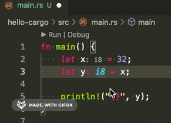

大家好，我是站长 polarisxu。

这是 Rust 劝退系列的第 4 个教程，探讨 Rust 中的基本数据类型，或叫标量类型（scalar type）。

Rust 和 Go 一样，都是静态类型语言，这表示每个变量的类型必须明确。和 Go 类似，大多数情况下，Rust 编译器能够推断出某个值的类型，不需要我们显示指定，写起来有点类似于弱类型似语言。但有些情况下，必须明确告知编译器我们使用什么类型，在 Rust 中，这叫 「类型注解」（type annotations）。

对于类型注解，看一个常见的例子：

```rust
let guess = "42".parse().expect("Not a number!");
```

这是将字符串 `"42"` 转为数字 42。在 Go 语言中，一般这么做：

```go
guess, err := strconv.Atoi("42")
if err != nil {
  panic(err)
}
```

但上面的 Rust 代码会报错：

```bash
error[E0282]: type annotations needed
 --> src/main.rs:2:9
  |
2 |     let guess = "42a".parse().expect("Not a number!");
  |         ^^^^^^ consider giving `guess` a type
```

这和 Go 还是不太一样。Go 中很多时候，数值类型会是 int。

为了修复这个问题，我们需要为 number 指定一个类型，比如 u32。

```rust
let guess: u32 = "42".parse().expect("Not a number!");
```

> 吐槽：在 Rust 中，类型注解和 Go 中一样，放在变量后面。但 Rust 中变量和类型直接非得加一个冒号（:），而且一般冒号紧跟着变量名（rustfmt 的建议）。不知道冒号有啥特殊需要？！

Rust 内置如下基本数据类型：

- 整数类型
  * 有符号整数：i8、i16、i32、i64、i128、isize
  * 无符号整数：u8、u16、u32、u64、u128、usize
- 浮点类型：f32、f64
- 布尔型：bool
- 字符型：char

## 01 整数类型

将整数类型整理为一张表，如下：（用 Go 语言对应的类型作对比）

|  长度   | 有符号   |  无符号  | Go 有符号  | Go 无符号 |
| ------- | ------- | ------- | ------- | ------- |
| 8-bit   | `i8`    | `u8`    | `int8`    | `uint8`    |
| 16-bit  | `i16`   | `u16`   | `int16`   | `uint16`   |
| 32-bit  | `i32`   | `u32`   | `int32`   | `uint32`   |
| 64-bit  | `i64`   | `u64`   | `int64`   | `uint64`   |
| 128-bit | `i128`  | `u128`  | - | - |
| arch    | `isize` | `usize` | `int` | `uint` |

> 吐槽：有时候 Rust 真的很节省，int、uint 直接省略为 i、u，function 省略为 fn。但有时候又很繁琐（不简洁），比如前面说到的变量和类型之间的冒号。。。
>
> 这里用 u、i 的形式，也需要一段时间适应。。。

两点说明：

- Go 中没有 128 位长度的整数
- isize 和 usize 对应 Go 中的 int 和 uint，它们的长度依赖运行程序的计算机架构：64 位架构上它们是 64 位的， 32 位架构上它们是 32 位的

在 Go 中，整型变量默认类型是 int，以下代码可以证明这一点：

```go
x := 32
fmt.Printf("%T\n", i)
// 输出：int
```

那 Rust 中默认是什么类型呢？

我想在 Rust 中找到一种办法，打印变量类型，网上找到了这样的办法（有点挫）：

```rust
// 打印变量类型的函数。该函数看不懂先放着。
fn print_type_of<T>(_: &T) {
		println!("{}", std::any::type_name::<T>())
}

fn main() {
    let x = 32;
    print_type_of(&x);
  	// 输出：i32
}
```

可见 Rust 中整型变量默认类型是 i32（即使在 64 位机器上，也是 i32）。这一定程度上说明，在 Go 中，整数一般建议用 int 类型；而 Rust 中，一般建议用 i32 类型。（所以，为什么开头的 parse 不能默认推断为 i32 类型呢？怕溢出？）

### 更智能的类型推断

上文说 Rust 和 Go 一样，支持类型推断。不过 Rust 的推断更智能，怎么个智能法？看下面的代码：

```rust
// 打印变量类型的函数
fn print_type_of<T>(_: &T) {
    println!("{}", std::any::type_name::<T>())
}

fn main() {
    let x = 32;
    let y: i8 = x;
    print_type_of(&x);
    print_type_of(&y)
}
```

根据上面的讲解，x 应该是默认类型：i32。但实际上，x 和 y 的类型都是 i8。也就是说，因为 x 的类型没有显示的指定（类型注解），Rust 编译器会根据上下文（实际上是 `let y: i8 = x` 这句）推断出 x 的类型应该和 y 一致，即 i8。

在 Go 中，int8 和 int 是不会进行隐式转换的，Rust 也一样，必须进行显示转换。但 Rust 的智能类型推断，可以让开发者少写类型转换的代码。

比如上面代码，在 Go 语言中是行不通的：

```go
package main

import (
	"fmt"
)

func main() {
	x := 32
	var y int8 = x
	fmt.Printf("%T\n", x)
	fmt.Printf("%T\n", y)
}
```

会报错：

```bash
cannot use x (type int) as type int8 in assignment
```

也就是说，Go 中的类型推断不会考虑上下文，因此没有 Rust 智能。

因为编译器的强大，VSCode 中（安装 rust-analyzer）会有类型提示，这样上面的 print_type_of 函数也不需要了。做了一个动图，注意上面 x 的类型变化：



此外，isize 和 usize 类型一般用作某些集合的索引，以后文章会看到。

> 关于各种类型的表示范围我不列出了，因为这个系列不是为无编程经验的人准备的。这个系列更多是为 Go 爱好者准备的 Rust 教程，因此和 Go 一致的地方可能不会讲。

## 02 浮点类型

和 Go 一样，Rust 也有两种浮点数类型：f32 和 f64，对应 Go 中的 float32 和 float64。和 Go 一样，默认类型是 f64，可以通过类型注解指定具体的浮点类型。（采用 IEEE-754 标准表示，关于浮点数知识，可以阅读[我之前写的文章](https://mp.weixin.qq.com/s/BmXbChq3RVRmdGNgfxLyvw)。）

```rust
let x = 2.0;	// 默认是 f64
```

一般地，整数类型和浮点类型都成为数值类型。

数值类型有一些共同的东西。比如都支持基本的数学运算。此外，除了通过类型注解指定类型，数值类型还可以在字面值后面带上类型后缀指定类型，比如：

```rust
let x = 2.0f32;	// f32 类型
let y = 32i64;	// i64 类型
```

## 03 布尔型

和 Go 语言一样，Rust 中的布尔类型使用 bool 表示（咋没用 b、bl 之类的缩写呢？哈哈哈）。有两个可能的值：true 和 false。

```rust
fn main() {
    let t = true;

    let f: bool = false; // 显式指定类型注解
}
```

## 04 字符型

Rust 中的 char 表示字符类型，是 Rust 的基本类型，字面值由单引号指定。

```rust
let a = 'a';
let b = '中';
let c = '🤣';
```

可见，Rust 中的 char 类型和 Go 中的 rune 一样，表示的是 Unicode 码点，占 4 个字节。

因为 Rust 中的字符串很复杂，而且不是基本类型，因此留在以后讲解。

## 05 小结

本文介绍了 Rust 中的四种基本数据类型：整型、浮点型、布尔型和字符型。其中，浮点型、布尔型和字符型分别对应 Go 中的浮点型、布尔型和 rune 类型，但整型，Go 和 Rust 有些许不一样，上文已经详细介绍了。此外，Go 中复数也是基本数据类型：complex64 和 complex128，而 Rust 中没有，复数通过第三方库实现，比如：<https://crates.io/crates/easy_complex>。

此外，你可能会说 Go 中还有一个基本类型：byte，而 Rust 没有。其实 Go 中的 byte 只是 uint8 的别名。另外，string 在 Go 中是基本数据类型，而在 Rust 中不是。

本节内容就这些，你被劝退了吗？欢迎留言交流！