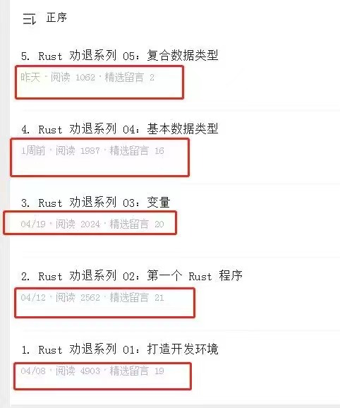

大家好，我是站长 polarisxu。

这是 Rust 劝退系列的第 6 个教程，探讨 Rust 中的常量，因为 static 和常量有类似之处，因此一并探讨。（Rust By Example 中甚至将常量分成两种类型：const 和 static，我个人觉得常量是常量，static 修饰的是变量，不能算是常量）

## 01 常量

在 Rust 语言中，术语"常量"用于表示固定的值，比如 5 、-89、 I love Rust、3.14 等等。一旦我们定义了一个常量，那么就再也不能改变常量的值了。

Rust 语言中使用 `const` 关键字来定义一个常量。定义常量时需要明确指定常量的数据类型。

看看下面的代码：（&str 类型以后讲解）

```rust
const NUM: i32 = 5;		// const NUM = 5i8	编译不通过
const PI: f64 = 3.14;
const LOVE: &str = "I love Rust!";	// 也可以使用： &'static str，即指定声明周期
```

在变量那一节讲过字面量。常量要求赋值时只能是常量表达式（字面量是常量表达式一种），这一点大部分语言都类似，即要求是编译期能计算出值的。

关于常量，需要注意以下几点：

- 必须显示指定数据类型。这一点我认为不如 Go。变量能推断，为什么常量不能推断呢？Go 甚至是无类型常量，这样在具体参与计算或赋值时，在赋予合适的类型，有点类似 Rust 变量的动态推断。即使有字面量类型后缀也不行。
- 常量名一般使用大写字母，否则编译器会报 Warning。
- 在编译时，常量会被替换为具体的值。这有点类似于 C 语言中的 `#define`。
- 常量不支持重定义（遮蔽），这和变量是不同的。

## 02 静态变量

> 这部分内容，我建议你看完就忘掉它！！！

Rust 中，静态变量也叫全局变量。一般不建议使用。通过 static 定义静态变量。（Go 中没有 static 关键字）

示例：

```rust
static NUM: i32 = 100;
```

之所以将它和常量放在一起讲，是因为和常量有一些相似之处：

- 定义方式类型，一个使用 static，一个使用 const；
- 名称都要求使用大写，否则会报 Warning；
- 都必须明确指定类型；
- 两者都要求必须使用常量表达式进行赋值，即必须是编译期能计算出的值；

但和常量也有一些重要的区别：

- 常量在编译时被内联，但静态变量不会。在整个程序中静态变量只有一个实例，也就是说所有引用都指向同一个地址。
- 常量不可变，而静态变量和普通变量一样，默认不可变，但可以通过 mut 关键字定义为可变。

也正是因为全局变量有可变特性，导致多个线程同时访问时，可能引发数据竞争，导致内存安全问题。因此，对于全局可变变量的访问和修改必须放在 unsafe 块中进行。以下代码编译不通过：

```rust
static mut NUM: i32 = 10;

fn main() {
    NUM += 1;
    println!("{}", NUM);
}
```

编译器提示：

> error[E0133]: use of mutable static is unsafe and requires unsafe function or block

改为这样就可以了：

```rust
static mut NUM: i32 = 10;

fn main() {
    unsafe {
        NUM += 1;
        println!("{}", NUM);
    }
}
```

unsafe，Go 程序员应该很熟悉。在 Go 中一般也建议别用它。

如果不用 unsafe，也就是静态变量别定义为可变，那这和常量似乎没啥区别，直接使用 const 更好。

## 03 小结

Rust 中的常量没有太多特殊的地方，但静态变量，我建议忘记它的存在。可能有极端的场景，通过静态变量能带来一些好处，但应该不是必须的。Rust 本身就够复杂的了，能学简单点就简单点。因此，我建议你可以忘掉关于 static 的内容。

---

上次有朋友截了个图，发现这个系列阅读量阶梯型下跌：



如果你都看到这里了，说明你还在坚持学习 Rust，随手给我来个三连吧：在看、点赞、转发，让我有坚持写下去的动力~