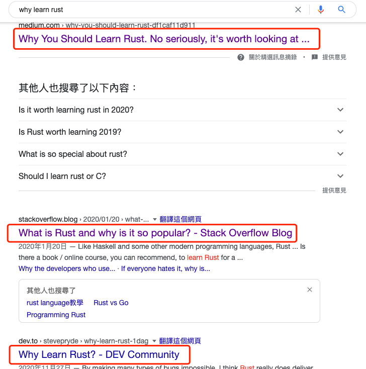
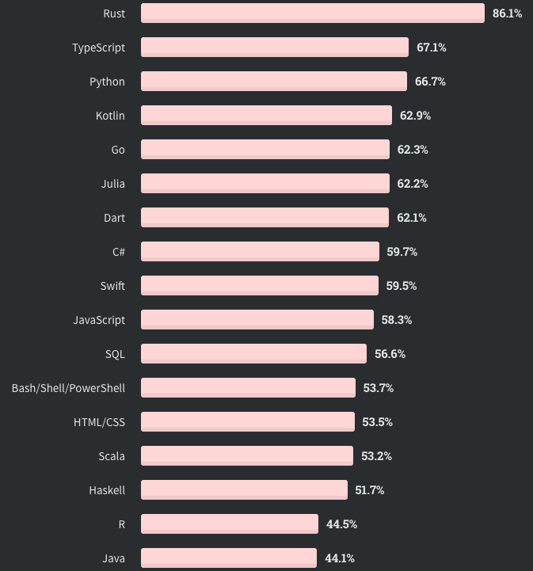

大家好，我是站长 polarisxu。

春节结束，我的 Rust 之旅才刚刚开始。经过春节期间的学习，发现 Rust 真的是有点复杂，好吧，我觉得很复杂。如果你跟我一样，决定学习 Rust，那一定要有心理准备，要啃一块硬骨头，毕竟跟 Go 语言比起来，复杂太多了。

## 01 为什么要学 Rust 呢？

看看 Google 上的结果：

爱总是能找到一堆理由，不爱亦如此。比如也有反对你学习 Rust 的，比如这篇：[《我为什么反对使用 Rust？》](https://www.infoq.cn/article/65tlwzqz2capvldohgix)。

所以为什么学，为什么不学，由你自己定。但有两个事实供参考。

**1、StackOverflow 调查中，连续 5 次夺得最受程序员喜爱的语言评比第一名。**

比如 2020 年的调查结果，65,000 名参与调查程序员中，最爱 Rust 的竟然占比高达 86.1%，远超第二名。咋一看很奇怪，其实这里有一个误区，问的问题这样的：多少开发人员正在使用该语言或技术进行开发，并且表示有兴趣继续开发该语言或技术。也就是说，使用 Rust 的开发这种，有 86.1% 的人有兴趣继续使用。实际上，这个调查中，一共只有 5% 的人使用 Rust。

我的理解是，那些入门 Rust 的人或喜欢 Rust 的人大概率继续喜欢（入门了就大概率成为了忠实粉，是不是不想白学。哈哈哈哈，毕竟辛苦不容易。玩笑下~），但让更多人入门 Rust 是个问题。。。

StackOverflow 专门做了一个调查，为什么 Rust 用户喜欢 Rust，这里直接放上译文：<https://rustcc.cn/article?id=3ce10a05-9506-475d-8c8a-3ad74130ad83>。

**2、Microsoft、Google 和 AWS 等似乎都在挺 Rust。**

比如 [微软组建 Rust 开发人员团队](https://www.oschina.net/news/128818/microsoft-rust-team)、[加大支持力度，AWS 计划招聘更多 Rust 开发人员](https://www.oschina.net/news/121772/amazon-software-engineer-rust)、[微软正用 Rust 重写 Windows 组件](https://www.infoq.cn/article/mqz2zrqt9pyu0ojoavra)、[用 Rust 重构核心开源软件吧，谷歌愿意给你钱](https://www.infoq.cn/article/uup3gzeGpAtd7KIS8pzf) 等。

在 [Rust 的第一印象](https://mp.weixin.qq.com/s/_VIUKpr20_h6jBNarnmk2g)就提到，Rust 基金会成立，这几个都是基金会成员，国内的华为也是。

从这些信息看出，这些公司都希望使用 Rust 替代 C++。所以，如果你掌握了 C++，Rust 对你来说是不错的选择，而且入门也会更容易。

至于我个人来说，为什么学习 Rust，主要有如下考虑：

- 应该尝试学习不同的语言，而且 Rust 是现代的编程语言，有很多常规语言中没有的东西；
- 程序员修炼之道中有个建议，就是想要抵抗技术过时的风险，就得每年学一门语言；
- 想通过对 Rust 的学习，和 Go 对比着来梳理、输出，加深对两门语言的理解；

所以，我学习 Rust 并没有想过将它用在工作中（但实际会不会用，谁知道呢），完全是出于好奇，让自己多掌握一门技能，提升自己。

## 02 相关学习资料推荐

我自己学习才几天，但连续看了一些资料，这里列举一些：

**1、官方文档**

官方有一本 The Rust Programming Language，国内也有人翻译了，免费阅读版本：<https://kaisery.github.io/trpl-zh-cn/>，因为官方这本书就是可以免费阅读的，虽然也出版了。官方出版了，国内出版社也引进了，这就是《Rust 权威指南》。

我最开始就是看的这本书，但看了一大半有点看不下去了。我个人感觉这本书不太适合入门。据说第一版本更是不适合，现在是改版之后的，稍微好些。

**2、Rust 编程之道**

这是国内张汉东老师出的，我初略看完了。为什么是初略？有些章节仔细认真阅读了，有些略过，因为内容太多了。但这本书看下来，会比官方的 “Rust 圣经” 更易看懂。借用书中前言的一段话：

> Rust 官方虽然提供了 Rust Book（即上面说的圣经），但是内容的组织非常不友好，基本就是对知识点的罗列，系统性比较差。后来官方也意识到了这个问题，推出了第 2 版的Rust Book，内容组织方面改善了很多，对学习者也非常友好，但系统性还是差了点。后来又看了国内 Rust 社区组织群友们合著的 Rust Primer，以及国外的Programming Rust，我才对 Rust 建立了基本的认知体系。

**3、Rust Primer**

给初学者的 Rust 中文教程。这是国内 Rust 社区组织编写的，在线阅读地址：<https://rustcc.gitbooks.io/rustprimer/content/>。这本书我还没有看。

**4、Programming Rust**

这是 O’REILLY 出版的一本书，图灵社区引进翻译了，但从评论看，似乎翻译的不好：<https://www.ituring.com.cn/book/2101>。挺奇怪的，译者感觉主要涉及的领域是 Web 前端，不知道为什么会翻译这本书。从评论看，如果要看这本书，似乎英文版更合适。当然我自己没看过，完全从大家的评论分析的。

**5、Mastering Rust**

这本书目前已经更新第二版了，而且中文版也出版了，即：《精通 Rust 第二版》。目前我还在看这本，看了一半，整体感觉写的挺好的。但翻译中有一些错误（在所难免，整体还是可以）。所以我建议大家看该书时，遇到一些名词或感觉不对的，和英文原版对照着确认下。

**6、Rust Programming Cookbook**

Cookbook 系列，中文版《Rust 语言编程实战》2021 年刚上线售卖。

**7、深入浅出 Rust**

这也是国人写的一本书，没有看过，不做评论。

此外，国外还有其他一些 Rust 相关的图书，比如 Rust 函数式编程、Rust 构建微服务系统、Rust 进行 WebAssembly 编程、用 Rust 实现数据结构和算法、Rust 并发编程、Rust 机器学习实践、Rust 系统编程等等，可以在 [Amazon](https://www.amazon.com/s?k=rust&i=stripbooks&rh=n%3A283155%2Cn%3A5&dc&qid=1613572146&rnid=283155&ref=sr_nr_n_4) 上查到。另外 《Rust In Action》也快出版了。

可见，Rust 相关的资料这两年还是出了不少。

因为 Rust 内容很多，入门不易，容易劝退，比较建议大家从中文资料入手。所以，我个人推荐看以下图书：

- 精通 Rust 第二版，对照着英文看。英文版可以关注公众号 **polarisxu** ，回复 **rust01** 获取；
- Rust 编程之道
- Rust Primer

可以选择一本，然后遇到不明白的，可以查其他的，结合者学习。同时，官方的文档应该查阅，比如标准库文档。

此外，有一个群友推荐了一个 B 站上的 Rust 视频教程：<https://www.bilibili.com/video/BV1hp4y1k7SV>，喜欢视频的朋友可以看看。如果你有好的资料推荐，欢迎留言，也欢迎对以上资料做评价。

是的，我创建了一个 Rust 的微信群，用来学习&吐槽 Rust，想进群的加我微信：**gopherstudio**，备注 rust。

