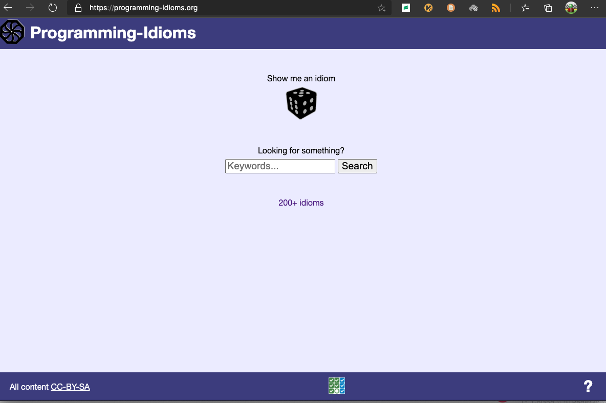
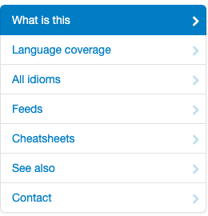
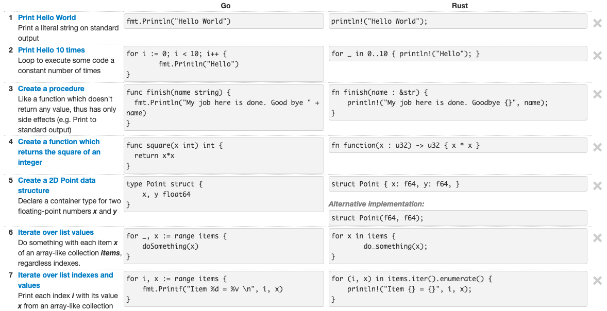

大家好，我是站长 polarisxu。

现在这样的环境要求我们程序员掌握多门语言。然而，很多人在掌握了一门语言后，学习其他语言时，总会有前一门语言的影子；亦或有些人希望在学习新语言时能和之前的语言进行对比学习。

无意中发现一个网站，对有上述情况的人可能有些帮助，因此推荐给大家。网站地址：<https://programming-idioms.org/>。

从网站名称也能猜出作者的意图，希望让大家掌握每门语言自己的习语。

下面简单介绍下该网站。

## 01

首先这个网站的核心存储部分代码是开源的，使用 Go 语言实现。源码地址：<https://github.com/Deleplace/programming-idioms>。

这个网站看起来功能不少，看菜单：

实际上主要是 idioms （目前 241 个），以及 31 门语言。通过这两者的组合，形成了相关的内容。比如，你可以看看 Hello World 在各个语言都是如何实现的。

## 02

我认为该网站最有价值的一点在于它提供的 Cheatsheets 功能。

通过选择两门语言来对比学习，比如 Go 和 Rust，你可以在这里查看：<https://programming-idioms.org/cheatsheet/Go/Rust>。这样你可以快速的通过一门自己熟悉的语言了解另外一门陌生的语言。

## 03

目前该站点的 Idioms 还不多，但每个人都可以贡献，通过该链接可以创建一个 idioms：<https://programming-idioms.org/idiom-create>。

此外，通过这个站点还发现了另外两个站点。

- <https://hyperpolyglot.org/>。这个站点通过并排的方式显示不同语言的对比，类似上面的 Cheatsheets。比如 C 语言与 Go 语言的对比就值得一看：<https://hyperpolyglot.org/c>；
- <https://rosettacode.org/wiki/Rosetta_Code>。这是一个编程主题网站。这个想法是要以尽可能多的不同语言提供针对同一任务的解决方案，以展示语言的相似性和差异性，并以一种解决方案为基础来帮助一个人学习另一门语言。 Rosetta Code 目前有 1,081 个任务，220 个草稿任务，有超过 810 种语言。当然没法为每种语言的每项任务提供解决方案，这需要大家一起努力，它已经形成了一个社区。实际上，这里有很多 LeetCode 上的题解。这个网站是刷算法的一个辅助网站。

## 04

你发现了其他好的站点吗？欢迎留言分享给大家，好东西别私藏哦。
