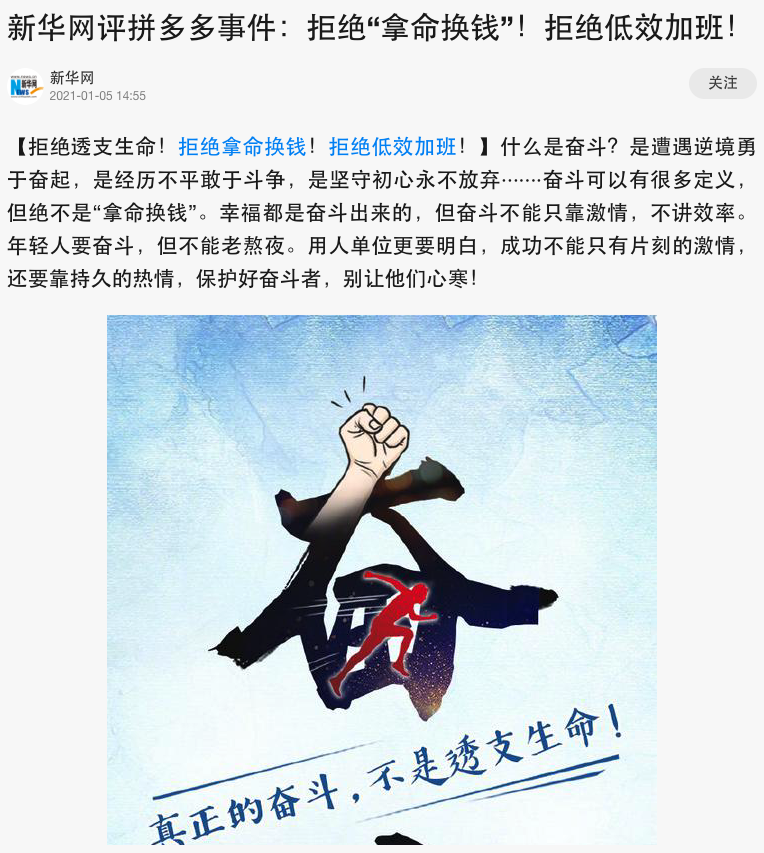
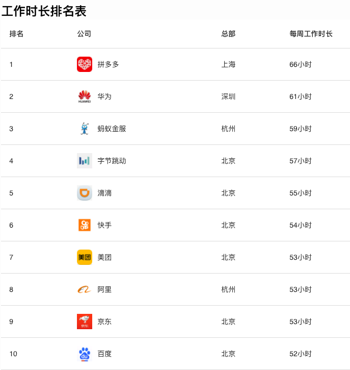

大家好，我是站长 polarisxu。

这几天圈内讨论最多的事非 pdd 事件莫属，于是再一次引出 996 问题的讨论，这似乎是国内码农永远的痛？！

新华网都发声了：（https://finance.sina.cn/tech/2021-01-05/detail-iiznezxt0681211.d.html）

互联网内卷真是不要太严重。

今天不再讨论 pdd 的事情。谈一下互联网加班的问题，因为在群里里看到这样一张图片：

这是一份 2020 年大厂加班榜，据说数据是广大网友提交的。

我读者中应该有不少在以上大厂的，这个数据还算真实吗？！

我想借这份榜单谈谈我职场这么多年的一些体会。先说我几个经历的事情。

## 01

我研究生毕业后去的开心网，经历过开心“最恐怖”的加班时刻。当时因为人人网上市，开心压力很大，员工都理解。但公司做了一个决定：做上市前的冲刺，开全员会议，宣布一周 7 天工作制。。。宣布完，就有一些人提离职！

我那时候应该刚毕业，心里想着就是好好工作，提升自己。我印象中加班最狠的一次：凌晨 2 点上线。因为是一个全新的、大项目上线，上线必然会有问题需要处理。我记得处理到 4、5 点。然后回去睡了一会（因为住公司附近，走路上下班）。8 点多起床接着上班，因为白天用户更多，需要对可能的问题及时处理。也许真的是因为年轻，那两天，整个人飘飘的感觉，很兴奋，一点睡意都没有，但吃饭也很少，感觉不到饿。现在想想，其实挺可怕的。。。

当然，最后开心网上市计划泡汤了。当初宣布 7 天工作制就是一个错误的决定，基本上没执行下去不说，弄得大家很不舒服。

## 02

创业这么多年，期间自己角色也在变。从 360 离开，加入一个创业公司，是想体验下创业的感觉。那时候，公司每个人都是创业的心态，每天 9 点到公司，晚上基本没有 10 点之前下班过，一周 6 天，远远超过 996 了。而且周日在家，我基本也是随时处理问题。那时，我并没有觉得累。（说明下：北京上下班单程平均时间近 1 个小时，我差不多在这个水平。也就是说，每天基本 7 点 50 左右出门，晚上到家一般 23 点之后）

我经常想，是什么让我可以那么多精力投入在工作上而不会觉得累？！我现在觉得是对创业的新鲜感，对做成后可能的回报的憧憬，而且那时人员少，大家很简单，工作时间虽然长，但心情比较愉快，不会有领导 PUA。

## 03

后来，我成为了负责人，心态有一些不一样了。

因为我属于很守时类型的人，讨厌迟到，无论是读书时代还是工作，很少迟到。

当我是普通员工时，我做好自己，不太会关心别人是什么情况，迟不迟到跟我没关系。但当我是负责人时，看到下属迟到，一两次还好，经常迟到的，心里会很不舒服。我知道有些人虽然迟到了，但晚上下班也会比较晚。因此我总是安慰自己，要看到大家的好。

但我不是公司老板，公司老板如果看到我的团队总是迟到等，他会怎么想？要知道，很多老板更多看到的是问题。他会发现总有人迟到，而不是发现总有人加班。我一直希望给技术团队一个相对自由的时间、环境。所以，很多事情老板并不管。但有一个前提是大家做的不错。

实话说，关于工作时长，我是要求过团队的。为了避免老板干预我的团队，我自然需要作出一些要求。不过现在看，时间的要求跟榜单上比还是少了很多。难道这就是我们创业不成功的原因？哈哈哈~

---

每个人都会焦虑！现在这个时代更是如此，更何况各种内卷严重。。。

- 开心网当时那个状态、压力，老板肯定特别焦虑，压力很大。但通过全员 7 天工作制就能解决压力吗？老板的焦虑就没了吗？如果最后上市成功了，老板你什么回报，普通员工什么回报？而且不少员工应该是没有期权，还有不少有期权跟没有也没太多区别。这样的情况下，凭什么老板的焦虑要用员工的时间来分担。
- 自发的行为和强制是有本质区别的。如何让员工更自发的去奋斗？这也许是 HR 要长期思考的问题吧。
- 作为管理者或老板，看到员工的问题也许是无法避免的。但应该有同理心。为什么大家都说外企很轻松？难道轻松的外企就不优秀吗？前段时间看了微软第三任 CEO 萨提亚-纳德拉的《刷新：重新发现商业与未来》，对萨提亚反复强调的“同理心是微软企业文化的重要内容”印象深刻，微软在他的带领下取得了辉煌的成绩。

借用新华网的话，奋斗不能只靠激情。年轻人要奋斗，要快乐的奋斗，健康的奋斗！