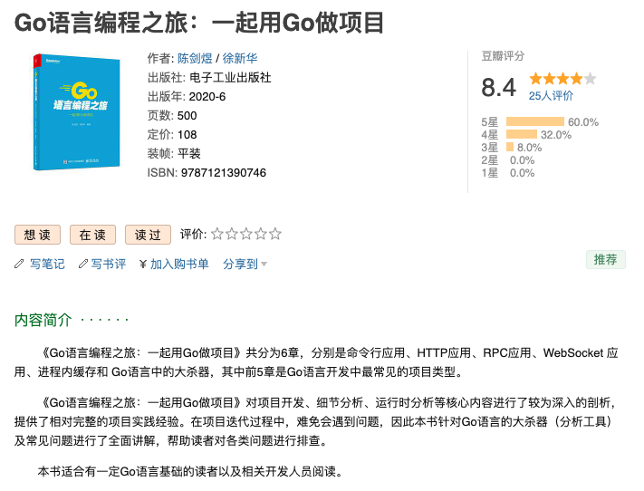
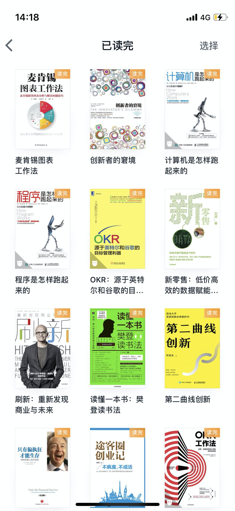

大家好，我是站长 polarisxu。

第一次正式写年终总结，也许是一个好的开始，希望以后年年写。

可能每个年终总结都会感慨，2020 年是不平凡的一年，疫情持续了一年，原以为好些了，最近似乎有变严重了。大家多保重。口罩戴了一年，不知道什么时候才能去掉，希望这天早点到来。

年终总结，是对我自己的一个回顾，但发出来，我希望能够对大家有点帮助或启发。

这份总结主要会聊五个方面的内容：

- 写作
- 读书
- 创业
- 家庭
- 收获

## 01 写作

先聊聊写书。

### 写书

2020 年最大的成绩就是出版了一本书。因为疫情，这个春节比往年都长，而且在家办公了一段时间，省去了路上的时间。当然最关键的还是，那段时间只有我和爱人在北京，使得我可以安心地写书。

目前这本书在豆瓣上的评分是 8.4 分，感谢大家的支持：<https://book.douban.com/subject/35130972/>。

关于写书，有些人可能想问点什么。比如：

- 赚了不少钱吧？
- 写书一种什么体验？
- 写书性价比高吗？
- 。。。

首先，对大部分人来说（畅销书作者除外），写书赚的钱是很少的。其实大家可以算一笔账：

> 假如一本书定价 100 元，一般版税 7%~8%，卖一本你得到 7 块钱，1 万本也才 7 万块钱，而实际上卖 1 万本真的挺难的。

既然赚不了多少钱，为什么还有那么多人出书呢？

我的理解，因为出书相当于给自己做了背书。之前还听说，某大厂职级晋升，如果出了书会有加分。一般来说，一件事情的回报不会是单一的，我们不能只盯着眼前的，不能只盯着金钱的回报。张一鸣总是强调延迟满足感，字节跳动的小伙伴因此也总提这个，我觉得大家要学会把眼光看远。

所以，如果你有机会出书，别犹豫，干就对了。如果你觉得自己有这个能力出书，想出书，但不清楚相关的事情，欢迎和我交流。

### 写文章

大家应该见到过不少类似这样的文章：技术人应不应该写博客？

写博客文章和写书还是不一样的，写文章会更灵活，写书限制、要求都会更多。我个人觉得，如果你想将来出一本书，但觉得水平不够，可以先试试写一些博文，提升提升写作水平。当你写的多了，很可能出版社会主动找你哦。

回顾 2020 年，我陆陆续续写了 60+ 篇文章。2020 年之前写的文章还是比较少，在 2020 年中旬，我决定开一个自己的公众号，并花钱买了留言功能，也就是现在的 「polarisxu」。之前写的文章如果要在「Go语言中文网」公众号发布，只能限于 Go 相关，但有了个人的公众号，主题可以很随意。在职场打拼这么多年，加上这几个月看了一些非技术类的文章、图书，我觉得写下来的，不应该只有技术。所以接下来，除了分享技术，我还会分享非技术的内容。

另外，如果你计划写作，我个人建议可以开通自己的公众号，搞一个自己的博客。为什么搞两个？

- 公众号读者粘性好，关注你了，你可以更好地触达他。目前我觉得公众号的粉丝是所有平台里价值最高的。
- 但公众号有一个问题，就是时效性，历史的文章很少有人看了。而博客可以借助搜索引擎，不断有流量，同时历史文章也更利于读者阅读。

对公众号运营感兴趣的可以一起交流。

## 02 读书

> 没有什么问题是一本书解决不了的，如果有那就再来一本。。。

大家都是读书人。学生时代，教科书读了不少，工作后，你读了多少书呢？书买了相当于看了：很多人热衷于买书，其实是好事，但只是热衷于买，多少就有点浪费了。

我自己买书比较少，一方面喜欢随时阅读，纸质图书不方便；另一方面，买了经常不读，内心有罪恶感。

2020 年中下旬，我开始使用微信读书。这里我个人强烈推荐「微信读书」：

- 数字化时代，应该充分利用数字化。下个十年，预计能被数字化的都会被数字化。
- 通过微信读书，可以把你的阅读进行数字化，让你很容易进行数据统计：读完了哪几本书？每本书阅读了多长时间？每周阅读多长时间？做了多少笔记等等。微信读书还为你生成了年度读书报告。
- 根据你的兴趣，为你推荐你喜欢的书，相当于帮你找书。
- 可以方便的看到大家对这本书的评价，书中还会有别人的笔记。
- 书中引用的其他图书，可以直接点击，看看是否自己喜欢，加入书架等。
- 还可以听书，非技术类的，听书的效果还不错。
- 。。。

半年来，我在微信读书读了 12 本图书，有些书是略读，有些书是精读：做了读书笔记。有一些还没有读完，正在阅读中。

这里推荐大家读一下樊登的《读懂一本书》，里面提到的一些方法有一定借鉴作用。

>  注意：技术类的图书，特别是代码比较多的，微信读书的阅读体验可能会差些。

2021 年也许会考虑写写读书心得。

对了，用微信读书，不代表说让你别买书了，有些书该买还得买。而且我一直认为，有些书买了不一定是用来读的：家里书架上满满的图书，是不是有种书香门第的感觉？我相信这对培养孩子读书的兴趣也是有帮助的。

## 03 创业

关于创业，前段时间写过一篇短文。虽然创业了很多年，但因为一直没有做出什么成绩，所以这块不想说太多。

在上面读过的书中，有一本创业记，作者将自己创业的过程完完整整记录了下来，没有过创业经历的人可能对其中的内容不会有太多体会。创业的苦、创业的难，个中滋味只有自己最清楚。

2020 年，因为疫情，虽然产生很多新机会，比如在线教育大火。但受影响的企业真的很多。很多人可能没有什么体会，因为你没有丢工作。前段时间，公司准备换办公室，去望京 SOHO 那块看了一些办公室，空的办公室不少。据中介介绍，疫情影响真的挺大，空出了很多办公室，房租价格也是比之前低不少。可见，很多小公司在疫情期间活不下去，关门了。

回顾 2020 年，创业对我来说，相比之前还是有更多的收获，虽然业务没起来，但比之前经历了更多，从技术、产品、运营等纯线上的管理到仓配、采购等线下的业务流程和管理，接触了很多之前不熟悉的领域，无形中学到了不少新知识。

不知道关注我的人中有多少是在校生。我个人特别不建议毕业后就去一个创业公司。当然自己创业或跟着认识的人觉得特别靠谱的除外，毕竟选择大于努力。如果你对一个创业公司不了解（除非是你的熟人，否则很难了解），风险挺大的。虽然似乎拿到的钱不少（实际上不多，因为加上福利，基本和大公司是有差距的），但随时都有可能丢工作，特别是今年，大环境不好，被动换工作，结果真的挺惨。如果你没得选，只能进一个小公司，建议你找一个注重员工个人成长的公司，因为环境挺重要的。当然个人积极主动学习更重要。

## 04 家庭

因为创业，欠家庭还是挺多的。

关于家庭方面，2020 年有两件大事。

- 住进了自己的小家，再也不用每年为房租涨价心烦，更不用为搬家发愁。

- 大女儿上小学了。

但家家有一本难念的经。有一天晚上，媳妇对我说：大女儿说想自己一个人睡，希望有一个自己的房间，因为她同学有。

随着孩子一天天长大，这个愿望会越来越强烈，而且也应该给她一个独立的空间。作为父亲需要承担这个责任，为孩子早日实现愿望。。。然而在北京真的好难！

如果愿望一时半会实现不了，希望自己在周末能够多花些时间陪陪她们。

如果你跟我一样，全靠自己奋斗，类似的问题、苦恼大概迟早也会到来吧。所以，趁年轻、趁单身，提升自己，多赚点钱，让将来过的更好些。

## 05 收获

关于收获，主要聊两方面。

### 公众号

上文提到，2020 年中（6 月 17 日）启用个人微信公众号，开始记录、分享我个人的学习、生活、工作和感想。因为这个号是基于之前「火丁笔记」的，自带了近 3.5k 粉丝。经过这半年的努力，涨了近 1.5 万粉丝。感谢大家的支持。

除了粉丝，运营公众号另外的收获就是能获得一定的收入回报。关于公众号运营的一些事情，2021 年计划写一些相关文章聊聊。

另外，上次发文说过，知乎有人给打理，收获了近 9 万粉丝。感谢有你！

### 社区

这一年，Go 语言中文网网站的开发工作很少，但 GCTT 一直在产出，无闻大佬一直在帮校对，感谢大家。

回顾这一年，社区主要做了如下事情：

- Go官网的镜像 <https://docs.studygolang.com> 启用新版，同时提供 playground、blog 等访问；
- 组织了一次重庆 gopher 聚餐；一次北京 gopher dinner；
- 为大家定制了 gopher 卫衣；
- 组织 Go 语言官网的翻译；
- Go 语言中文网公众号每天为大家推送 Go 相关文章；
- 每周一期的《Go 语言爱好者周刊》；
- 开发上线了一版 Go 语言中文网小程序；
- 。。。

当然最重要的是认识了更多的朋友：一些新认识的，一些之前没见过面见上了，一些有了更多的交流。。。

2021 年，希望 Go 语言中文网网站能给大家带来一些惊喜。

---

一年了，你可能觉得自己没做什么，但只要你静下心来回顾，会发现做了不少事情，而且肯定有值得记录的。也许等你老了，回过头来看看自己的过往记录，回忆起过去的你，也算是一种幸福吧！

冯大说，每个人都应该阶段性对自己做一次梳理、总结，工作也好、生活也罢。其实，我的这份总结是不够的，因为缺少复盘和反思。但毕竟是公开的，自己反思的内容就先不放上了。建议你元旦可以为自己的生活、学习或工作写一份总结，至少工作上应该写一份，然后看情况发给你的 Leader，也许年终奖或来年加薪有惊喜也未可知！