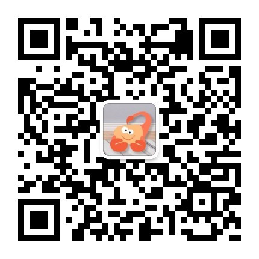
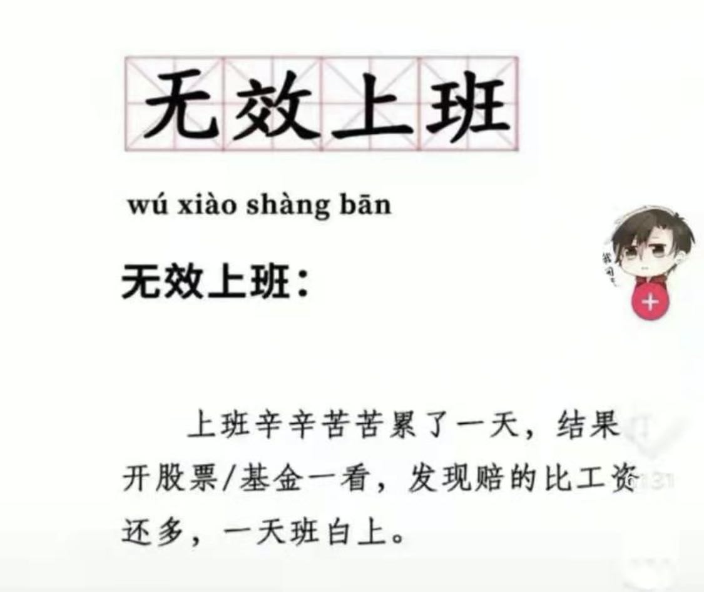

大家好，我是 polarisxu。

元旦假期结束，2022 年工作开启，2021 年总结做了吗？今天我简单回顾下我的 2021。

年终总结，是对我自己的一个回顾，但发出来，我希望能够对大家有点帮助或启发。

这份总结主要会聊五个方面的内容：

- 写作
- 读书
- 理财
- 家庭
- 收获

## 01 写作

这里主要谈我的个人品牌公众号 「polarisxu」，而不是 「Go语言中文网」，Go语言中文网的年终总结见：[Go 语言中文网 2021 年回顾，2022 年该立 Flag 吗？](https://mp.weixin.qq.com/s/-NFjO_9Scqcfs4izxEo58Q)。

翻看 2020 年年终总结，发现那一年写了 60+ 篇文章，而 2021 年写了 132+ 篇原创文章，这是历史的新高，以往从来没有写过这么多文章。不管水平怎么样，从阅读量、留言反馈看，还算凑合。这也证明了写 2020 年总结时说的：如果你计划写作，我个人建议可以开通自己的公众号，搞一个自己的博客。

文章类型方面，除了 Go 语言方面的，还写了一系列 Rust 语言的，但还未更新完。不过，并没有放弃 Rust 的学习，为了保持对 Rust 的持续关注，特意注册了一个 Rust 方向的公众号：「Rust编程指北」，对 Rust 感兴趣的可以关注下。

2021 年，「polarisxu」公众号粉丝量目标没有达到，差了 1k，2022 年粉丝增长目标是增加 16000 ~ 18000 粉丝。

## 02 读书

一年下来，公众号送了好几次图书，不知道大家看了多少？

2021 年，在微信读书上读完 12 本书，有点少。。。读过 63 本，属于没有读完的状态。成绩不理想。

不到年终写总结，没感觉到问题。为什么会这样？也许是中间缺少复盘。

于是又忍不住要立 Flag：2022 年至少看完 20 本书，每个月做一次复盘，反思自己的行为，确保进度和读书质量。

## 03 理财

2021 年最大的事情就是我入坑理财了。可能很多人惊讶，竟然 2021 年才开始？！确实财商意识太差。但种一棵树最好的时间是十年前，其次是现在。所以，我认为任何时候开始做一件事都不晚，就怕迟迟不行动。

印象中，是在好友煎鱼的影响下开始尝试了解理财，了解基金投资。都说没有入坑，收益率就超过了 90% 的人。。。从 2021 年的收益看，还真是如此，这算是交的学费吧。

前几天，媳妇问我：年底要查账，基金亏了多少？

她咋知道我一定亏呢？因为如果我赚了，肯定会主动跟她汇报，没汇报，那就是亏了。。。哑口无言呀！！！

其实还好，毕竟只是暂时浮亏。主要亏在「中概」，成了丐帮长老（煎鱼和我都是丐帮长老了）。。。有同是丐帮弟子的点个赞、留个言，安慰一下？！🤣

2021 年经常出现这样的情况：

2021 年学了不少理财方面的知识，我相信时间会证明学的东西不会白学。

2022 年，希望能小赚~

## 04 家庭

这次总结没有谈工作，主要是工作上不符合预期，没有太多值得说的。

2021 年，小女儿开始上幼儿园了，公立幼儿园离得比较远，不方便接送，只好选择较近的私立幼儿园，费用是 5k 一个月。。。着实有点高！

但如我在[《好快，竟然已经结婚 9 年了！》](https://mp.weixin.qq.com/s/Z1YuEPGniVBGSNZGhbqYNA)中说的，生娃不仅是响应国家号召，而且能给生活增添很多乐趣。因此，虽然有压力，但也会更有动力赚钱。

一年下来，两个小孩子全靠媳妇一人辛苦照顾，不仅是照顾她们生活还要辅导作业、陪玩，真的是比上班还辛苦，女人为家庭、为孩子付出真的是很多很多。找到一个好媳妇真的是人生最幸运的事情。

## 05 收获

2021 年，运营公众号，让我每天都很充实，每天都有事情要做，而且需要不断输入，以更好地输出。

公众号的收入，使得即使媳妇全职带娃，我的压力也不至于那么大。

通过公众号，这一年认识了更多的朋友。虽然几乎每天都会花一些时间回答读者的问题，以及花时间拉群、维护群，但这似乎已经成了我生活的一部分，经常和读者交流中也会有新的收获。想加我微信好友的可以搜索：gopherstudio 加好友、进群。

其次，虽然投资理财亏了，但我认为这是收获。我坚信，理财是能给我带来额外收入的，值得我花些时间了解、学习。因此，我会持续不断地了解更多理财知识。（投资有风险，入市需谨慎！）

---

一年了，你可能觉得自己没做什么，但只要你静下心来回顾，会发现做了不少事情，而且肯定有值得记录的。也许等你老了，回过头来看看自己的过往记录，回忆起过去的你，也算是一种幸福吧！

每个人都应该阶段性对自己做一次梳理、总结，工作也好、生活也罢。其实，我的这份总结是不够的，因为缺少复盘和反思。但毕竟是公开的，自己反思的内容就先不放上了。建议你可以为自己的生活、学习或工作写一份总结，至少工作上应该写一份，然后看情况发给你的 Leader，也许年终奖或来年加薪有惊喜也未可知！
