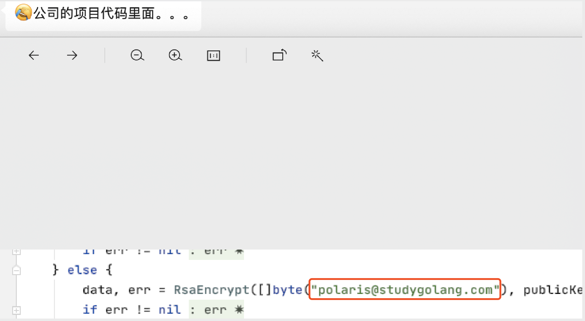
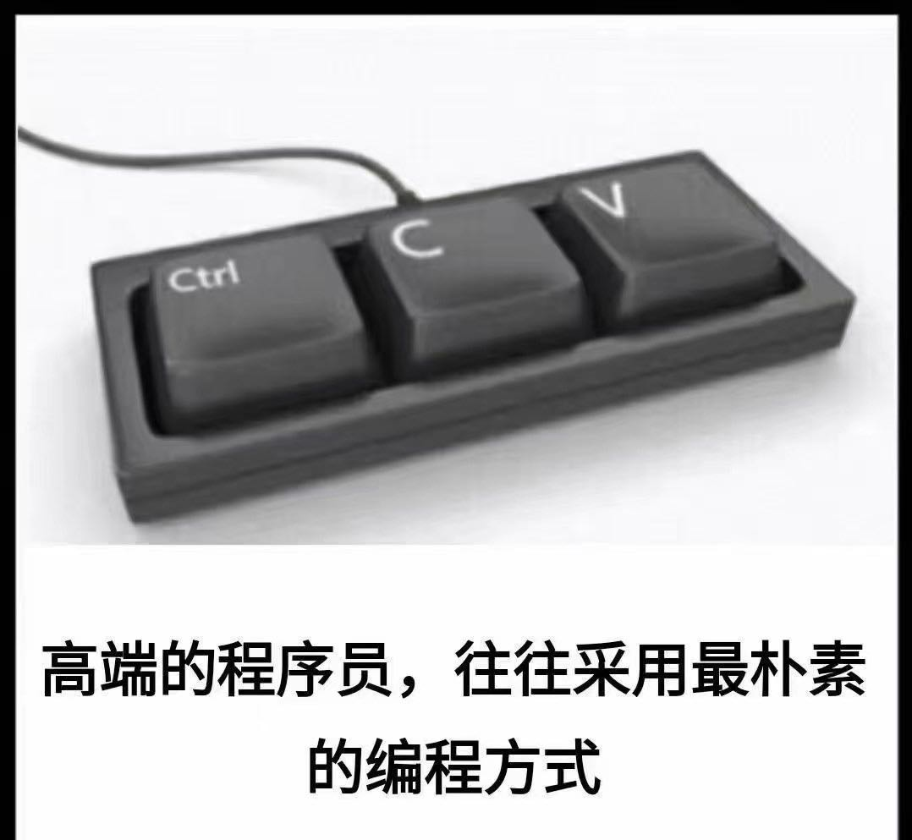

大家好，我是 polarisxu。

在群里有一位大厂大佬发了这么一条信息：

有点惊住了！

这是我在 2013 年 1 月写的一篇关于 RSA 的文章：[《GO加密解密之RSA》](http://blog.studygolang.com/2013/01/go%e5%8a%a0%e5%af%86%e8%a7%a3%e5%af%86%e4%b9%8brsa/)，没想到进入了大厂的项目里。只不过，这 CTRL + C、CTRL +V 有点小猛，邮箱地址直接进入了仓库。。。不愧是：

群友们很有才，说可以写一篇文章：当初写下的示例程序，已然在巨头大厂安稳运行 6 年，创造的价值数以亿记。

这件事还是有些启发：

- 对外输出，一定要认真负责。输出，是提升能力很好的方式，通过输出也能倒逼输入。但输出一定要对读者负责，因为你的输出会成为别人的输入。我又重新验证了 2013 年文章的例子，虽然 Go 升级了这么多版本，但得益于 Go1 的兼容性，代码运行正常；
- 做一个「高端程序员，采用最朴素的编程方式」没错，但不能只是这种方式，复制、粘贴完后，一定要自己读一遍，看看有没有需要修改的地方，不能犯低级错误。我见过最多的就是，把注释也一起复制过去，然后从来不改注释，弄得注释和代码完全不是一回事。。。

如果你是一个「高端程序员」，建议你试试输出，让别人也享受下「最朴素的编程方式」。