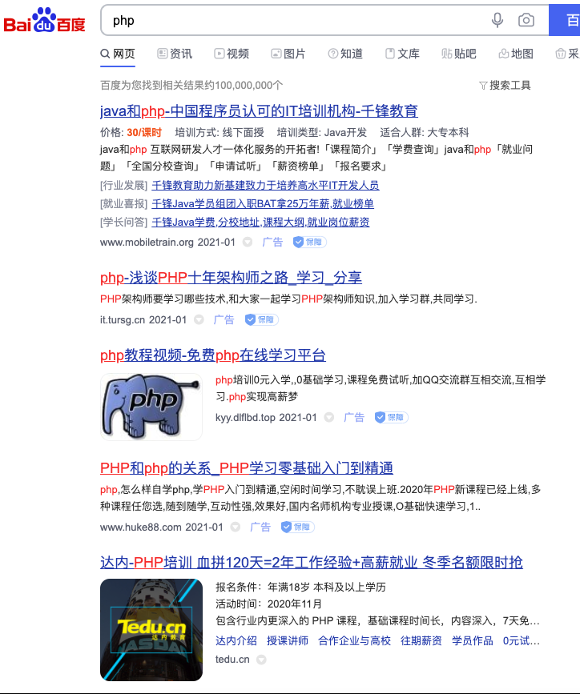
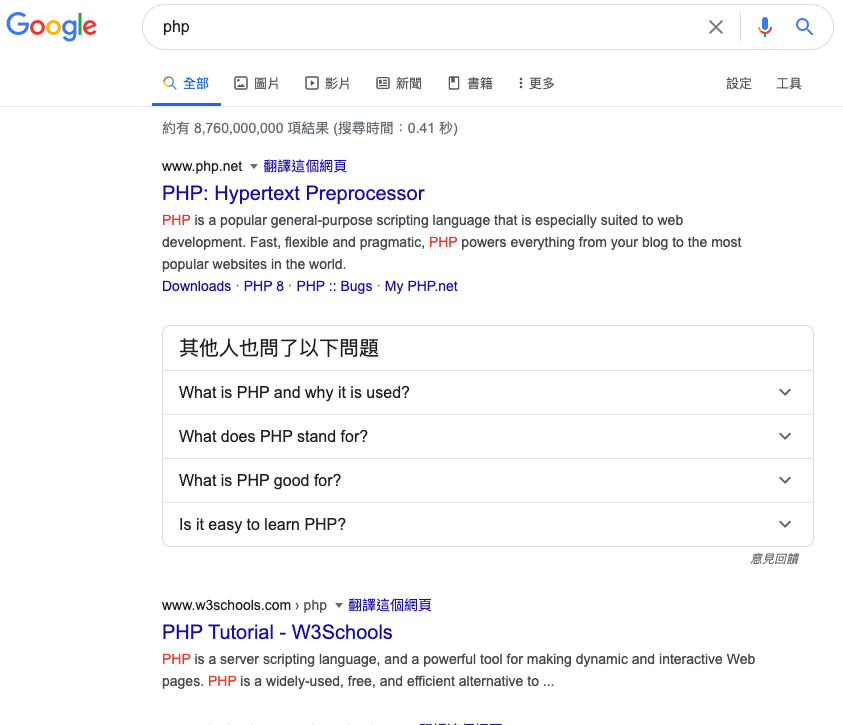
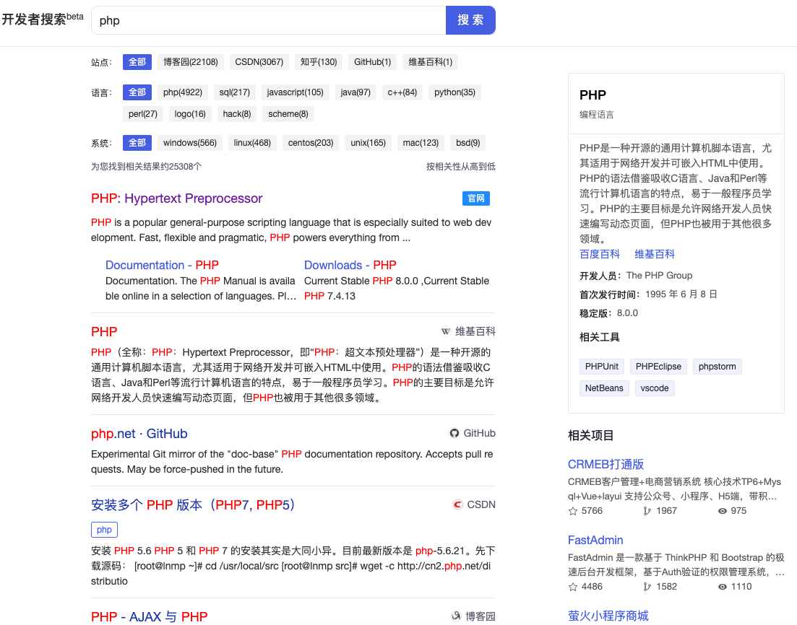

大家好，我是站长 polarisxu。

百度，这个国内最大的搜索引擎，大家对其是又爱又恨，特别是程序员。所以，有一些程序员会直接不用百度，甚至觉得程序员就不应该用百度，用百度是 low 的行为。

的确，百度在搜索技术相关的东西，会让人很抓狂。比如搜索世界上最好的语言 php：

我的天，全是广告。。。

反观谷歌：

第一个就是 PHP 官网。

据相关调研预测，到 2026 年国内编程教育覆盖人数也将超过 1 亿。如此庞大的用户群体，不能无视他们的搜索体验。终于，今天看到百度出了一个专门针对开发者的搜索引擎：<https://kaifa.baidu.com>。作为开发者，同时也是站长，我想谈谈自己的一些看法，欢迎交流。

首先，这是一个好消息，你看搜索 php 的结果：

官网终于排在第一了，而且没有任何广告，至少现在没有。

在搜索结果的顶部，有「站点」、「语言」、「系统」三个筛选项，右侧有百科对应的词条，右下角是来自 gitee 平台的相关项目。隐约感觉，gitee 要大火？！

但是，细心的读者会发现，目前的版本存在一些局限，比如搜索结果固定来自几个站点：「博客园」、「CSDN」、「知乎」。。。而实际上很多个人独立技术博客的质量很高，这里却搜索不到，可见目前这个所谓的开发者搜索，只是简单的搜索这几个站点的内容。

此外，对于像 「Go语言中文网」 这样的站点来说，相当不友好，在 baidu.com 上搜索 golang，排除广告的话，它排第一，但在这个开发者搜索中却搜索不到它的任何内容。

当然，我相信这只是起步。以上的一些问题，特别是内容丰富性方面，只要百度用心，肯定可以做的更好：比如基于 AI 技术，分析出全网站点，哪些是技术类的，提升权重等。

如果这个搜索引擎真的做起来了，码农们都使用它，文中开头的哪些培训机构是不是不在百度投广告了？真有那一天，不知道百度能否顶住诱惑，像谷歌一样，有节制的展示广告。

不过，要做起来其实挺难的，虽然 PC 时代的搜索，搜狗也还好，360 也好，都没有对百度形成冲击，但现在头条搜索、微信搜索，它们在另一个维度上和百度竞争，对百度的冲击还是不小。

优质内容 + 好的体验，如果百度能做到，对于开发者这个人群来说，PC 搜索是更适合的，就看百度是否真要这部分市场了。