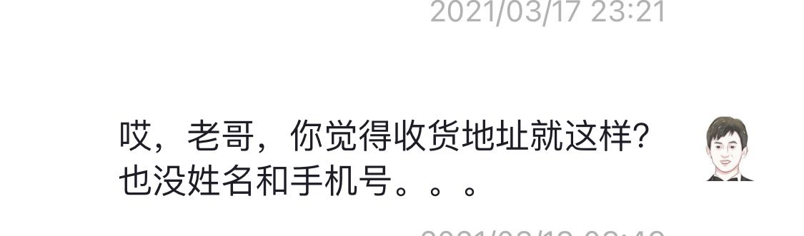
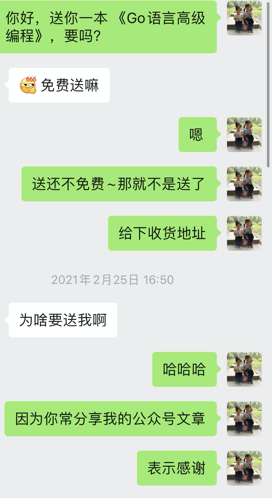
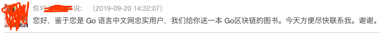

大家好，我是站长 polarisxu。

上周在公众号搞了一个[送书活动](https://mp.weixin.qq.com/s/sWDeK2de5pTLU1wrXYGAIA)，感谢大家的参与，留言数 170+，而微信公众号最多只能放出来 100 个留言，因此有些晚留言的，可能留言没放出来，下次再有活动，大家可以早点参与，我公众号发文时间一般是 **18:12**。

根据文中的相关规则，第二天就开奖了，中奖的用户一一留言回复了，他们的书也已经收到了。

不过陆续还有人问：这个开奖了吗？据说还有群里讨论这个抽奖的公平性。我做了一些解释，但想想还是写篇文章聊聊这件事。

## 01 自我反思

首先，有人询问、有人质疑，说明我有做的不足之处，至少考虑不周，这也算是积累经验。

关于规则，那篇文章说，点赞排行前 20 中抽取 10 位，具体怎么抽，会考虑对我的支持，比如阅读文章、打赏、点赞、转发等。这没有什么大问题，但有一点，开奖后，没有留言置顶，导致没有中奖的人不清楚有没有抽奖，担心是不是我忘记了。

此外，对中奖的用户，我回复留言后，没有将我的留言公开，所以，没中奖的看不到谁中奖了。

所以导致大家有疑问、有质疑。透明公开会更好。

但任何事情，要有心理预期，不可能让所有人满意，尽自己努力做到最好即可，因为。。。

## 02 人性

最近在学习理财相关的知识，有这么一个小故事，我稍微改了一下：

> 比如土拨鼠有一个书：《Go语言编程之旅》，他卖给大象，报价 60 元，大象会觉得贵；但如果这本书是大象的，他卖给土拨鼠，大概率觉得 60 有点便宜，至少不会认为 60 贵。。。

相信大家明白其中意思了。

对于任何抽奖，大家普遍会有这样的心理：

> 中奖者，自然觉得自己很幸运，没啥说的；但未中奖者，多半会怀疑抽奖的公平性，怀疑是不是有内幕？！

上周我这个抽奖，完全无任何套路，不需要关注一堆公众号，留言就有相当于参与了，就有可能中，完全是给粉丝的福利，所以我没有搞内幕的必要。

但人性使然，所以也无可厚非。更何况有些人可能努力了，比如让朋友帮点赞，结果却没中，内心肯定会失落，很理解。我只能说，以后我还会送书，也许还有机会，但我送书，肯定是希望送给忠实读者的。这就是另外一点。。。

## 03 双赢

所谓公平，这个很难说。这就好比上文讲的那个小故事，每个人对公平也会有自己的看法。不说别的，子女们还总是认为父母对自己不公平。

至于抽奖的公平性，我更想通过「双赢」来谈。

首先，我做这个抽奖的初衷或目的是什么？实话说，搞这么一次抽奖（特别是牛年 Go 春晚的抽奖），其实挺费神的。不说别的，联系中奖者，让他们提供收货地址都挺费劲：

而且回复他后，一天过去了也没后续，我只能想办法通过其他方式提醒他。10 个中奖的，不止一个有这种问题你。。。

我花费时间和精力做这些，自然希望中奖者是我的忠实读者，真正支持我的读者。这是互惠互利的事情，任何「赢输」或「输赢」模式肯定都不合适，而应该是「**双赢**」。这也是我在中奖规则中着重说明的，你经常看我的文章，点个赞，点个在看，留个言，觉得不错转发一下，都是对我最好的支持，我自然更可能把福利给到你。比如这位读者：

包括 Go 语言中文网站的活跃用户，有福利，我也会优先想到他们：

所以，我认为的公平是建立在「**双赢**」基础上的。**双赢思维**，这也是高效能人士的七个习惯之一。

欢迎大家「点赞」、「在看」、「转发」和「留言」，**四连的是真爱**。

