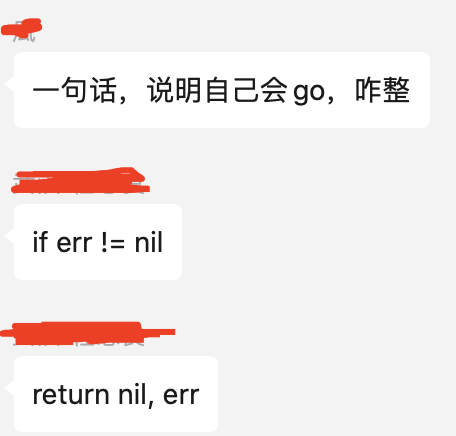
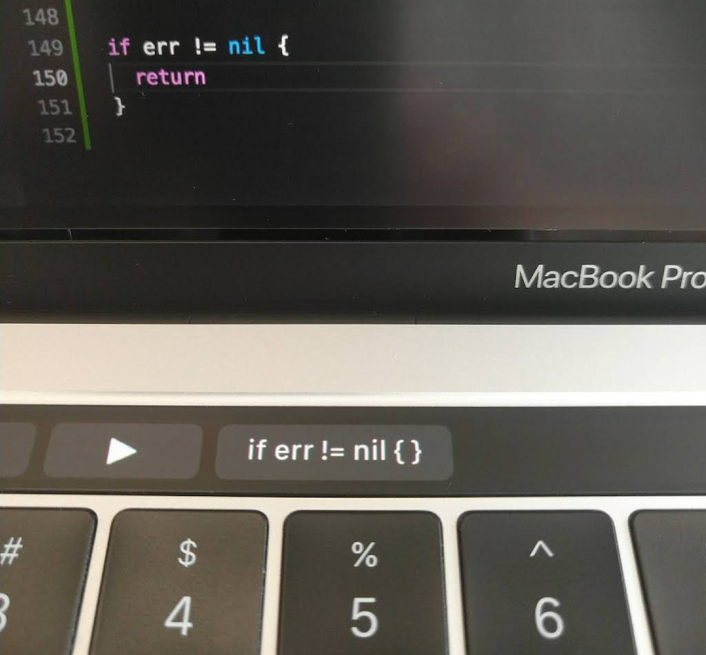

大家好，我是 polarisxu。

今天在「Go语言中文网」微信群里有网友问了这么一个问题：一句话，说明自己会 go，咋整？一个哥们立马给出了一个回复，竟然无法反驳，感觉 Go 被黑的很惨？！（被黑的最惨的一次？！！）

关于 `if err != nil` 的调侃真的不要太多。这里列举几个：

1）之前发过一篇文章：[写了50万行Go代码是一种什么样的体验？](https://mp.weixin.qq.com/s/pzoTAl8xA9sefI_Ckpv8PA)，有人留言调侃说：有 10 万行是 `if err != nil`。。。

2）VSCode 有一个插件，配合 Mac 的 touch bar 可以一键生成 `if err != nil`，地址：<https://github.com/dongri/touch-bar-if-err>

3）GoLand 编辑器也支持快捷键生成 `if err != nil`

关于错误处理的问题确实是 Go 争议最多的，也有大量的文章讨论相关的问题，包括各种推荐的做法。在 Go 语言提案中，也有这种各样的错误处理提案。看几个：

- [simplify error handling with try err == nil {} except {}](https://github.com/golang/go/issues/33387)，目前这个提案被否了；
- [try-catch by assignment](https://github.com/golang/go/issues/46433)，还是想要回到传统的 try catch，目测大概率会被否；
- [error handling with error receiver function](https://github.com/golang/go/issues/36338)，增加了 or 关键字；
- 。。。

因为 error 大改影响挺大的，目前相关的提案都收录在了这个 issue 中：<https://github.com/golang/go/issues/33892>，这里包含了各种放在 go2 处理的 issue，有兴趣的可以了解。

一句话，说明自己会 Go，咋整？你会如何回答，欢迎留言交流！