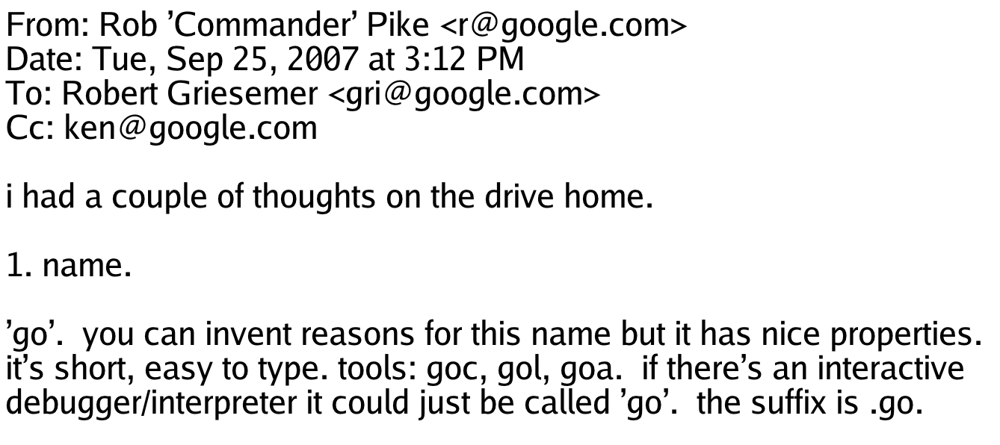
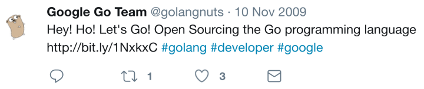
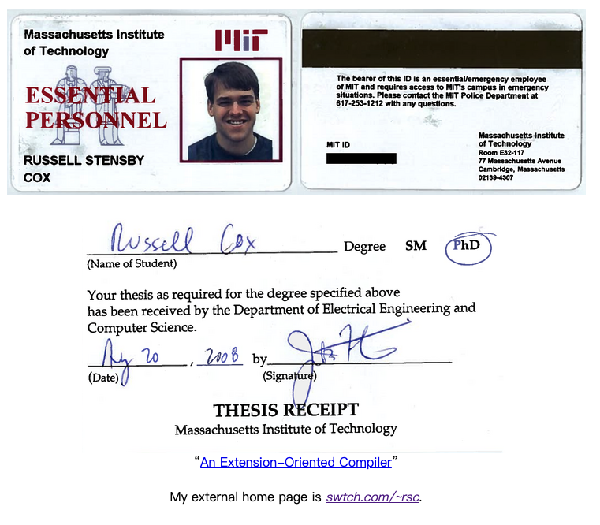
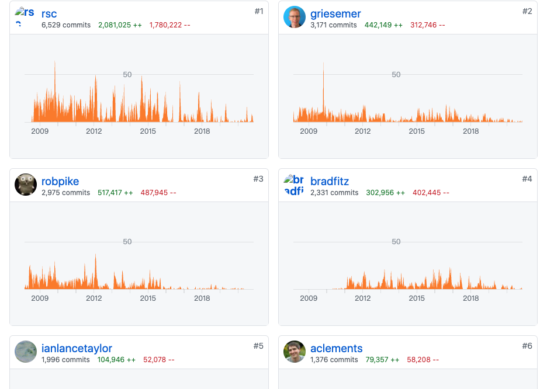

大家好，我是站长 polarisxu。

今天和大家聊聊 Go 语言名人的那些事。

## 01

说起 Go 语言，很多人知晓有三个创始人。在 2007 年 09 月 25 日，Rob Pike 发了一封邮件：

所以一般认为 Rob Pike、Robert Griesemer 和 Ken Thompson 是 Go 的创始人，而很长一段时间，Rob Pike 在引领 Go 团队，同时在一些公众场合经常出现，因此大家对 Rob Piike 更熟悉。关于他们三个的情况，网上资料挺多的，这里不说了。

今天说的是另外一个人。在 Go 项目启动后不久，Russ Cox 和 Lance Taylor 也加入了 Go 语言的设计团队。他们 5 人一起开发了两款编译器和一个标准库，为 2009 年 11 月 10 日 Go 语言以开源方式发布打下了基础。

> 问题：为什么说开发了两款编译器？

是的，今天要说的这个人就是 Russ Cox，他是现在 Go Team 的 Leader。

## 02

Russ Cox，网络上的昵称是 rsc，2008 年博士毕业于 MIT（麻省理工学院），毕业后就加入了 Go 核心设计开发团队，非常年轻。下面是毕业证信息，在 MIT 网站可以查到：<https://pdos.csail.mit.edu/~rsc/>。

关于 Russ Cox 加入 Google 进入 Go Team 团队有一段小故事，这是 Russ Cox 本人在 2018 年 4 月份参加[第 77 期 GoTime](https://changelog.com/gotime/77) 时讲述的。

> 我上大学时就曾与 Rob Pike 合作参与 Plan 9 操作系统的开发，之后在 Google 研究院实习。当我读完研究生（博士）时，Rob 告诉我有关 Go 的内容，大概是说：“我们正在尝试吸收我们在 Plan 9 上开发软件时真正喜欢的所有东西，并使它们能够用于我们在 Google 的日常编程中。你想帮忙吗？”我当时想，“是的，当然。” 就这样我加入了 Go 团队。
>
> 有趣的是，我在想这件事（因为你可能会问这个...那是十年前的事了），我自己不敢相信这有多幸运，因为我完成博士研究生学业的时候，这份工作随之而来，就像是我过去十年所做的所有事情的完美结合。似乎过去做的事情是为做 Go 这件事做铺垫。 然后我和所有这些伟大的人一起工作，比如 Rob，Ken，Robert Griesemer，Ian Taylor。。。我们辛苦了两年，然后 Go 开源了。
>
> 然后真正令人惊讶的事情发生了，坦诚地说，我们没有人预料到，我们选择开源后，人们竟然想使用 Go。这对我们来说很震惊。 我在发布（开源发布）前几天对 Rob  说，我希望也许有几个人会注意到，理想的情况是，无论下一个大语言是什么，都会窃取 Go 的并发和接口思想。这将是我们使编程更好一点的微小贡献。

大牛果然一开始就很厉害！

此外在这个 Go Time 中，Russ Cox 谈到了较多 Plan9 的事情以及大篇幅说道 vgo 的设计。当然还有很多其他内容，虽然过去 2 年了，感兴趣的可以去读一读。

实际上，几年前开始，Russ Cox 就已经是 Go Team 的技术负责人（Leader）。他会做一些领导工作，并帮助确定优先事项等。很多拿不定主意的决策都是 Russ Cox 最后拍板，很多时候他都是力排众议。相信大家印象最深的就是他设计的 vgo，即 Go Module 的前身，在这之前可是已经有了 dep 这个准官方解决方案。为此有一个 Go 的社区贡献者写文说 Go 是 Google 的而非社区的。Russ Cox 对此进行了[回应](https://groups.google.com/g/golang-nuts/c/6dKNSN0M_kg/m/Y1yDJRwQBgAJ)，同时引用了他 2015 年发表在 [Go 官方博客上的文章](https://docs.studygolang.com/blog/open-source)（那时候似乎就意识到会有这样的事情发生？）。这里我不做任何评价，相信每个人心里有自己的一杆秤。

在整个 Go 代码仓库中，Russ Cox 提交的代码量是最多的。

## 03

推荐下 Russ Cox 的博客：<https://research.swtch.com/>，涉猎比较广。其中有一篇文章预测了[世界上有多少 Go Developers](https://research.swtch.com/gophercount)。你觉得有多少？

Russ Cox 预测，截至 2019 年 11 月，估计是 115 万到 196 万。

他给了一个预测的方法：

> Number of Go Developers    =    Number of Software Developers   ×   Fraction using Go

所以我们需要回答世界上有多少软件开发人员，以及他们使用 Go 的百分比。这些数据主要通过一些第三方发布的调查、统计得到。有兴趣的可以看看他的预测方法。

最后他得出：

- 2017 年 7 月，在 1680 万-2100 万的开发者中，有 3%-4.6％  Go 开发者，即 50 万 — 90 万；

- 在 2018 年 7 月，在 1840 万-2300 万的开发者中，有 4.6%-7.1％ Go 开发者，即 85 万 - 163 万；

- 在 2019 年 11 月，在 1890 万-2390 万的开发者中，有 6.1%-8.2％ Go 开发者，即 115 万 - 196 万；

你觉得中国有多少 Go 开发者？

## 04

Go 有这样的大牛主导开发，未来会越来越好！

看看大牛的书房，除了各种书，我相信吸引你眼光的是那些 gopher 小玩偶吧！

关于 Russ Cox，你还知道哪些事情？欢迎留言交流。